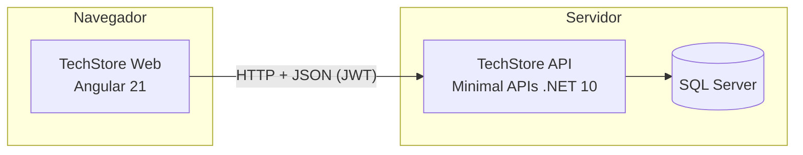
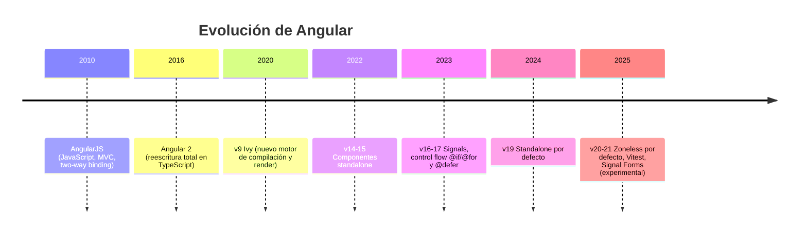
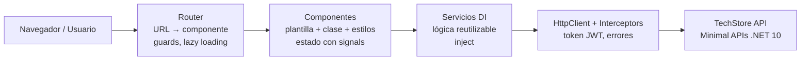
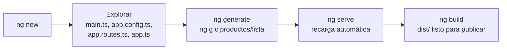
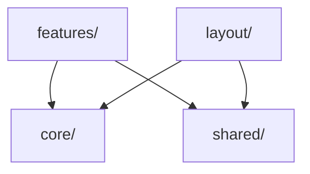
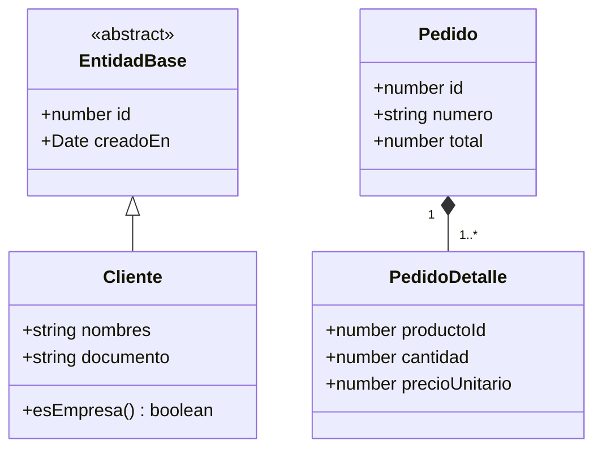

# Clase 01 · Introducción a Angular 21 · Arquitectura y modelos

> **Especialización Full-Stack .NET 10 & Angular 21 Developer**
> Módulo 02 — Front-End: Aplicaciones con Angular 21 · Sesiones 01 y 02

| Dato del curso | Detalle |
|---|---|
| Programa | Especialización Full-Stack .NET 10 & Angular 21 Developer |
| Módulo | 02 — Front-End: Aplicaciones con Angular 21 |
| Clase | 01 (Sesión 01 + Sesión 02) |
| Fecha | 12 de setiembre de 2026 |
| Horario | 08:00 – 12:00 h (según cronograma oficial) |
| Modalidad | Virtual, vía Zoom |
| Institución | Galaxy Training — [www.galaxy.edu.pe](https://www.galaxy.edu.pe) |
| Tecnologías | Angular 21, TypeScript, RxJS, Angular Material, Node.js, npm, Angular CLI, Sass |
| Proyecto del curso | **TechStore Web**: front-end que consume **TechStore API** (Minimal APIs .NET 10 del Módulo 01) |

| Instructor | |
|---|---|
| Nombre | Juan Carlos De La Cruz |
| Perfil | Senior Software Engineer y Technical Lead, con más de 9 años de experiencia en .NET, arquitectura de software y aplicaciones full-stack |
| Contacto | jdelacruz@galaxy.edu.pe |
| Canal técnico | YouTube: @juancarlosdelacruz481 |

---

## Contenido

- [Objetivos de la clase](#objetivos-de-la-clase)
- [Sesión 01 · Introducción a Angular 21](#sesión-01--introducción-a-angular-21)
  - [1.1 ¿Qué es Angular?](#11-qué-es-angular)
  - [1.2 MPA vs. SPA](#12-mpa-vs-spa)
  - [1.3 Herramientas de desarrollo](#13-herramientas-de-desarrollo)
  - [1.4 Instalación paso a paso](#14-instalación-paso-a-paso)
  - [1.5 Evolución de Angular](#15-evolución-de-angular)
  - [1.6 Novedades de Angular 21](#16-novedades-de-angular-21)
  - [1.7 Ventajas y comparativa](#17-ventajas-y-comparativa)
  - [1.8 Arquitectura de Angular](#18-arquitectura-de-angular)
  - [1.9 Anatomía de un componente](#19-anatomía-de-un-componente)
  - [1.10 Data binding](#110-data-binding)
  - [1.11 Signals y RxJS](#111-signals-y-rxjs)
  - [1.12 Mi primera aplicación](#112-mi-primera-aplicación)
- [Sesión 02 · Arquitectura y modelos](#sesión-02--arquitectura-y-modelos)
  - [2.1 Diseño de la estructura del proyecto](#21-diseño-de-la-estructura-del-proyecto)
  - [2.2 Creación del proyecto TechStore Web](#22-creación-del-proyecto-techstore-web)
  - [2.3 Configuración del proyecto](#23-configuración-del-proyecto)
  - [2.4 Componentes y servicios core](#24-componentes-y-servicios-core)
  - [2.5 Modelos con TypeScript](#25-modelos-con-typescript)
- [Laboratorio](#laboratorio)
- [Errores frecuentes](#errores-frecuentes)
- [Autoevaluación](#autoevaluación)
- [Glosario](#glosario)
- [Referencias](#referencias)

---

## Objetivos de la clase

Al terminar esta clase podrás:

1. Explicar qué problema resuelve Angular y cuándo conviene elegirlo.
2. Instalar el entorno de trabajo y crear una aplicación con Angular CLI.
3. Reconocer las piezas de la arquitectura de Angular y cómo se comunican.
4. Dejar lista la base del proyecto **TechStore Web**, con estructura, configuración y modelos alineados a **TechStore API**.

---

# Sesión 01 · Introducción a Angular 21

## 1.1 ¿Qué es Angular?

**Angular** es un framework de Google para construir **aplicaciones web de una sola página (SPA)** con **TypeScript**. Se basa en tres ideas centrales: componentes, inyección de dependencias y un conjunto completo de herramientas oficiales.

La diferencia con una librería como React es que Angular **trae resuelto** lo que casi todo proyecto empresarial necesita:

| Necesidad | Solución oficial en Angular |
|---|---|
| Navegación entre pantallas | `@angular/router` |
| Formularios y validaciones | `@angular/forms` (reactivos y de plantilla) |
| Llamadas HTTP | `HttpClient` + interceptores |
| Estado reactivo | Signals (`signal`, `computed`, `effect`) + RxJS |
| Pruebas | Vitest (por defecto en v21) + `TestBed` |
| Build y servidor de desarrollo | Angular CLI (esbuild + Vite) |
| Componentes visuales | Angular Material (Material Design 3) |

Los cuatro pilares que veremos durante el módulo:

- **Componentes:** la interfaz se construye como un árbol de piezas reutilizables.
- **TypeScript:** el tipado estático detecta errores antes de ejecutar.
- **SPA:** hay una sola carga inicial y la navegación no recarga la página.
- **Angular CLI:** un comando para crear, generar, probar y compilar.

> 💡 **Idea clave:** Angular es *opinado*. Define una forma de hacer las cosas, lo cual es una ventaja en equipos grandes porque todos trabajan con las mismas convenciones.

## 1.2 MPA vs. SPA

| Aspecto | MPA tradicional (Razor, JSP, PHP) | SPA con Angular |
|---|---|---|
| Navegación | Cada clic pide una página HTML nueva al servidor | El router cambia componentes sin recargar |
| Datos | Viajan dentro del HTML | Viajan como JSON desde una API REST |
| Estado de la pantalla | Se pierde en cada recarga | Se mantiene en memoria |
| Lógica de UI | En el servidor | En el navegador |
| Despliegue | Front y back juntos | Front como archivos estáticos; back como API |



> Este es el modelo full-stack del programa: **Minimal APIs (.NET 10)** expone los datos y **Angular 21** construye la experiencia de usuario.

## 1.3 Herramientas de desarrollo

| Herramienta | Para qué sirve | Recomendación |
|---|---|---|
| **Node.js (LTS)** | Ejecuta el CLI, el compilador y el servidor de desarrollo | Usa una versión LTS soportada por Angular 21 (revisa la tabla de compatibilidad en angular.dev) |
| **npm** | Instala paquetes declarados en `package.json` | Usa `npm ci` en servidores de build |
| **Angular CLI** | `ng new`, `ng generate`, `ng serve`, `ng build`, `ng test`, `ng update` | Instálalo de forma global |
| **VS Code** | Editor | Extensión **Angular Language Service** |
| **Angular DevTools** | Extensión del navegador para inspeccionar componentes, signals y rendimiento | Chrome o Edge |
| **Git** | Control de versiones | Commit desde el primer día |

Extensiones de VS Code sugeridas:

- Angular Language Service (autocompletado y errores en plantillas).
- ESLint y Prettier (calidad y formato de código).
- Material Icon Theme (identificar archivos rápidamente).

## 1.4 Instalación paso a paso

```bash
# 1. Verificar herramientas
node -v
npm -v

# 2. Instalar Angular CLI de forma global
npm install -g @angular/cli@21
ng version

# 3. Crear la aplicación (SCSS, sin SSR)
ng new hola-angular --style=scss --ssr=false
cd hola-angular

# 4. Levantar el servidor de desarrollo y abrir el navegador
ng serve -o
# http://localhost:4200
```

Qué ocurre en cada paso:

1. **`ng new`** crea la estructura del proyecto, instala dependencias e inicializa Git.
2. **`ng serve`** compila con esbuild/Vite en memoria y recarga el navegador en cada cambio.
3. **`-o`** abre el navegador automáticamente.

> ⚠️ En Windows, si PowerShell bloquea el comando `ng`, ejecuta `Set-ExecutionPolicy -Scope CurrentUser RemoteSigned` o usa `npx ng serve`.

## 1.5 Evolución de Angular



**Ritmo de versiones:** Angular publica **una versión mayor cada 6 meses** y cada versión tiene **18 meses de soporte** (6 meses activos + 12 meses LTS). Las migraciones entre versiones se automatizan con:

```bash
ng update @angular/core @angular/cli
```

> AngularJS (1.x) y Angular (2+) son productos distintos. AngularJS ya no tiene soporte; si encuentras un proyecto con `$scope` o `ng-controller`, es AngularJS.

## 1.6 Novedades de Angular 21

| Novedad | Qué significa en la práctica |
|---|---|
| **Zoneless por defecto** | Los proyectos nuevos ya no incluyen `zone.js`. La detección de cambios la guían los signals y los eventos de la plantilla. |
| **Signals** | `signal`, `computed` y `effect` son la forma principal de manejar el estado. |
| **Vitest por defecto** | `ng test` usa Vitest en lugar de Karma: más rápido y con modo *watch*. |
| **Signal Forms** | Nueva API de formularios basada en signals, en fase **experimental**. |
| **Standalone** | Componentes sin `NgModule`, por defecto desde v19. |
| **Control flow y `@defer`** | `@if`, `@for` y `@switch` nativos; carga diferida de bloques con `@defer`. |

> ⚠️ Lo experimental o en *developer preview* puede cambiar. Antes de usarlo en producción, confirma su estado en las notas de versión de [angular.dev](https://angular.dev).

## 1.7 Ventajas y comparativa

**Ventajas en proyectos empresariales:**

- **Todo incluido:** router, formularios, HTTP, pruebas e i18n oficiales y compatibles entre sí.
- **TypeScript nativo:** contratos tipados con la API y menos errores en ejecución.
- **Inyección de dependencias:** servicios desacoplados y fáciles de probar, igual que en .NET.
- **Estructura opinada:** los equipos grandes trabajan con las mismas convenciones.
- **Actualizaciones guiadas:** `ng update` migra el código con *schematics*.
- **Respaldo de Google:** se usa en productos propios y en banca, retail y gobierno.

| Criterio | Angular | React | Vue |
|---|---|---|---|
| Tipo | Framework completo | Librería de UI | Framework progresivo |
| Lenguaje | TypeScript de serie | JS/TS (JSX) | JS/TS (SFC) |
| Router, forms, HTTP | Oficiales e incluidos | De terceros | Oficiales parciales |
| Reactividad | Signals + RxJS | Hooks / estado externo | Refs reactivas |
| Curva de aprendizaje | Media-alta | Media | Baja-media |
| Encaja mejor en | Apps empresariales grandes | Productos flexibles | Proyectos ágiles y medianos |

> No hay un ganador absoluto. Angular destaca cuando el equipo es grande y se valora la estructura y la consistencia.

## 1.8 Arquitectura de Angular



| Pieza | Responsabilidad | Ejemplo en TechStore |
|---|---|---|
| **Componente** | Mostrar datos y reaccionar a eventos del usuario | `ProductoLista`, `ProductoForm` |
| **Plantilla** | HTML con bindings y control flow | `producto-lista.html` |
| **Servicio** | Lógica reutilizable y acceso a datos | `ProductoService`, `AuthService` |
| **Inyección de dependencias** | Entrega instancias de servicios | `inject(ProductoService)` |
| **Router** | Asocia URLs con componentes | `/productos` → `ProductoLista` |
| **HttpClient** | Comunicación REST con la API | `GET /api/productos` |
| **Interceptor** | Modifica todas las peticiones o respuestas | Agrega `Authorization: Bearer ...` |
| **Guard** | Decide si se puede entrar a una ruta | `authGuard`, `roleGuard` |

**Recorrido de una acción:** el usuario entra a `/productos` → el router carga `ProductoLista` → el componente pide datos a `ProductoService` → el servicio usa `HttpClient` → el interceptor agrega el token → la API responde JSON → el signal se actualiza y la vista se redibuja.

## 1.9 Anatomía de un componente

Desde Angular v20, la guía de estilo **omite el sufijo `Component`**: el archivo es `contador.ts` y la clase `Contador`.

**`contador.ts`**

```ts
import { Component, signal, computed } from '@angular/core';

@Component({
  selector: 'app-contador',
  templateUrl: './contador.html',
  styleUrl: './contador.scss'
})
export class Contador {
  // Estado reactivo
  count = signal(0);

  // Valor derivado: se recalcula solo cuando cambia count
  doble = computed(() => this.count() * 2);

  incrementar() {
    this.count.update(v => v + 1);
  }
}
```

**`contador.html`**

```html
<h2>Contador: {{ count() }}</h2>
<p>El doble es {{ doble() }}</p>

<button (click)="incrementar()">+1</button>

@if (count() > 5) {
  <p class="alerta">¡Superaste 5 clics!</p>
}
```

| Parte | Función |
|---|---|
| `selector` | Etiqueta HTML con la que se usa el componente: `<app-contador />` |
| `templateUrl` | Archivo HTML de la vista |
| `styleUrl` | Estilos encapsulados solo para este componente |
| `imports` | Componentes, directivas y pipes que usa la plantilla (standalone) |
| Clase | Estado (signals) y comportamiento (métodos) |

## 1.10 Data binding

| Tipo | Sintaxis | Dirección | Ejemplo |
|---|---|---|---|
| Interpolación | `{{ expresión }}` | Clase → vista | `{{ producto().nombre }}` |
| Property binding | `[propiedad]="valor"` | Clase → vista | `[disabled]="guardando()"` |
| Event binding | `(evento)="metodo()"` | Vista → clase | `(click)="guardar()"` |
| Two-way binding | `[(ngModel)]` / `model()` | Ambas | `[(ngModel)]="busqueda"` |
| Inputs y outputs | `input()` / `output()` | Padre ↔ hijo | `[producto]="p" (eliminar)="quitar($event)"` |

**Comunicación padre ↔ hijo con la API moderna:**

```ts
// producto-card.ts (hijo)
export class ProductoCard {
  producto = input.required<Producto>();
  eliminar = output<number>();

  onEliminar() {
    this.eliminar.emit(this.producto().id);
  }
}
```

```html
<!-- lista (padre) -->
@for (p of productos(); track p.id) {
  <app-producto-card [producto]="p" (eliminar)="quitar($event)" />
}
```

> Con signals los valores se leen como funciones: `count()`. Así Angular sabe exactamente qué parte del DOM actualizar sin necesidad de `zone.js`.

## 1.11 Signals y RxJS

| | Signals | RxJS (Observables) |
|---|---|---|
| Naturaleza | Valor actual, síncrono | Flujo de valores en el tiempo, asíncrono |
| Uso ideal | Estado de la UI: usuario, filtros, carrito | Eventos, HTTP, búsquedas con debounce, WebSockets |
| Derivados | `computed()` | Operadores: `map`, `switchMap`, `debounceTime` |
| Efectos | `effect()` | `subscribe()` / `tap()` |
| Puente | `toSignal(obs$)` | `toObservable(signal)` |

```ts
// API de signals
const precio = signal(100);            // escribir: set / update
const igv = computed(() => precio() * 0.18);
effect(() => console.log('Nuevo precio:', precio()));

precio.set(200);          // igv() pasa a 36
precio.update(p => p + 50);
```

> **Regla práctica del curso:** RxJS para *llegar* a los datos, signals para *mostrarlos*.

## 1.12 Mi primera aplicación



**Archivos principales de un proyecto nuevo:**

| Archivo | Propósito |
|---|---|
| `src/main.ts` | Punto de entrada: arranca la app con `bootstrapApplication` |
| `src/app/app.config.ts` | Proveedores globales: router, HttpClient, animaciones |
| `src/app/app.routes.ts` | Tabla de rutas |
| `src/app/app.ts` | Componente raíz |
| `angular.json` | Configuración del CLI: builds, budgets, assets |
| `package.json` | Dependencias y scripts |

**Ejercicio: lista de productos de TechStore**

```ts
// src/app/productos/lista.ts
import { Component, signal, computed } from '@angular/core';
import { CurrencyPipe } from '@angular/common';

interface Producto {
  id: number;
  nombre: string;
  precio: number;
}

@Component({
  selector: 'app-lista-productos',
  imports: [CurrencyPipe],
  templateUrl: './lista.html'
})
export class ListaProductos {
  productos = signal<Producto[]>([
    { id: 1, nombre: 'Laptop Pro 14', precio: 5499 },
    { id: 2, nombre: 'Monitor 27" 4K', precio: 1899 },
    { id: 3, nombre: 'Teclado mecánico', precio: 349 }
  ]);

  total = computed(() =>
    this.productos().reduce((suma, p) => suma + p.precio, 0));
}
```

```html
<!-- src/app/productos/lista.html -->
<h2>Catálogo TechStore</h2>

<ul>
  @for (p of productos(); track p.id) {
    <li>{{ p.nombre }} — {{ p.precio | currency:'PEN' }}</li>
  } @empty {
    <li>No hay productos registrados.</li>
  }
</ul>

<strong>Total: {{ total() | currency:'PEN' }}</strong>
```

> `track` es obligatorio en `@for`. Le indica a Angular cómo identificar cada elemento y evita redibujar toda la lista cuando cambia un solo ítem.

---

# Sesión 02 · Arquitectura y modelos

## 2.1 Diseño de la estructura del proyecto

```text
src/app/
├─ core/                     # Singletons de toda la aplicación
│   ├─ services/             api.service.ts, auth.service.ts, notification.service.ts
│   ├─ interceptors/         auth.interceptor.ts, error.interceptor.ts
│   ├─ guards/               auth.guard.ts, role.guard.ts
│   ├─ constants/            api.routes.ts, app.constants.ts
│   └─ models/               api-response.ts, paged-response.ts
├─ shared/                   # Reutilizables sin lógica de negocio
│   ├─ components/           confirm-dialog/
│   ├─ directives/           tiene-rol.ts
│   ├─ pipes/
│   └─ validators/
├─ layout/                   # Plantilla visual
│   ├─ shell/  header/  sidenav/
├─ features/                 # Funcionalidades de negocio (lazy)
│   ├─ auth/                 login
│   ├─ productos/            lista, formulario, producto.service.ts, productos.routes.ts
│   ├─ clientes/
│   └─ pedidos/
├─ app.config.ts
├─ app.routes.ts
└─ app.ts
```

| Carpeta | Qué contiene | Regla |
|---|---|---|
| `core/` | Servicios únicos, interceptores, guards, constantes y modelos base | Se usa en toda la app; no depende de `features/` |
| `shared/` | Componentes de UI, pipes, directivas y validadores reutilizables | Sin llamadas a la API ni lógica de negocio |
| `layout/` | Shell, barra superior y menú lateral | Solo estructura visual |
| `features/` | Una carpeta por funcionalidad, con sus componentes, servicio y rutas | Se carga bajo demanda (*lazy*) |



> Las flechas indican dependencias permitidas. `core/` y `shared/` **nunca** importan nada de `features/`.

## 2.2 Creación del proyecto TechStore Web

```bash
ng new techstore-web --style=scss --ssr=false
cd techstore-web

# Angular Material (tema, tipografía y animaciones)
ng add @angular/material

# Archivos de entorno (desarrollo y producción)
ng generate environments

# Piezas base
ng g s core/services/api
ng g s core/services/auth
ng g c layout/shell
ng g c features/productos/lista

ng serve -o
```

| Comando | Genera |
|---|---|
| `ng g c <ruta>` | Componente (`.ts`, `.html`, `.scss`, `.spec.ts`) |
| `ng g s <ruta>` | Servicio con `@Injectable({ providedIn: 'root' })` |
| `ng g guard <ruta> --functional` | Guard funcional |
| `ng g interceptor <ruta>` | Interceptor funcional |
| `ng g environments` | `environment.ts` y `environment.development.ts` |

## 2.3 Configuración del proyecto

En Angular moderno **no hay `AppModule`**: la configuración global se declara con funciones `provideXxx()`.

```ts
// src/app/app.config.ts
import { ApplicationConfig, provideBrowserGlobalErrorListeners } from '@angular/core';
import { provideRouter, withComponentInputBinding } from '@angular/router';
import { provideHttpClient, withFetch, withInterceptors } from '@angular/common/http';
import { provideAnimationsAsync } from '@angular/platform-browser/animations/async';
import { routes } from './app.routes';
import { authInterceptor } from './core/interceptors/auth.interceptor';

export const appConfig: ApplicationConfig = {
  providers: [
    provideBrowserGlobalErrorListeners(),
    provideRouter(routes, withComponentInputBinding()),
    provideHttpClient(
      withFetch(),
      withInterceptors([authInterceptor])
    ),
    provideAnimationsAsync()
  ]
};
```

```ts
// src/environments/environment.development.ts
export const environment = {
  production: false,
  apiUrl: 'https://localhost:7001/api',
  recordarSesion: false
};

// src/environments/environment.ts (producción)
export const environment = {
  production: true,
  apiUrl: 'https://techstore-api.azurewebsites.net/api',
  recordarSesion: false
};
```

| Proveedor | Para qué |
|---|---|
| `provideRouter(routes, withComponentInputBinding())` | Router; los parámetros de ruta (`:id`) llegan como `input()` del componente |
| `provideHttpClient(withFetch(), withInterceptors([...]))` | Cliente HTTP con la API `fetch` y los interceptores funcionales |
| `provideAnimationsAsync()` | Animaciones de Material cargadas bajo demanda |
| `provideBrowserGlobalErrorListeners()` | Captura errores globales del navegador |

> ⚠️ Las URLs y los ajustes por ambiente viven en `environments/`. Nunca escribas la URL de la API directamente en un servicio.

## 2.4 Componentes y servicios core

| Pieza | Responsabilidad | Sesión |
|---|---|---|
| `ApiService` | Cliente HTTP genérico con URL base y desempaquetado de `ApiResponse<T>` | 03 |
| `AuthService` | Login, logout, token y usuario actual como signals | 04 |
| Interceptores | Adjuntar token y manejar errores globales | 04 y 07 |
| Guards | Proteger rutas por sesión y por rol | 04 |
| `NotificationService` | Mensajes de éxito, advertencia y error unificados | 04 |
| `Shell` (layout) | Barra superior, menú lateral y área de contenido | 03 |

> 🚫 **No va en `core/`:** las pantallas de negocio. Viven en `features/` y se cargan bajo demanda.

## 2.5 Modelos con TypeScript

Los modelos reflejan los **DTOs de TechStore API**: si el contrato cambia, el compilador avisa.

```ts
// src/app/core/models/api-response.ts
export interface ApiResponse<T> {
  success: boolean;
  data: T;
  message?: string;
}

export interface PagedResponse<T> {
  items: T[];
  page: number;
  pageSize: number;
  totalCount: number;
}
```

```ts
// src/app/features/productos/producto.model.ts
export interface Producto {
  id: number;
  nombre: string;
  precio: number;
  stock: number;
  categoriaId: number;
  categoria: string;
}

export type ProductoCrear = Omit<Producto, 'id' | 'categoria'>;

export interface ProductoFiltro {
  page: number;
  pageSize: number;
  search?: string;
}
```

**Clases con herencia**, cuando el modelo necesita comportamiento:

```ts
// src/app/core/models/base.ts
export abstract class EntidadBase {
  constructor(
    public id: number,
    public creadoEn: Date = new Date()
  ) {}
}

export class Cliente extends EntidadBase {
  constructor(
    id: number,
    public nombres: string,
    public documento: string
  ) {
    super(id);
  }

  get esEmpresa(): boolean {
    return this.documento.length === 11; // RUC
  }
}
```

**Modelo del pedido (maestro-detalle):**

```ts
export interface PedidoDetalle {
  productoId: number;
  producto?: string;
  cantidad: number;
  precioUnitario: number;
}

export interface Pedido {
  id: number;
  numero: string;
  clienteId: number;
  fecha: string;          // ISO 8601 desde la API
  total: number;
  detalles: PedidoDetalle[];
}
```



| Opción | Qué es | Úsala para | Ejemplo |
|---|---|---|---|
| `interface` | Contrato de forma; desaparece al compilar | DTOs de la API | `Producto`, `ApiResponse<T>` |
| `type` | Alias; admite uniones e intersecciones | Estados y combinaciones | `type Rol = 'Admin' \| 'Vendedor'` |
| `class` | Plantilla con comportamiento; existe en ejecución | Modelos con lógica o herencia | `Cliente` con `esEmpresa` |
| `abstract class` | Clase base que no se instancia | Comportamiento común heredado | `EntidadBase` |

> **Recomendación:** interfaces para los datos de la API; clases solo cuando el modelo necesita métodos propios. Recuerda que `HttpClient` devuelve objetos planos, no instancias de clase.

---

## Laboratorio

1. Crear `techstore-web` con Angular Material y los entornos configurados.
2. Construir la lista de productos con `signal`, `@for` y un total con `computed`.
3. Definir las interfaces `Producto`, `Cliente`, `Pedido`, `PedidoDetalle` y `PagedResponse<T>`.
4. Crear la estructura de carpetas `core/`, `shared/`, `layout/` y `features/`.
5. Subir el proyecto a un repositorio Git con un primer commit.

**Criterios de aceptación**

- [ ] `ng serve` levanta la app sin errores ni advertencias.
- [ ] La lista usa `track p.id` y muestra el total en soles.
- [ ] `environment.development.ts` apunta a la URL local de TechStore API.
- [ ] Los modelos compilan con `strict` activado.

## Errores frecuentes

| Error | Causa | Solución |
|---|---|---|
| `ng: command not found` | CLI no instalado o fuera del PATH | `npm install -g @angular/cli@21` o usar `npx ng` |
| `NG8001: 'app-x' is not a known element` | Falta importar el componente en `imports` | Agregarlo al arreglo `imports` del componente padre |
| La vista no se actualiza | Se modificó un arreglo sin crear uno nuevo | Usar `signal.update(lista => [...lista, nuevo])` |
| `@for` exige `track` | Falta la expresión de seguimiento | Agregar `track item.id` |
| Pipe `currency` no reconocido | Falta `CurrencyPipe` en `imports` | Importarlo desde `@angular/common` |

## Autoevaluación

1. ¿Qué diferencia hay entre una MPA y una SPA?
2. ¿Por qué en Angular 21 los proyectos nuevos no necesitan `zone.js`?
3. ¿Cuándo usarías `computed()` y cuándo `effect()`?
4. ¿Qué va en `core/` y qué va en `features/`?
5. ¿Por qué preferimos `interface` para los DTOs de la API?

<details>
<summary>Ver respuestas</summary>

1. La MPA pide una página HTML completa al servidor en cada navegación; la SPA carga una vez y luego solo intercambia datos JSON.
2. Porque los signals le indican a Angular exactamente qué cambió; la detección de cambios ya no depende de interceptar cada evento asíncrono.
3. `computed()` para valores derivados que se muestran; `effect()` para efectos secundarios (logs, sincronizar con almacenamiento, llamadas imperativas).
4. `core/`: singletons (servicios de API, auth, interceptores, guards). `features/`: pantallas y lógica de cada funcionalidad de negocio.
5. Porque describen la forma de los datos sin generar código en ejecución, y `HttpClient` devuelve objetos planos que encajan con ese contrato.

</details>

## Glosario

| Término | Definición |
|---|---|
| **SPA** | Aplicación de una sola página: la navegación ocurre en el navegador sin recargar |
| **Componente** | Unidad de UI con plantilla, clase y estilos |
| **Standalone** | Componente que declara sus propias dependencias, sin `NgModule` |
| **Signal** | Valor reactivo que notifica a quien lo lee cuando cambia |
| **Zoneless** | Modo de detección de cambios sin `zone.js` |
| **Inyección de dependencias** | Mecanismo que entrega instancias de servicios a quien las necesita |
| **Lazy loading** | Cargar código solo cuando el usuario navega a esa parte |

## Referencias

- Documentación oficial de Angular: <https://angular.dev>
- Angular Material: <https://material.angular.dev>
- RxJS: <https://rxjs.dev>
- TypeScript Handbook: <https://www.typescriptlang.org/docs/>

---

**Siguiente:** [Clase 02 · Servicios core · Autenticación y autorización](Angular21-Clase-02-Servicios-Core-y-Autenticacion)

*Material elaborado por Juan Carlos De La Cruz para Galaxy Training · Especialización Full-Stack .NET 10 & Angular 21 Developer.*
