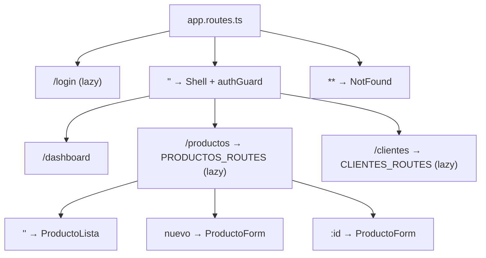
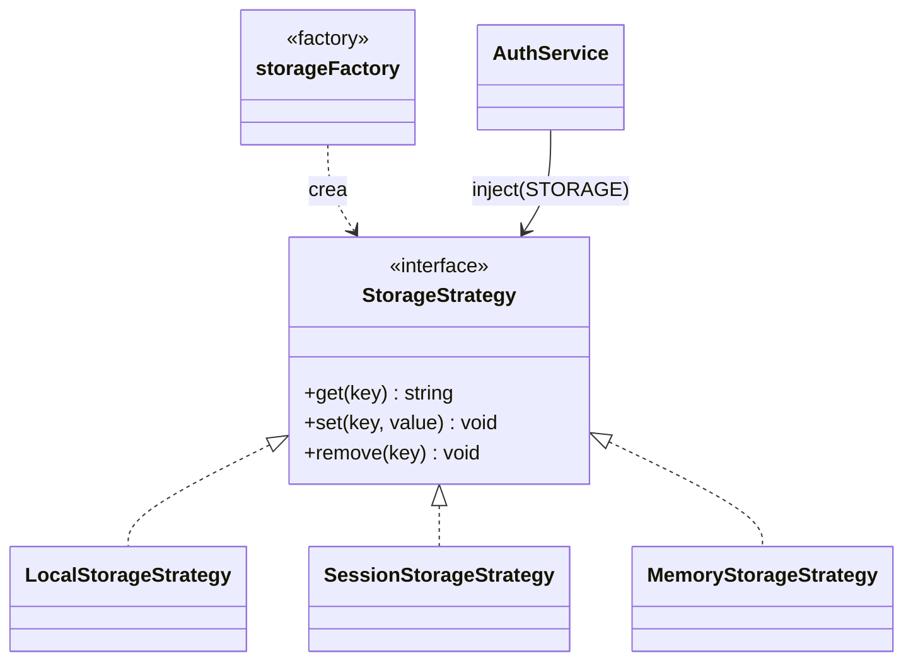
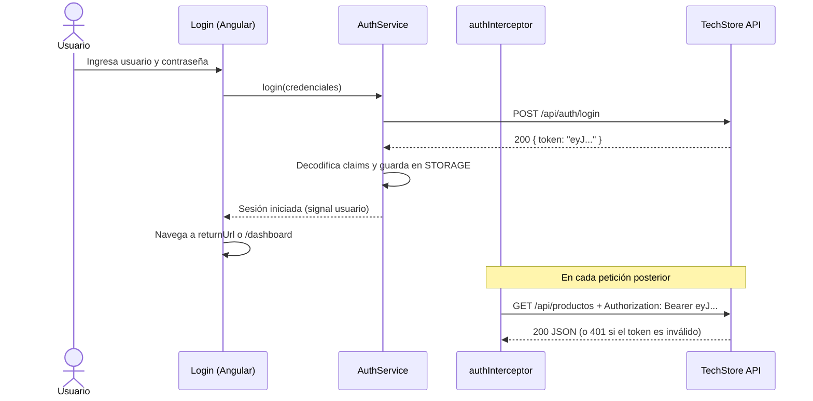
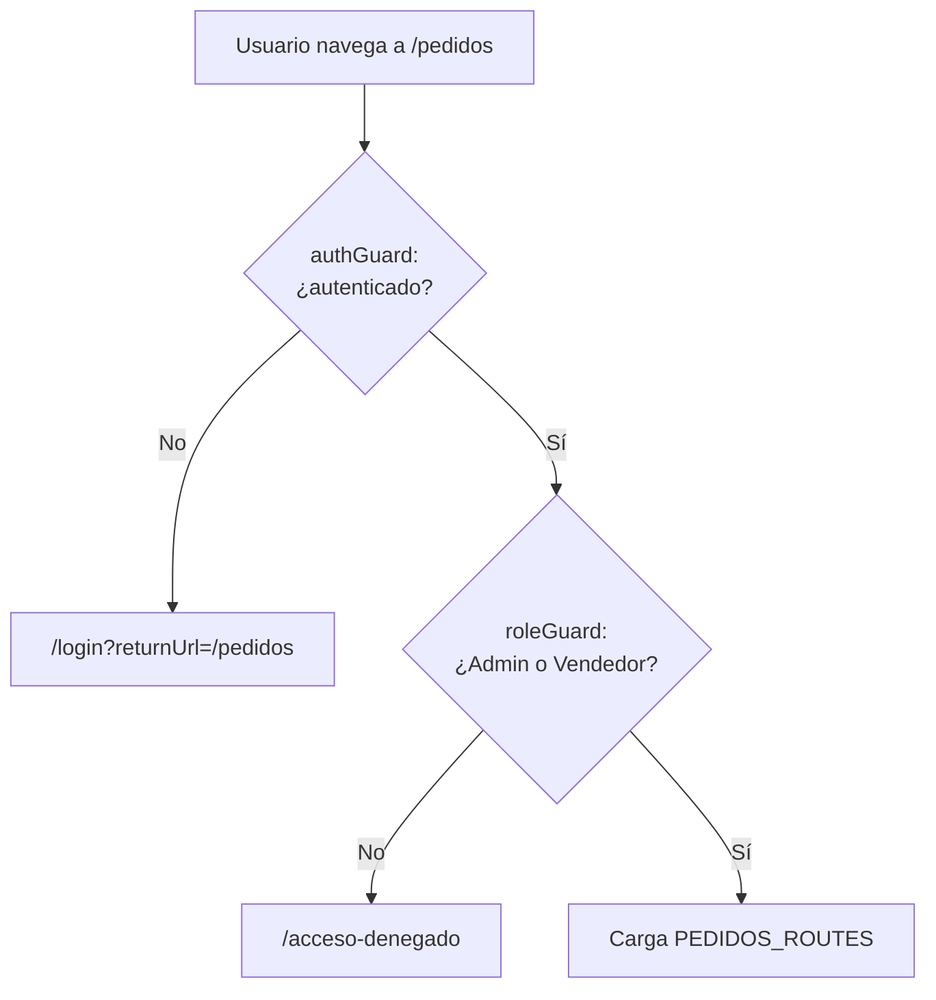

# Clase 02 · Servicios core · Autenticación y autorización

> **Especialización Full-Stack .NET 10 & Angular 21 Developer**
> Módulo 02 — Front-End: Aplicaciones con Angular 21 · Sesiones 03 y 04

| Dato del curso | Detalle |
|---|---|
| Programa | Especialización Full-Stack .NET 10 & Angular 21 Developer |
| Módulo | 02 — Front-End: Aplicaciones con Angular 21 |
| Clase | 02 (Sesión 03 + Sesión 04) |
| Fecha | 19 de setiembre de 2026 |
| Horario | 08:00 – 12:00 h (según cronograma oficial) |
| Modalidad | Virtual, vía Zoom |
| Institución | Galaxy Training — [www.galaxy.edu.pe](https://www.galaxy.edu.pe) |
| Tecnologías | Angular 21, Angular Router, HttpClient, Angular Material, JWT, RxJS |
| Proyecto del curso | **TechStore Web** consumiendo **TechStore API** (Minimal APIs .NET 10) |

| Instructor | |
|---|---|
| Nombre | Juan Carlos De La Cruz |
| Perfil | Senior Software Engineer y Technical Lead, con más de 9 años de experiencia en .NET, arquitectura de software y aplicaciones full-stack |
| Contacto | jdelacruz@galaxy.edu.pe |
| Canal técnico | YouTube: @juancarlosdelacruz481 |

**Anterior:** [Clase 01](Angular21-Clase-01-Introduccion-y-Arquitectura) · **Siguiente:** [Clase 03](Angular21-Clase-03-Listados-Busquedas-Registros-Actualizacion)

---

## Contenido

- [Objetivos de la clase](#objetivos-de-la-clase)
- [Sesión 03 · Creación de servicios core](#sesión-03--creación-de-servicios-core)
  - [3.1 Módulos: de NgModule a features standalone](#31-módulos-de-ngmodule-a-features-standalone)
  - [3.2 Rutas con lazy loading](#32-rutas-con-lazy-loading)
  - [3.3 Servicios core: ApiService](#33-servicios-core-apiservice)
  - [3.4 Patrón Factory](#34-patrón-factory)
  - [3.5 Rutas y constantes](#35-rutas-y-constantes)
  - [3.6 Plantilla del proyecto (Shell)](#36-plantilla-del-proyecto-shell)
- [Sesión 04 · Autenticación y autorización](#sesión-04--autenticación-y-autorización)
  - [4.1 GUI con Material Design](#41-gui-con-material-design)
  - [4.2 Flujo de autenticación con JWT](#42-flujo-de-autenticación-con-jwt)
  - [4.3 AuthService y login](#43-authservice-y-login)
  - [4.4 Sesiones y datos de auditoría](#44-sesiones-y-datos-de-auditoría)
  - [4.5 Autorización: guards y rutas por perfil](#45-autorización-guards-y-rutas-por-perfil)
  - [4.6 Mensajes personalizados](#46-mensajes-personalizados)
- [Laboratorio](#laboratorio)
- [Errores frecuentes](#errores-frecuentes)
- [Autoevaluación](#autoevaluación)
- [Referencias](#referencias)

---

## Objetivos de la clase

1. Organizar la aplicación en *features* cargadas bajo demanda.
2. Centralizar el acceso a la API en servicios core reutilizables.
3. Aplicar el patrón Factory con el sistema de inyección de dependencias de Angular.
4. Iniciar sesión contra TechStore API y guardar el token de forma controlada.
5. Proteger rutas según autenticación y perfil del usuario.

---

# Sesión 03 · Creación de servicios core

## 3.1 Módulos: de NgModule a features standalone

| | NgModule (legado) | Features standalone (Angular 21) |
|---|---|---|
| Declaración | `declarations`, `imports`, `exports` en un módulo | Cada componente declara sus `imports` |
| Dependencias | Implícitas: difícil saber qué usa cada componente | Explícitas y visibles en el componente |
| Rutas | `RouterModule.forChild(...)` | Un archivo `feature.routes.ts` |
| Lazy loading | `loadChildren` hacia un módulo | `loadChildren` hacia rutas o `loadComponent` |
| Situación | Sigue existiendo en proyectos antiguos | Forma recomendada y por defecto |

> En Angular 21, **"crear un módulo" significa crear una feature**: su carpeta, sus componentes, su servicio y su archivo de rutas.

Si heredas un proyecto con NgModules, la migración está asistida:

```bash
ng generate @angular/core:standalone
```

## 3.2 Rutas con lazy loading

El **Shell** envuelve todas las rutas protegidas; cada feature se descarga solo cuando el usuario navega hacia ella.

```ts
// src/app/app.routes.ts
import { Routes } from '@angular/router';
import { Shell } from './layout/shell/shell';
import { authGuard } from './core/guards/auth.guard';

export const routes: Routes = [
  {
    path: 'login',
    loadComponent: () => import('./features/auth/login').then(m => m.Login)
  },
  {
    path: '',
    component: Shell,
    canActivate: [authGuard],
    children: [
      {
        path: 'dashboard',
        loadComponent: () => import('./features/dashboard/dashboard').then(m => m.Dashboard)
      },
      {
        path: 'productos',
        loadChildren: () => import('./features/productos/productos.routes')
          .then(m => m.PRODUCTOS_ROUTES)
      },
      {
        path: 'clientes',
        loadChildren: () => import('./features/clientes/clientes.routes')
          .then(m => m.CLIENTES_ROUTES)
      },
      { path: '', redirectTo: 'dashboard', pathMatch: 'full' }
    ]
  },
  {
    path: '**',
    loadComponent: () => import('./shared/pages/not-found').then(m => m.NotFound)
  }
];
```

```ts
// src/app/features/productos/productos.routes.ts
export const PRODUCTOS_ROUTES: Routes = [
  { path: '', component: ProductoLista, title: 'Productos' },
  { path: 'nuevo', component: ProductoForm, title: 'Nuevo producto' },
  { path: ':id', component: ProductoForm, title: 'Editar producto' }
];
```

```ts
// ProductoForm recibe :id como input() gracias a withComponentInputBinding()
export class ProductoForm {
  id = input<string>();
}
```



**Beneficios del lazy loading:** el bundle inicial es más pequeño, la primera carga es más rápida y cada equipo puede trabajar en su feature sin tocar las demás.

## 3.3 Servicios core: ApiService

Toda llamada HTTP pasa por un **único punto**: URL base, desempaquetado de `ApiResponse<T>` y tipado.

```ts
// src/app/core/services/api.service.ts
import { Injectable, inject } from '@angular/core';
import { HttpClient, HttpParams } from '@angular/common/http';
import { map } from 'rxjs';
import { environment } from '../../../environments/environment';
import { ApiResponse } from '../models/api-response';

@Injectable({ providedIn: 'root' })
export class ApiService {
  private http = inject(HttpClient);
  private base = environment.apiUrl;

  get<T>(url: string, params?: HttpParams) {
    return this.http
      .get<ApiResponse<T>>(`${this.base}/${url}`, { params })
      .pipe(map(r => r.data));
  }

  post<T>(url: string, body: unknown) {
    return this.http
      .post<ApiResponse<T>>(`${this.base}/${url}`, body)
      .pipe(map(r => r.data));
  }

  put<T>(url: string, body: unknown) {
    return this.http
      .put<ApiResponse<T>>(`${this.base}/${url}`, body)
      .pipe(map(r => r.data));
  }

  delete(url: string) {
    return this.http.delete<void>(`${this.base}/${url}`);
  }
}
```

Cada feature tiene su propio servicio que **usa** `ApiService`:

```ts
// src/app/features/productos/producto.service.ts
@Injectable({ providedIn: 'root' })
export class ProductoService {
  private api = inject(ApiService);

  listar(f: ProductoFiltro) {
    const params = new HttpParams({
      fromObject: { page: f.page, pageSize: f.pageSize, search: f.search ?? '' }
    });
    return this.api.get<PagedResponse<Producto>>(API_ROUTES.productos, params);
  }

  obtener(id: number) {
    return this.api.get<Producto>(`${API_ROUTES.productos}/${id}`);
  }

  crear(dto: ProductoCrear) {
    return this.api.post<Producto>(API_ROUTES.productos, dto);
  }

  actualizar(id: number, dto: ProductoCrear) {
    return this.api.put<Producto>(`${API_ROUTES.productos}/${id}`, dto);
  }

  eliminar(id: number) {
    return this.api.delete(`${API_ROUTES.productos}/${id}`);
  }
}
```

> ⚠️ Si TechStore API no envuelve las respuestas en `ApiResponse<T>`, elimina el `map(r => r.data)` y tipa directamente el DTO. El contrato del front debe coincidir **exactamente** con el de la API.

| `providedIn: 'root'` | Significado |
|---|---|
| Instancia única | Un solo objeto en toda la aplicación (singleton) |
| Tree-shakable | Si nadie lo usa, no entra en el bundle |
| Sin registro manual | No se agrega a ningún arreglo de `providers` |

## 3.4 Patrón Factory

**Problema:** la aplicación necesita guardar el token, pero *dónde* guardarlo depende del contexto: `localStorage` si el usuario marcó "recordarme", `sessionStorage` si no, y memoria en pruebas o SSR.

**Solución:** un `InjectionToken` con `useFactory`. Los consumidores piden "un almacenamiento" y la fábrica decide cuál entregar.

```ts
// src/app/core/storage/storage.ts
export interface StorageStrategy {
  get(key: string): string | null;
  set(key: string, value: string): void;
  remove(key: string): void;
}

export class LocalStorageStrategy implements StorageStrategy {
  get = (k: string) => localStorage.getItem(k);
  set = (k: string, v: string) => localStorage.setItem(k, v);
  remove = (k: string) => localStorage.removeItem(k);
}

export class SessionStorageStrategy implements StorageStrategy {
  get = (k: string) => sessionStorage.getItem(k);
  set = (k: string, v: string) => sessionStorage.setItem(k, v);
  remove = (k: string) => sessionStorage.removeItem(k);
}

export class MemoryStorageStrategy implements StorageStrategy {
  private data = new Map<string, string>();
  get = (k: string) => this.data.get(k) ?? null;
  set = (k: string, v: string) => void this.data.set(k, v);
  remove = (k: string) => void this.data.delete(k);
}
```

```ts
// src/app/core/storage/storage.factory.ts
import { InjectionToken } from '@angular/core';
import { environment } from '../../../environments/environment';

export const STORAGE = new InjectionToken<StorageStrategy>('STORAGE');

export function storageFactory(): StorageStrategy {
  if (typeof window === 'undefined') {
    return new MemoryStorageStrategy();      // SSR o pruebas
  }
  return environment.recordarSesion
    ? new LocalStorageStrategy()
    : new SessionStorageStrategy();
}
```

```ts
// app.config.ts
providers: [
  { provide: STORAGE, useFactory: storageFactory },
  // ...
]

// Uso en cualquier servicio
private storage = inject(STORAGE);
```



> El consumidor **nunca hace `new`**: depende del contrato `StorageStrategy` y la fábrica encapsula la decisión. Es el mismo principio de inversión de dependencias que usamos en .NET.

## 3.5 Rutas y constantes

Cero "strings mágicos": rutas de la API, rutas de navegación, claves de almacenamiento y roles viven en un solo lugar tipado.

```ts
// src/app/core/constants/api.routes.ts
export const API_ROUTES = {
  auth: { login: 'auth/login', refresh: 'auth/refresh' },
  productos: 'productos',
  clientes: 'clientes',
  pedidos: 'pedidos',
  categorias: 'categorias'
} as const;

export const STORAGE_KEYS = {
  token: 'ts_token',
  usuario: 'ts_usuario'
} as const;
```

```ts
// src/app/core/constants/app.constants.ts
export const APP_ROUTES = {
  login: '/login',
  dashboard: '/dashboard',
  productos: '/productos',
  accesoDenegado: '/acceso-denegado'
} as const;

export const ROLES = {
  admin: 'Admin',
  vendedor: 'Vendedor',
  almacen: 'Almacen'
} as const;

export type Rol = typeof ROLES[keyof typeof ROLES];  // 'Admin' | 'Vendedor' | 'Almacen'
```

> `as const` convierte los valores en literales de solo lectura: el editor autocompleta y el compilador detecta errores de escritura.

## 3.6 Plantilla del proyecto (Shell)

El **Shell** es el componente padre de todas las rutas protegidas. Define la estructura visual común.

| Parte | Componente Material | Función |
|---|---|---|
| Barra superior | `mat-toolbar` | Marca, botón de menú y usuario en sesión |
| Menú lateral | `mat-sidenav` | Navegación por módulos; se oculta en móviles |
| Contenido | `<router-outlet />` | Muestra la pantalla de la ruta activa |

```html
<!-- src/app/layout/shell/shell.html -->
<mat-toolbar color="primary">
  <button mat-icon-button (click)="menu.toggle()"><mat-icon>menu</mat-icon></button>
  <span>TechStore</span>
  <span class="spacer"></span>
  <span>{{ auth.usuario()?.nombre }}</span>
  <button mat-icon-button (click)="auth.logout()"><mat-icon>logout</mat-icon></button>
</mat-toolbar>

<mat-sidenav-container class="contenedor">
  <mat-sidenav #menu mode="side" opened>
    <app-sidenav />
  </mat-sidenav>
  <mat-sidenav-content>
    <main class="contenido">
      <router-outlet />
    </main>
  </mat-sidenav-content>
</mat-sidenav-container>
```

```ts
// src/app/layout/shell/shell.ts
@Component({
  selector: 'app-shell',
  imports: [RouterOutlet, MatToolbarModule, MatSidenavModule,
            MatIconModule, MatButtonModule, Sidenav],
  templateUrl: './shell.html',
  styleUrl: './shell.scss'
})
export class Shell {
  auth = inject(AuthService);
}
```

```scss
/* shell.scss */
.contenedor { height: calc(100vh - 64px); }
.contenido  { padding: 24px; }
.spacer     { flex: 1 1 auto; }
```

---

# Sesión 04 · Autenticación y autorización

## 4.1 GUI con Material Design

| Componente | Uso en TechStore Web |
|---|---|
| Toolbar y Sidenav | Estructura del Shell |
| Form Field e Input | Campos con etiqueta flotante, *hints* y errores integrados |
| Table y Paginator | Listados con orden y paginación |
| Dialog | Formularios y confirmaciones modales |
| Snackbar | Mensajes breves de éxito, advertencia o error |
| Tema Material 3 | Colores, tipografía y densidad definidos con Sass |

```scss
/* src/styles.scss — tema Material 3 */
@use '@angular/material' as mat;

html {
  color-scheme: light;
  @include mat.theme((
    color: mat.$rose-palette,
    typography: Roboto,
    density: 0
  ));
}
```

## 4.2 Flujo de autenticación con JWT



**Estructura de un JWT:** `header.payload.signature`, cada parte en Base64URL.

| Parte | Contenido | Ejemplo |
|---|---|---|
| Header | Algoritmo y tipo | `{ "alg": "HS256", "typ": "JWT" }` |
| Payload | Claims del usuario | `{ "sub": "15", "name": "jdelacruz", "role": ["Admin"], "exp": 1790000000 }` |
| Signature | Firma con la clave secreta de la API | Garantiza que el token no fue alterado |

> 🔐 **El front solo *lee* el token para la experiencia de usuario** (mostrar el nombre, armar el menú). La seguridad real siempre la valida la API: firma, expiración y rol de cada endpoint.

## 4.3 AuthService y login

El estado de sesión es un **signal**: el menú, los guards y la barra superior reaccionan solos al iniciar o cerrar sesión.

```ts
// src/app/core/models/auth.ts
export interface LoginRequest { usuario: string; clave: string; }
export interface LoginResponse { token: string; }

export interface UsuarioSesion {
  id: string;
  nombre: string;
  roles: string[];
  expira: Date;
  ingreso: Date;
}
```

```ts
// src/app/core/services/auth.service.ts
@Injectable({ providedIn: 'root' })
export class AuthService {
  private api = inject(ApiService);
  private storage = inject(STORAGE);
  private router = inject(Router);

  private _usuario = signal<UsuarioSesion | null>(this.leerSesion());
  usuario = this._usuario.asReadonly();
  autenticado = computed(() => !!this._usuario());
  roles = computed(() => this._usuario()?.roles ?? []);

  login(cred: LoginRequest) {
    return this.api.post<LoginResponse>(API_ROUTES.auth.login, cred)
      .pipe(tap(r => this.iniciarSesion(r.token)));
  }

  logout() {
    this.storage.remove(STORAGE_KEYS.token);
    this.storage.remove(STORAGE_KEYS.usuario);
    this._usuario.set(null);
    this.router.navigateByUrl(APP_ROUTES.login);
  }

  private leerSesion(): UsuarioSesion | null {
    const raw = this.storage.get(STORAGE_KEYS.usuario);
    if (!raw) return null;
    const u = JSON.parse(raw) as UsuarioSesion;
    u.expira = new Date(u.expira);
    u.ingreso = new Date(u.ingreso);
    return u.expira > new Date() ? u : null;   // descarta sesiones vencidas
  }

  // iniciarSesion(): ver sección 4.4
}
```

```ts
// src/app/features/auth/login.ts
@Component({
  selector: 'app-login',
  imports: [ReactiveFormsModule, MatFormFieldModule, MatInputModule, MatButtonModule],
  templateUrl: './login.html'
})
export class Login {
  private fb = inject(NonNullableFormBuilder);
  private auth = inject(AuthService);
  private router = inject(Router);
  private route = inject(ActivatedRoute);
  private notify = inject(NotificationService);

  cargando = signal(false);
  form = this.fb.group({
    usuario: ['', Validators.required],
    clave: ['', Validators.required]
  });

  ingresar() {
    if (this.form.invalid) return;
    this.cargando.set(true);
    this.auth.login(this.form.getRawValue())
      .pipe(finalize(() => this.cargando.set(false)))
      .subscribe({
        next: () => {
          const returnUrl = this.route.snapshot.queryParamMap.get('returnUrl') ?? APP_ROUTES.dashboard;
          this.router.navigateByUrl(returnUrl);
        },
        error: () => this.notify.error('Usuario o contraseña incorrectos')
      });
  }
}
```

```html
<!-- src/app/features/auth/login.html -->
<form [formGroup]="form" (ngSubmit)="ingresar()" class="login">
  <h1>TechStore</h1>

  <mat-form-field appearance="outline">
    <mat-label>Usuario</mat-label>
    <input matInput formControlName="usuario" autocomplete="username" />
  </mat-form-field>

  <mat-form-field appearance="outline">
    <mat-label>Contraseña</mat-label>
    <input matInput type="password" formControlName="clave" autocomplete="current-password" />
  </mat-form-field>

  <button mat-flat-button [disabled]="form.invalid || cargando()">
    {{ cargando() ? 'Ingresando…' : 'Ingresar' }}
  </button>
</form>
```

## 4.4 Sesiones y datos de auditoría

```ts
// Dentro de AuthService
private iniciarSesion(token: string) {
  // La parte central del JWT es Base64URL
  const payload = JSON.parse(atob(
    token.split('.')[1].replace(/-/g, '+').replace(/_/g, '/')
  ));

  const usuario: UsuarioSesion = {
    id: payload.sub,
    nombre: payload.name,
    roles: ([] as string[]).concat(payload.role ?? []),  // role puede ser string o arreglo
    expira: new Date(payload.exp * 1000),                  // exp está en segundos
    ingreso: new Date()                                    // dato de auditoría
  };

  this.storage.set(STORAGE_KEYS.token, token);
  this.storage.set(STORAGE_KEYS.usuario, JSON.stringify(usuario));
  this._usuario.set(usuario);
}
```

| Dato | Uso |
|---|---|
| `id` (`sub`) | Identificar al usuario en peticiones y logs |
| `nombre` (`name`) | Mostrarlo en la barra superior |
| `roles` (`role`) | Armar el menú y evaluar guards |
| `expira` (`exp`) | Cerrar la sesión automáticamente (Clase 04) |
| `ingreso` | Auditoría: cuándo inició la sesión |

> ⚠️ **Nombres de claims:** si la API usa los nombres largos de .NET (`http://schemas.microsoft.com/ws/2008/06/identity/claims/role`), mapea esa clave o configura la API para emitir `role` y `name`. Coordínalo con el Módulo 01.

> 🔐 **Seguridad:** `localStorage` y `sessionStorage` son accesibles desde JavaScript; protege la app contra XSS (Angular sanitiza las plantillas por defecto) y usa tokens de vida corta. Para escenarios de alta seguridad, evalúa cookies `HttpOnly` emitidas por la API.

## 4.5 Autorización: guards y rutas por perfil

```ts
// src/app/core/guards/auth.guard.ts
export const authGuard: CanActivateFn = (_route, state) => {
  const auth = inject(AuthService);
  const router = inject(Router);

  return auth.autenticado()
    ? true
    : router.createUrlTree([APP_ROUTES.login], { queryParams: { returnUrl: state.url } });
};
```

```ts
// src/app/core/guards/role.guard.ts
export const roleGuard: CanActivateFn = route => {
  const auth = inject(AuthService);
  const router = inject(Router);
  const permitidos = (route.data['roles'] ?? []) as Rol[];

  return permitidos.some(r => auth.roles().includes(r))
    ? true
    : router.createUrlTree([APP_ROUTES.accesoDenegado]);
};
```

> ⚠️ `inject()` solo funciona en un **contexto de inyección**. Llámalo al inicio del guard, nunca dentro de un callback como `.some(...)`.

```ts
// app.routes.ts (fragmento dentro de children del Shell)
{
  path: 'usuarios',
  canActivate: [roleGuard],
  data: { roles: [ROLES.admin] },
  loadChildren: () => import('./features/usuarios/usuarios.routes').then(m => m.USUARIOS_ROUTES)
},
{
  path: 'pedidos',
  canActivate: [roleGuard],
  data: { roles: [ROLES.admin, ROLES.vendedor] },
  loadChildren: () => import('./features/pedidos/pedidos.routes').then(m => m.PEDIDOS_ROUTES)
}
```

| Tipo de guard | Pregunta que responde |
|---|---|
| `CanActivateFn` | ¿Puede entrar a esta ruta? |
| `CanActivateChildFn` | ¿Puede entrar a las rutas hijas? |
| `CanMatchFn` | ¿Esta ruta aplica? (evita incluso descargar el código lazy) |
| `CanDeactivateFn` | ¿Puede salir? (formularios con cambios sin guardar) |



## 4.6 Mensajes personalizados

```ts
// src/app/core/services/notification.service.ts
@Injectable({ providedIn: 'root' })
export class NotificationService {
  private snack = inject(MatSnackBar);

  exito(msg: string)       { this.abrir(msg, 'snack-exito'); }
  info(msg: string)        { this.abrir(msg, 'snack-info'); }
  advertencia(msg: string) { this.abrir(msg, 'snack-warn', 5000); }
  error(msg: string)       { this.abrir(msg, 'snack-error', 0); }  // hasta que el usuario cierre

  private abrir(msg: string, clase: string, duracion = 3500) {
    this.snack.open(msg, 'Cerrar', {
      duration: duracion || undefined,
      panelClass: [clase],
      horizontalPosition: 'right',
      verticalPosition: 'top'
    });
  }
}
```

```scss
/* styles.scss */
.snack-exito { --mat-snack-bar-container-color: #15803d; }
.snack-info  { --mat-snack-bar-container-color: #0369a1; }
.snack-warn  { --mat-snack-bar-container-color: #b45309; }
.snack-error { --mat-snack-bar-container-color: #b91c1c; }
```

| Buenas prácticas de mensajes |
|---|
| Lenguaje del usuario, no del programador: "No se pudo guardar el producto", no "HttpErrorResponse 500". |
| Los errores permanecen visibles hasta que el usuario los cierra. |
| Un solo servicio: mismo estilo, posición y duración en toda la app. |

---

## Laboratorio

1. Crear las features `productos`, `clientes` y `pedidos` con sus archivos de rutas lazy.
2. Implementar `ApiService`, el token `STORAGE` con su fábrica y las constantes.
3. Construir el Shell con toolbar, sidenav y `router-outlet`.
4. Implementar el login contra `POST /api/auth/login` de TechStore API.
5. Proteger rutas con `authGuard` y `roleGuard`, y crear la página `/acceso-denegado`.

**Criterios de aceptación**

- [ ] En la pestaña *Network* se ve que `productos` se descarga solo al navegar a esa ruta.
- [ ] Tras el login, el nombre del usuario aparece en la barra superior.
- [ ] Un usuario `Vendedor` que escribe `/usuarios` en la URL es redirigido a `/acceso-denegado`.
- [ ] Al recargar la página con sesión vigente, el usuario sigue autenticado.

## Errores frecuentes

| Error | Causa | Solución |
|---|---|---|
| `NG0203: inject() must be called from an injection context` | `inject()` dentro de un callback | Llamarlo al inicio del guard, interceptor o como campo de clase |
| CORS bloquea el login | La API no permite el origen `http://localhost:4200` | Configurar la política CORS en TechStore API |
| `NullInjectorError: No provider for InjectionToken STORAGE` | Falta registrar la fábrica | Agregar `{ provide: STORAGE, useFactory: storageFactory }` en `app.config.ts` |
| Los roles llegan vacíos | Nombre de claim distinto al esperado | Revisar el payload en jwt.io y mapear la clave correcta |
| Bucle de redirecciones | `/login` protegido por `authGuard` | La ruta de login debe quedar fuera del Shell |

## Autoevaluación

1. ¿Qué ventaja tiene `loadChildren` frente a importar el componente directamente?
2. ¿Por qué `ApiService` usa `providedIn: 'root'`?
3. ¿Qué problema resuelve el patrón Factory en el almacenamiento del token?
4. ¿Por qué el front no debe validar la firma del JWT?
5. ¿Qué diferencia hay entre `authGuard` y `roleGuard`?

<details>
<summary>Ver respuestas</summary>

1. El código de la feature se descarga solo cuando el usuario navega a ella: bundle inicial más pequeño.
2. Para tener una única instancia en toda la app y que sea *tree-shakable*.
3. Permite elegir `localStorage`, `sessionStorage` o memoria según el contexto sin que los consumidores lo sepan.
4. Porque la clave secreta vive solo en la API; además, cualquier validación en el navegador puede ser manipulada.
5. `authGuard` exige una sesión; `roleGuard` exige además que el usuario tenga uno de los roles definidos en la ruta.

</details>

## Referencias

- Routing y lazy loading: <https://angular.dev/guide/routing>
- Inyección de dependencias: <https://angular.dev/guide/di>
- HttpClient: <https://angular.dev/guide/http>
- Angular Material: <https://material.angular.dev>
- Estructura de JWT: <https://jwt.io/introduction>

---

**Anterior:** [Clase 01](Angular21-Clase-01-Introduccion-y-Arquitectura) · **Siguiente:** [Clase 03](Angular21-Clase-03-Listados-Busquedas-Registros-Actualizacion)

*Material elaborado por Juan Carlos De La Cruz para Galaxy Training · Especialización Full-Stack .NET 10 & Angular 21 Developer.*
