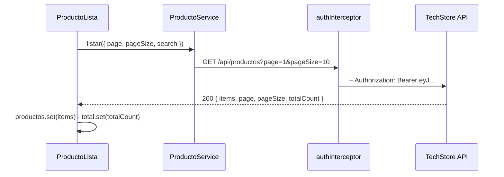
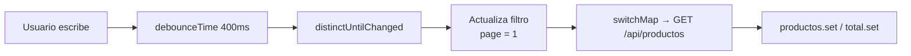
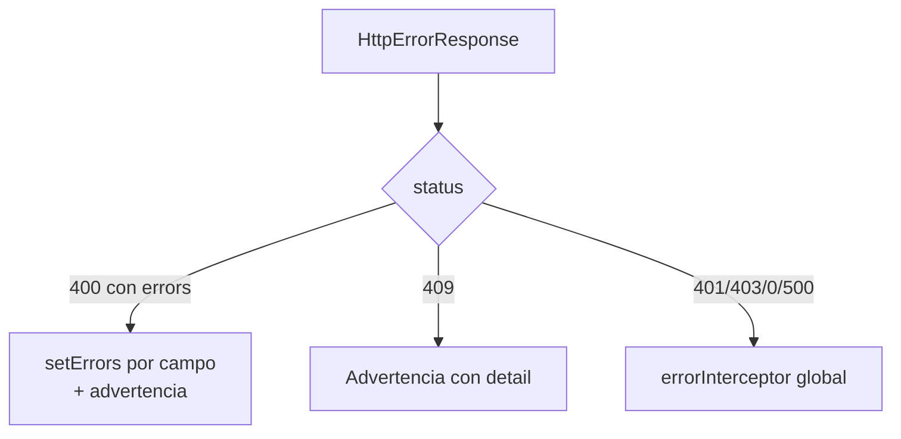

# Clase 03 · Listados y búsquedas · Registros y actualización

> **Especialización Full-Stack .NET 10 & Angular 21 Developer**
> Módulo 02 — Front-End: Aplicaciones con Angular 21 · Sesiones 05 y 06

| Dato del curso | Detalle |
|---|---|
| Programa | Especialización Full-Stack .NET 10 & Angular 21 Developer |
| Módulo | 02 — Front-End: Aplicaciones con Angular 21 |
| Clase | 03 (Sesión 05 + Sesión 06) |
| Fecha | 26 de setiembre de 2026 |
| Horario | 08:00 – 12:00 h (según cronograma oficial) |
| Modalidad | Virtual, vía Zoom |
| Institución | Galaxy Training — [www.galaxy.edu.pe](https://www.galaxy.edu.pe) |
| Tecnologías | Angular 21, HttpClient, RxJS, Reactive Forms, Angular Material (Table, Paginator, Dialog, Form Field) |
| Proyecto del curso | **TechStore Web** consumiendo **TechStore API** (Minimal APIs .NET 10) |

| Instructor | |
|---|---|
| Nombre | Juan Carlos De La Cruz |
| Perfil | Senior Software Engineer y Technical Lead, con más de 9 años de experiencia en .NET, arquitectura de software y aplicaciones full-stack |
| Contacto | jdelacruz@galaxy.edu.pe |
| Canal técnico | YouTube: @juancarlosdelacruz481 |

**Anterior:** [Clase 02](Angular21-Clase-02-Servicios-Core-y-Autenticacion) · **Siguiente:** [Clase 04](Angular21-Clase-04-Accesos-Excepciones-y-Despliegue)

---

## Contenido

- [Objetivos de la clase](#objetivos-de-la-clase)
- [Contrato con TechStore API](#contrato-con-techstore-api)
- [Sesión 05 · Implementando listados y búsquedas](#sesión-05--implementando-listados-y-búsquedas)
  - [5.1 GUI del listado con Material Design](#51-gui-del-listado-con-material-design)
  - [5.2 GET con token desde el componente](#52-get-con-token-desde-el-componente)
  - [5.3 Búsqueda reactiva](#53-búsqueda-reactiva)
  - [5.4 Paginación en el servidor](#54-paginación-en-el-servidor)
  - [5.5 DELETE con confirmación](#55-delete-con-confirmación)
  - [5.6 Mensajes según la respuesta de la API](#56-mensajes-según-la-respuesta-de-la-api)
- [Sesión 06 · Implementando registros y actualización](#sesión-06--implementando-registros-y-actualización)
  - [6.1 Buenas prácticas para formularios](#61-buenas-prácticas-para-formularios)
  - [6.2 Formulario reactivo tipado](#62-formulario-reactivo-tipado)
  - [6.3 POST y PUT con token](#63-post-y-put-con-token)
  - [6.4 Errores del servidor en el campo correcto](#64-errores-del-servidor-en-el-campo-correcto)
  - [6.5 Validadores personalizados](#65-validadores-personalizados)
  - [6.6 Extensión: pedido maestro-detalle con FormArray](#66-extensión-pedido-maestro-detalle-con-formarray)
- [Laboratorio](#laboratorio)
- [Errores frecuentes](#errores-frecuentes)
- [Autoevaluación](#autoevaluación)
- [Referencias](#referencias)

---

## Objetivos de la clase

1. Construir listados paginados y con búsqueda sobre la API.
2. Eliminar registros con confirmación y retroalimentación al usuario.
3. Registrar y actualizar datos con formularios reactivos tipados.
4. Mostrar los errores de validación del servidor en el campo que los causó.

## Contrato con TechStore API

Endpoints de productos que consume esta clase (todos requieren `Authorization: Bearer <token>`, que agrega el interceptor):

| Método | Endpoint | Uso | Respuesta esperada |
|---|---|---|---|
| `GET` | `/api/productos?page=1&pageSize=10&search=lap` | Listado paginado con búsqueda | `200` + `PagedResponse<Producto>` |
| `GET` | `/api/productos/{id}` | Obtener uno para editar | `200` / `404` |
| `POST` | `/api/productos` | Registrar | `201` / `400` / `409` |
| `PUT` | `/api/productos/{id}` | Actualizar | `200` o `204` / `400` / `404` |
| `DELETE` | `/api/productos/{id}` | Eliminar | `204` / `404` / `409` |



---

# Sesión 05 · Implementando listados y búsquedas

## 5.1 GUI del listado con Material Design

| Elemento | Componente | Comportamiento |
|---|---|---|
| Búsqueda | `mat-form-field` + `input` | Filtra mientras se escribe (debounce de 400 ms) |
| Tabla | `mat-table` | Columnas nombre, categoría, precio, stock y acciones |
| Paginador | `mat-paginator` | Página y tamaño; la API devuelve el total real |
| Acciones | `mat-icon-button` | Editar (navega al formulario) y eliminar (con confirmación) |
| Carga | `mat-progress-bar` | Visible mientras la petición está en curso |

## 5.2 GET con token desde el componente

El token viaja solo gracias al `authInterceptor`: ni el servicio ni el componente lo manejan.

```ts
// src/app/features/productos/producto-lista.ts
@Component({
  selector: 'app-producto-lista',
  imports: [ReactiveFormsModule, CurrencyPipe, RouterLink,
            MatTableModule, MatPaginatorModule, MatFormFieldModule,
            MatInputModule, MatIconModule, MatButtonModule, MatProgressBarModule],
  templateUrl: './producto-lista.html'
})
export class ProductoLista {
  private service = inject(ProductoService);
  private destroyRef = inject(DestroyRef);

  productos = signal<Producto[]>([]);
  total = signal(0);
  cargando = signal(false);
  filtro = signal<ProductoFiltro>({ page: 1, pageSize: 10, search: '' });

  columnas = ['nombre', 'categoria', 'precio', 'stock', 'acciones'];

  constructor() {
    this.cargar();
  }

  cargar() {
    this.cargando.set(true);
    this.service.listar(this.filtro())
      .pipe(
        takeUntilDestroyed(this.destroyRef),
        finalize(() => this.cargando.set(false))
      )
      .subscribe(r => {
        this.productos.set(r.items);
        this.total.set(r.totalCount);
      });
  }
}
```

| Técnica | Por qué |
|---|---|
| Estado en signals | La plantilla lee `productos()`, `total()` y `cargando()` directamente |
| Filtro como un solo objeto | Página, tamaño y búsqueda viajan juntos a la API |
| `finalize` | Apaga el indicador de carga tanto en éxito como en error |
| `takeUntilDestroyed` | Cancela la petición si el usuario sale de la pantalla |

> **Alternativa moderna:** Angular ofrece `httpResource()` para declarar lecturas HTTP reactivas a signals. Revisa su estado de estabilidad en angular.dev antes de adoptarlo; en el curso usamos el patrón con `HttpClient`, que es estable y explícito.

## 5.3 Búsqueda reactiva

Sin *debounce*, escribir "laptop" dispararía **6 peticiones**. Con él, solo **una**.

```ts
// producto-lista.ts (búsqueda)
busqueda = new FormControl('', { nonNullable: true });

constructor() {
  this.busqueda.valueChanges.pipe(
    debounceTime(400),                  // espera a que el usuario deje de escribir
    map(t => t.trim()),
    distinctUntilChanged(),             // ignora si el texto no cambió
    tap(search => this.filtro.update(f => ({ ...f, page: 1, search }))),
    switchMap(() => this.service.listar(this.filtro())),  // cancela la búsqueda anterior
    takeUntilDestroyed()
  ).subscribe(r => {
    this.productos.set(r.items);
    this.total.set(r.totalCount);
  });

  this.cargar();
}
```

```html
<mat-form-field appearance="outline" class="busqueda">
  <mat-label>Buscar producto</mat-label>
  <mat-icon matPrefix>search</mat-icon>
  <input matInput [formControl]="busqueda" placeholder="Nombre o categoría" />
</mat-form-field>

@if (cargando()) {
  <mat-progress-bar mode="indeterminate" />
}
```

| Operador | Función en la búsqueda |
|---|---|
| `debounceTime(400)` | Emite solo cuando pasan 400 ms sin escribir |
| `distinctUntilChanged()` | Evita repetir la misma búsqueda |
| `switchMap()` | Cancela la petición anterior si llega una nueva: evita resultados desordenados |
| `takeUntilDestroyed()` | Libera la suscripción al destruir el componente |



## 5.4 Paginación en el servidor

La API devuelve `PagedResponse<T>`: la tabla muestra una página y el paginador conoce el **total real**.

```html
<!-- producto-lista.html -->
<table mat-table [dataSource]="productos()" class="mat-elevation-z1">

  <ng-container matColumnDef="nombre">
    <th mat-header-cell *matHeaderCellDef>Nombre</th>
    <td mat-cell *matCellDef="let p">{{ p.nombre }}</td>
  </ng-container>

  <ng-container matColumnDef="categoria">
    <th mat-header-cell *matHeaderCellDef>Categoría</th>
    <td mat-cell *matCellDef="let p">{{ p.categoria }}</td>
  </ng-container>

  <ng-container matColumnDef="precio">
    <th mat-header-cell *matHeaderCellDef>Precio</th>
    <td mat-cell *matCellDef="let p">{{ p.precio | currency:'PEN' }}</td>
  </ng-container>

  <ng-container matColumnDef="stock">
    <th mat-header-cell *matHeaderCellDef>Stock</th>
    <td mat-cell *matCellDef="let p">{{ p.stock }}</td>
  </ng-container>

  <ng-container matColumnDef="acciones">
    <th mat-header-cell *matHeaderCellDef></th>
    <td mat-cell *matCellDef="let p">
      <a mat-icon-button [routerLink]="[p.id]"><mat-icon>edit</mat-icon></a>
      <button mat-icon-button (click)="eliminar(p)"><mat-icon>delete</mat-icon></button>
    </td>
  </ng-container>

  <tr mat-header-row *matHeaderRowDef="columnas"></tr>
  <tr mat-row *matRowDef="let row; columns: columnas"></tr>

  <tr class="mat-row" *matNoDataRow>
    <td class="mat-cell" [attr.colspan]="columnas.length">No se encontraron productos.</td>
  </tr>
</table>

<mat-paginator
  [length]="total()"
  [pageIndex]="filtro().page - 1"
  [pageSize]="filtro().pageSize"
  [pageSizeOptions]="[5, 10, 25]"
  (page)="cambiarPagina($event)" />
```

```ts
cambiarPagina(e: PageEvent) {
  this.filtro.update(f => ({
    ...f,
    page: e.pageIndex + 1,   // mat-paginator empieza en 0; la API en 1
    pageSize: e.pageSize
  }));
  this.cargar();
}
// Petición resultante: GET /api/productos?page=2&pageSize=10&search=lap
```

| Paginación en cliente | Paginación en servidor |
|---|---|
| Se descargan todos los registros | Se descarga solo una página |
| Sencilla para pocos datos | Obligatoria con miles de registros |
| `MatTableDataSource` + `paginator` | Parámetros `page` y `pageSize` a la API |

## 5.5 DELETE con confirmación

Diálogo reutilizable en `shared/`:

```ts
// src/app/shared/components/confirm-dialog/confirm-dialog.ts
export interface ConfirmData { titulo: string; mensaje: string; }

@Component({
  selector: 'app-confirm-dialog',
  imports: [MatDialogModule, MatButtonModule],
  template: `
    <h2 mat-dialog-title>{{ data.titulo }}</h2>
    <mat-dialog-content>{{ data.mensaje }}</mat-dialog-content>
    <mat-dialog-actions align="end">
      <button mat-button [mat-dialog-close]="false">Cancelar</button>
      <button mat-flat-button [mat-dialog-close]="true">Confirmar</button>
    </mat-dialog-actions>`
})
export class ConfirmDialog {
  data = inject<ConfirmData>(MAT_DIALOG_DATA);
}
```

```ts
// producto-lista.ts (eliminar)
private dialog = inject(MatDialog);
private notify = inject(NotificationService);

eliminar(p: Producto) {
  this.dialog.open(ConfirmDialog, {
    data: { titulo: 'Eliminar producto', mensaje: `¿Eliminar "${p.nombre}"?` }
  }).afterClosed().pipe(
    filter(Boolean),                               // continúa solo si confirmó
    switchMap(() => this.service.eliminar(p.id))
  ).subscribe(() => {
    this.notify.exito('Producto eliminado');
    this.cargar();                                  // mantiene el total correcto
  });
}
```

> Si se elimina el último elemento de una página, conviene retroceder una página antes de recargar para no mostrar una tabla vacía.

## 5.6 Mensajes según la respuesta de la API

| Código HTTP | Significado | Mensaje sugerido | Tipo |
|---|---|---|---|
| `200` / `201` | Consulta o registro correcto | "Producto registrado correctamente" | Éxito |
| `204` | Eliminado sin contenido | "Producto eliminado" | Éxito |
| `400` | Datos inválidos | Errores junto a cada campo del formulario | Advertencia |
| `401` | Token ausente o expirado | "Tu sesión expiró, vuelve a ingresar" | Error + login |
| `403` | Sin permiso para la acción | "No tienes permisos para esta opción" | Error |
| `404` | Recurso inexistente | "El producto ya no existe" | Advertencia |
| `409` | Conflicto de negocio | "Ya existe un producto con ese nombre" | Advertencia |
| `500` / `0` | Error del servidor o sin conexión | "Ocurrió un problema, intenta más tarde" | Error |

> Los códigos `401`, `403`, `0` y `500` se centralizan en el `errorInterceptor` (Clase 04). Los `400` y `409` se resuelven en cada formulario porque dependen del contexto.

---

# Sesión 06 · Implementando registros y actualización

## 6.1 Buenas prácticas para formularios

| Práctica | Detalle |
|---|---|
| Campos claros | `appearance="outline"`, etiqueta visible y *hint* con el formato esperado |
| Errores en su lugar | `mat-error` debajo de cada campo, en lenguaje del usuario |
| Controles adecuados | `mat-select` para categorías, `mat-datepicker` para fechas, `type="number"` para precios |
| Diálogo o página | Diálogo para entidades simples; página completa para pedidos (maestro-detalle) |
| Estado de envío | Botón deshabilitado e indicador mientras se guarda: evita dobles registros |
| Accesibilidad | Orden de tabulación lógico, `label` asociado y contraste suficiente |

## 6.2 Formulario reactivo tipado

Un solo componente sirve para **crear y editar**: si la ruta trae un `:id`, carga el producto y cambia a modo edición.

```ts
// src/app/features/productos/producto-form.ts
@Component({
  selector: 'app-producto-form',
  imports: [ReactiveFormsModule, MatFormFieldModule, MatInputModule,
            MatSelectModule, MatButtonModule],
  templateUrl: './producto-form.html'
})
export class ProductoForm {
  private fb = inject(NonNullableFormBuilder);
  private service = inject(ProductoService);
  private notify = inject(NotificationService);
  private router = inject(Router);

  id = input<string>();                         // desde la ruta :id
  esEdicion = computed(() => !!this.id());
  guardando = signal(false);
  categorias = signal<Categoria[]>([]);

  form = this.fb.group({
    nombre: ['', [Validators.required, Validators.maxLength(150)]],
    categoriaId: [0, [Validators.min(1)]],
    precio: [0, [Validators.required, Validators.min(0.1)]],
    stock: [0, [Validators.min(0)]]
  });
}
```

```html
<!-- producto-form.html -->
<h2>{{ esEdicion() ? 'Editar producto' : 'Nuevo producto' }}</h2>

<form [formGroup]="form" (ngSubmit)="guardar()" class="formulario">
  <mat-form-field appearance="outline">
    <mat-label>Nombre</mat-label>
    <input matInput formControlName="nombre" />
    @if (form.controls.nombre.hasError('required')) {
      <mat-error>El nombre es obligatorio</mat-error>
    }
    @if (form.controls.nombre.hasError('server')) {
      <mat-error>{{ form.controls.nombre.getError('server') }}</mat-error>
    }
  </mat-form-field>

  <mat-form-field appearance="outline">
    <mat-label>Categoría</mat-label>
    <mat-select formControlName="categoriaId">
      @for (c of categorias(); track c.id) {
        <mat-option [value]="c.id">{{ c.nombre }}</mat-option>
      }
    </mat-select>
  </mat-form-field>

  <mat-form-field appearance="outline">
    <mat-label>Precio (S/)</mat-label>
    <input matInput type="number" formControlName="precio" />
    <mat-hint>Incluye IGV</mat-hint>
  </mat-form-field>

  <mat-form-field appearance="outline">
    <mat-label>Stock</mat-label>
    <input matInput type="number" formControlName="stock" />
  </mat-form-field>

  <button mat-flat-button [disabled]="form.invalid || guardando()">
    {{ esEdicion() ? 'Actualizar' : 'Registrar' }}
  </button>
</form>
```

| Validador integrado | Uso |
|---|---|
| `Validators.required` | Campo obligatorio |
| `Validators.min` / `max` | Rangos numéricos |
| `Validators.minLength` / `maxLength` | Longitud de texto |
| `Validators.email` | Formato de correo |
| `Validators.pattern` | Expresión regular |

> `NonNullableFormBuilder` hace que `getRawValue()` devuelva tipos sin `null`, alineados con el DTO de la API.

## 6.3 POST y PUT con token

```ts
// producto-form.ts (continuación)
constructor() {
  effect(() => {
    const id = this.id();
    if (id) {
      this.service.obtener(+id).subscribe(p => this.form.patchValue(p));
    }
  });
}

guardar() {
  if (this.form.invalid) {
    this.form.markAllAsTouched();
    return;
  }
  this.guardando.set(true);
  const dto = this.form.getRawValue();

  const peticion = this.esEdicion()
    ? this.service.actualizar(+this.id()!, dto)   // PUT /api/productos/{id}
    : this.service.crear(dto);                     // POST /api/productos

  peticion.pipe(finalize(() => this.guardando.set(false)))
    .subscribe({
      next: () => {
        this.notify.exito(this.esEdicion() ? 'Producto actualizado' : 'Producto registrado');
        this.router.navigateByUrl(APP_ROUTES.productos);
      },
      error: (e: HttpErrorResponse) => this.mostrarErrores(e)
    });
}
```

| Método | Idempotente | Cuándo |
|---|---|---|
| `POST` | No | Crear un recurso nuevo; la API asigna el id |
| `PUT` | Sí | Reemplazar un recurso existente identificado por id |
| `PATCH` | Depende | Modificar solo algunos campos |

## 6.4 Errores del servidor en el campo correcto

Las Minimal APIs responden `400` con **ValidationProblemDetails** (RFC 7807):

```json
{
  "type": "https://tools.ietf.org/html/rfc9110#section-15.5.1",
  "title": "One or more validation errors occurred.",
  "status": 400,
  "errors": {
    "Nombre": ["Ya existe un producto con ese nombre."],
    "Precio": ["El precio debe ser mayor a cero."]
  }
}
```

```ts
private mostrarErrores(e: HttpErrorResponse) {
  if (e.status === 400 && e.error?.errors) {
    for (const [campo, mensajes] of Object.entries<string[]>(e.error.errors)) {
      const key = campo.charAt(0).toLowerCase() + campo.slice(1);   // "Nombre" → "nombre"
      const control = this.form.get(key);
      control?.setErrors({ server: mensajes[0] });
      control?.markAsTouched();
    }
    this.notify.advertencia('Revisa los campos marcados');
    return;
  }
  if (e.status === 409) {
    this.notify.advertencia(e.error?.detail ?? 'El registro ya existe');
  }
  // 401, 403, 404, 500 y 0: los maneja el errorInterceptor (Clase 04)
}
```



## 6.5 Validadores personalizados

**Síncrono — documento peruano (DNI de 8 dígitos o RUC de 11 que empieza con 10 o 20):**

```ts
// src/app/shared/validators/documento.validator.ts
export const documentoValido: ValidatorFn = control => {
  const v = String(control.value ?? '');
  const dni = /^\d{8}$/.test(v);
  const ruc = /^(10|20)\d{9}$/.test(v);
  return dni || ruc ? null : { documento: true };
};
```

**Asíncrono — email único consultando a la API:**

```ts
// src/app/shared/validators/email-unico.validator.ts
export function emailUnico(api: ClienteService): AsyncValidatorFn {
  return control => timer(400).pipe(                 // debounce: espera 400 ms
    switchMap(() => api.existeEmail(control.value)),
    map(existe => (existe ? { emailUsado: true } : null)),
    catchError(() => of(null))                        // si falla la API, no bloquea
  );
}
```

```ts
// Uso en el formulario de clientes
form = this.fb.group({
  documento: ['', [Validators.required, documentoValido]],
  nombres: ['', Validators.required],
  email: ['', [Validators.email], [emailUnico(inject(ClienteService))]]
}, { updateOn: 'blur' });
```

```html
@if (form.controls.documento.hasError('documento')) {
  <mat-error>Ingresa un DNI (8 dígitos) o un RUC válido (11 dígitos)</mat-error>
}
@if (form.controls.email.hasError('emailUsado')) {
  <mat-error>Este correo ya está registrado</mat-error>
}
@if (form.controls.email.pending) {
  <mat-hint>Verificando…</mat-hint>
}
```

> La validación en el front mejora la experiencia; la validación en la API protege los datos. **Siempre se necesitan ambas.**

## 6.6 Extensión: pedido maestro-detalle con FormArray

El registro de pedidos de TechStore es maestro-detalle: una cabecera con varias líneas.

```ts
// src/app/features/pedidos/pedido-form.ts
export class PedidoForm {
  private fb = inject(NonNullableFormBuilder);

  form = this.fb.group({
    clienteId: [0, Validators.min(1)],
    detalles: this.fb.array<FormGroup>([], Validators.minLength(1))
  });

  get detalles() { return this.form.controls.detalles; }

  agregarLinea(p: Producto) {
    this.detalles.push(this.fb.group({
      productoId: [p.id],
      producto: [p.nombre],
      cantidad: [1, [Validators.required, Validators.min(1)]],
      precioUnitario: [p.precio]
    }));
  }

  quitarLinea(i: number) { this.detalles.removeAt(i); }

  total() {
    return this.detalles.getRawValue()
      .reduce((s: number, d: any) => s + d.cantidad * d.precioUnitario, 0);
  }
}
```

```html
<div formArrayName="detalles">
  @for (linea of detalles.controls; track $index; let i = $index) {
    <div [formGroupName]="i" class="linea">
      <span>{{ linea.value.producto }}</span>
      <input matInput type="number" formControlName="cantidad" />
      <span>{{ linea.value.precioUnitario | currency:'PEN' }}</span>
      <button mat-icon-button type="button" (click)="quitarLinea(i)">
        <mat-icon>delete</mat-icon>
      </button>
    </div>
  }
</div>
<strong>Total: {{ total() | currency:'PEN' }}</strong>
```

> El total mostrado en el front es informativo. El **total oficial lo calcula la API** dentro de su transacción (Módulo 01, Sesión 07).

---

## Laboratorio

1. Completar listado, búsqueda y paginación de **Clientes** siguiendo el patrón de Productos.
2. Implementar el formulario de **Productos** en modo registro y edición.
3. Agregar `documentoValido` y `emailUnico` al formulario de Clientes.
4. Mostrar en los campos los errores `400` devueltos por la API.
5. (Reto) Implementar el registro de **Pedidos** con `FormArray`.

**Criterios de aceptación**

- [ ] Escribir en la búsqueda genera una sola petición por término (verificar en *Network*).
- [ ] El paginador muestra el total real de registros de la API.
- [ ] Eliminar pide confirmación y muestra un mensaje de éxito.
- [ ] Un nombre duplicado muestra el error debajo del campo "Nombre".
- [ ] El botón de guardar se deshabilita mientras la petición está en curso.

## Errores frecuentes

| Error | Causa | Solución |
|---|---|---|
| La tabla no se actualiza | Se mutó el arreglo | `productos.set(nuevos)` en lugar de `push` |
| Página 2 muestra los mismos datos que la 1 | Desfase `pageIndex` (0) vs. `page` (1) | Sumar 1 al enviar a la API |
| Búsquedas con resultados desordenados | Se usó `mergeMap` | Usar `switchMap` |
| `setErrors` no muestra el mensaje | Falta `mat-error` para `server` o el campo no está *touched* | Agregar el `@if` y `markAsTouched()` |
| Validador asíncrono llama a la API en cada tecla | Sin debounce | `timer(400)` o `updateOn: 'blur'` |

## Autoevaluación

1. ¿Por qué `switchMap` y no `mergeMap` en la búsqueda?
2. ¿Qué ventaja tiene la paginación en servidor?
3. ¿Cómo sabe el formulario si está en modo edición?
4. ¿Cómo se relaciona `ValidationProblemDetails` con los controles del formulario?
5. ¿Por qué el validador asíncrono tiene `catchError(() => of(null))`?

<details>
<summary>Ver respuestas</summary>

1. `switchMap` cancela la petición anterior; `mergeMap` las deja correr en paralelo y una respuesta vieja podría pisar a la nueva.
2. Solo viaja una página de datos: menos memoria, menos red y tiempos de respuesta estables con miles de registros.
3. Por el `input()` `id`, que llega desde el parámetro `:id` de la ruta gracias a `withComponentInputBinding()`.
4. Cada clave de `errors` corresponde a una propiedad del DTO; se convierte a camelCase y se asigna con `setErrors` al control del mismo nombre.
5. Para que una falla de red no deje el formulario bloqueado en estado inválido; la API volverá a validar al guardar.

</details>

## Referencias

- Formularios reactivos: <https://angular.dev/guide/forms/reactive-forms>
- Validación de formularios: <https://angular.dev/guide/forms/form-validation>
- Material Table: <https://material.angular.dev/components/table/overview>
- Operadores RxJS: <https://rxjs.dev/guide/operators>
- Problem Details (RFC 9457): <https://www.rfc-editor.org/rfc/rfc9457>

---

**Anterior:** [Clase 02](Angular21-Clase-02-Servicios-Core-y-Autenticacion) · **Siguiente:** [Clase 04](Angular21-Clase-04-Accesos-Excepciones-y-Despliegue)

*Material elaborado por Juan Carlos De La Cruz para Galaxy Training · Especialización Full-Stack .NET 10 & Angular 21 Developer.*
