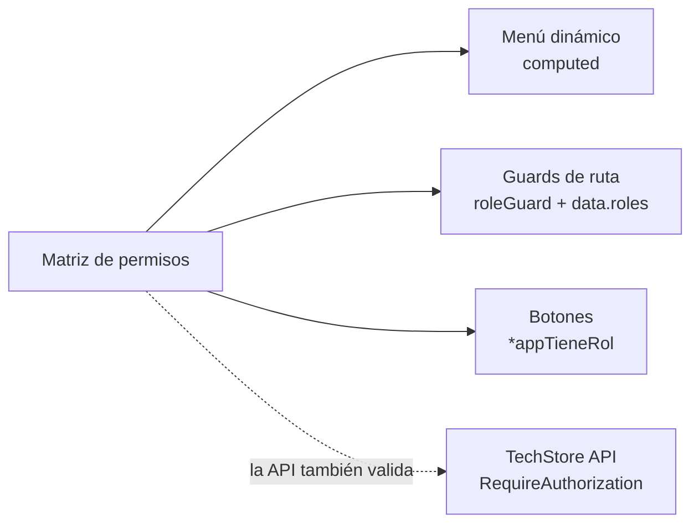
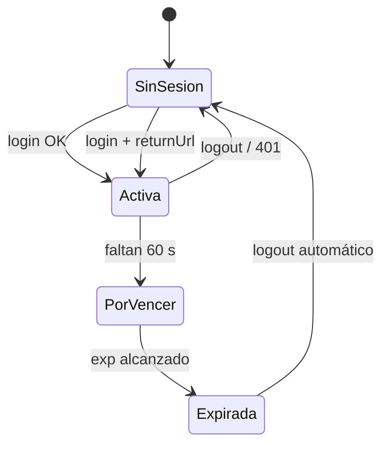
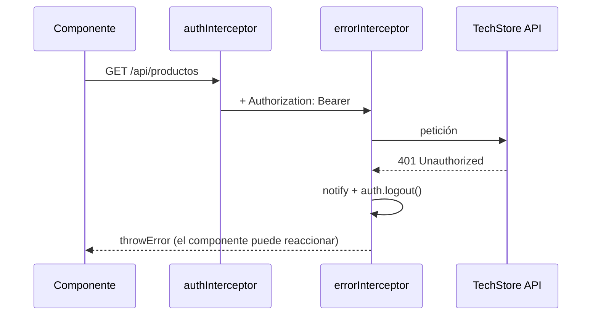
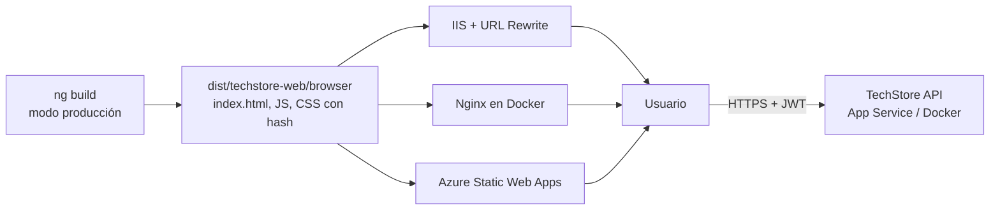

# Clase 04 · Gestión de accesos y excepciones · Despliegue local y nube

> **Especialización Full-Stack .NET 10 & Angular 21 Developer**
> Módulo 02 — Front-End: Aplicaciones con Angular 21 · Sesiones 07 y 08

| Dato del curso | Detalle |
|---|---|
| Programa | Especialización Full-Stack .NET 10 & Angular 21 Developer |
| Módulo | 02 — Front-End: Aplicaciones con Angular 21 |
| Clase | 04 (Sesión 07 + Sesión 08) |
| Fecha | 03 de octubre de 2026 |
| Horario | 08:00 – 12:00 h (según cronograma oficial) |
| Modalidad | Virtual, vía Zoom |
| Institución | Galaxy Training — [www.galaxy.edu.pe](https://www.galaxy.edu.pe) |
| Tecnologías | Angular 21, Guards, Interceptors, ErrorHandler, Vitest, IIS, Docker, Nginx, Azure Static Web Apps, GitHub Actions |
| Proyecto del curso | **TechStore Web** consumiendo **TechStore API** (Minimal APIs .NET 10) |

| Instructor | |
|---|---|
| Nombre | Juan Carlos De La Cruz |
| Perfil | Senior Software Engineer y Technical Lead, con más de 9 años de experiencia en .NET, arquitectura de software y aplicaciones full-stack |
| Contacto | jdelacruz@galaxy.edu.pe |
| Canal técnico | YouTube: @juancarlosdelacruz481 |

**Anterior:** [Clase 03](Angular21-Clase-03-Listados-Busquedas-Registros-Actualizacion) · **Siguiente:** [Clase 05](Angular21-Clase-05-Evaluacion-y-Calificacion)

---

## Contenido

- [Objetivos de la clase](#objetivos-de-la-clase)
- [Sesión 07 · Gestión de accesos y excepciones](#sesión-07--gestión-de-accesos-y-excepciones)
  - [7.1 Matriz de permisos por perfil](#71-matriz-de-permisos-por-perfil)
  - [7.2 Menú dinámico y directiva appTieneRol](#72-menú-dinámico-y-directiva-apptienerol)
  - [7.3 Sesiones: expiración y redireccionamiento](#73-sesiones-expiración-y-redireccionamiento)
  - [7.4 Interceptores: token y errores HTTP](#74-interceptores-token-y-errores-http)
  - [7.5 Logs y excepciones de la aplicación](#75-logs-y-excepciones-de-la-aplicación)
  - [7.6 Pruebas y ajustes con Vitest](#76-pruebas-y-ajustes-con-vitest)
- [Sesión 08 · Despliegue de apps local y nube](#sesión-08--despliegue-de-apps-local-y-nube)
  - [8.1 Introducción al despliegue](#81-introducción-al-despliegue)
  - [8.2 Build de producción](#82-build-de-producción)
  - [8.3 Despliegue local en IIS](#83-despliegue-local-en-iis)
  - [8.4 Docker y Docker Compose](#84-docker-y-docker-compose)
  - [8.5 Azure Static Web Apps](#85-azure-static-web-apps)
  - [8.6 Recomendaciones y buenas prácticas](#86-recomendaciones-y-buenas-prácticas)
- [Laboratorio](#laboratorio)
- [Errores frecuentes](#errores-frecuentes)
- [Autoevaluación](#autoevaluación)
- [Referencias](#referencias)

---

## Objetivos de la clase

1. Mostrar solo lo que cada perfil puede usar, en el menú, en las rutas y en los botones.
2. Cerrar la sesión automáticamente cuando el token expira y devolver al usuario a donde estaba.
3. Centralizar el manejo de errores HTTP y de la aplicación.
4. Probar guards y servicios con Vitest.
5. Publicar TechStore Web en IIS, en contenedores y en Azure.

---

# Sesión 07 · Gestión de accesos y excepciones

## 7.1 Matriz de permisos por perfil

La matriz se define una vez y alimenta tres cosas: **el menú**, **los guards de ruta** y **los botones visibles** en cada pantalla.

| Opción | Admin | Vendedor | Almacén | Ruta | Guard |
|---|---|---|---|---|---|
| Dashboard | ✓ | ✓ | ✓ | `/dashboard` | `authGuard` |
| Productos | ✓ total | Solo lectura | ✓ total | `/productos` | `roleGuard` |
| Clientes | ✓ | ✓ | — | `/clientes` | `roleGuard` |
| Pedidos | ✓ | ✓ | Solo lectura | `/pedidos` | `roleGuard` |
| Usuarios | ✓ | — | — | `/usuarios` | `roleGuard` |



> 🔐 **Ocultar un botón es experiencia de usuario; impedir la acción es trabajo de la API.** Cada endpoint de TechStore API debe exigir el rol correspondiente (`RequireAuthorization` con políticas por rol).

## 7.2 Menú dinámico y directiva appTieneRol

```ts
// src/app/layout/sidenav/sidenav.ts
interface ItemMenu {
  texto: string;
  icono: string;
  ruta: string;
  roles: string[];     // vacío = visible para cualquier usuario autenticado
}

const MENU: ItemMenu[] = [
  { texto: 'Dashboard', icono: 'dashboard',    ruta: '/dashboard', roles: [] },
  { texto: 'Productos', icono: 'inventory_2',  ruta: '/productos', roles: [] },
  { texto: 'Clientes',  icono: 'group',        ruta: '/clientes',  roles: ['Admin', 'Vendedor'] },
  { texto: 'Pedidos',   icono: 'receipt_long', ruta: '/pedidos',   roles: ['Admin', 'Vendedor', 'Almacen'] },
  { texto: 'Usuarios',  icono: 'manage_accounts', ruta: '/usuarios', roles: ['Admin'] }
];

@Component({
  selector: 'app-sidenav',
  imports: [MatListModule, MatIconModule, RouterLink, RouterLinkActive],
  template: `
    <mat-nav-list>
      @for (item of menu(); track item.ruta) {
        <a mat-list-item [routerLink]="item.ruta" routerLinkActive="activo">
          <mat-icon matListItemIcon>{{ item.icono }}</mat-icon>
          <span matListItemTitle>{{ item.texto }}</span>
        </a>
      }
    </mat-nav-list>`
})
export class Sidenav {
  private auth = inject(AuthService);

  menu = computed(() => MENU.filter(m =>
    !m.roles.length || m.roles.some(r => this.auth.roles().includes(r))));
}
```

**Directiva estructural para botones:**

```ts
// src/app/shared/directives/tiene-rol.ts
@Directive({ selector: '[appTieneRol]' })
export class TieneRol {
  private auth = inject(AuthService);
  private tpl = inject(TemplateRef<unknown>);
  private vcr = inject(ViewContainerRef);

  appTieneRol = input.required<string[]>();

  constructor() {
    effect(() => {
      this.vcr.clear();
      const permitido = this.appTieneRol().some(r => this.auth.roles().includes(r));
      if (permitido) this.vcr.createEmbeddedView(this.tpl);
    });
  }
}
```

```html
<!-- Uso en la lista de productos -->
<button mat-flat-button *appTieneRol="['Admin', 'Almacen']" routerLink="nuevo">
  + Nuevo producto
</button>

<button mat-icon-button *appTieneRol="['Admin']" (click)="eliminar(p)">
  <mat-icon>delete</mat-icon>
</button>
```

> Como `menu` es un `computed` y la directiva usa `effect`, ambos se actualizan solos si cambian los roles (por ejemplo, al cerrar sesión).

## 7.3 Sesiones: expiración y redireccionamiento

```ts
// src/app/core/services/session.service.ts
@Injectable({ providedIn: 'root' })
export class SessionService {
  private auth = inject(AuthService);
  private notify = inject(NotificationService);
  private router = inject(Router);
  private timers: ReturnType<typeof setTimeout>[] = [];

  /** Se llama al iniciar sesión y al arrancar la app con una sesión guardada. */
  programar(expira: Date) {
    this.cancelar();
    const ms = expira.getTime() - Date.now();
    if (ms <= 0) return this.expirar();

    if (ms > 60_000) {
      this.timers.push(setTimeout(
        () => this.notify.advertencia('Tu sesión vence en 1 minuto'), ms - 60_000));
    }
    this.timers.push(setTimeout(() => this.expirar(), ms));
  }

  cancelar() {
    this.timers.forEach(clearTimeout);
    this.timers = [];
  }

  private expirar() {
    const returnUrl = this.router.url;
    this.auth.logout();
    this.router.navigate([APP_ROUTES.login], {
      queryParams: { returnUrl, expirada: true }
    });
  }
}
```

Para que el temporizador siempre esté sincronizado con la sesión, puede reaccionar al signal del usuario:

```ts
// En el componente raíz App
constructor() {
  const auth = inject(AuthService);
  const session = inject(SessionService);
  effect(() => {
    const u = auth.usuario();
    u ? session.programar(u.expira) : session.cancelar();
  });
}
```



| Escenario | Comportamiento esperado |
|---|---|
| El token vence mientras el usuario trabaja | Aviso 1 minuto antes; luego logout y login con `returnUrl` |
| El usuario recarga con un token vencido | `leerSesion()` lo descarta y el `authGuard` lo envía al login |
| La API responde `401` antes de tiempo (token revocado) | El `errorInterceptor` ejecuta el logout |
| Tras reingresar | Vuelve a la página donde estaba gracias a `returnUrl` |

## 7.4 Interceptores: token y errores HTTP

Los interceptores funcionales se registran en `provideHttpClient(withInterceptors([...]))` y se ejecutan **en orden** para cada petición.

```ts
// src/app/core/interceptors/auth.interceptor.ts
export const authInterceptor: HttpInterceptorFn = (req, next) => {
  const token = inject(STORAGE).get(STORAGE_KEYS.token);

  if (!token || req.url.includes(API_ROUTES.auth.login)) {
    return next(req);
  }

  return next(req.clone({
    setHeaders: { Authorization: `Bearer ${token}` }
  }));
};
```

```ts
// src/app/core/interceptors/error.interceptor.ts
export const errorInterceptor: HttpInterceptorFn = (req, next) => {
  const notify = inject(NotificationService);
  const auth = inject(AuthService);

  return next(req).pipe(
    catchError((e: HttpErrorResponse) => {
      switch (e.status) {
        case 0:   notify.error('Sin conexión con el servidor'); break;
        case 401: notify.advertencia('Tu sesión expiró, vuelve a ingresar'); auth.logout(); break;
        case 403: notify.error('No tienes permisos para esta opción'); break;
        case 404: notify.advertencia('El recurso solicitado no existe'); break;
        case 500: notify.error('Ocurrió un problema, intenta más tarde'); break;
        // 400 y 409 los maneja cada formulario
      }
      return throwError(() => e);
    })
  );
};
```

```ts
// app.config.ts
provideHttpClient(
  withFetch(),
  withInterceptors([authInterceptor, errorInterceptor])
)
```



| Ejemplo de otros interceptores útiles | Propósito |
|---|---|
| `loadingInterceptor` | Contador global de peticiones para una barra de progreso |
| `correlationInterceptor` | Agrega un header `X-Correlation-Id` para rastrear en los logs de la API |
| `retryInterceptor` | Reintenta errores de red transitorios con `retry({ count: 2, delay: 1000 })` |

## 7.5 Logs y excepciones de la aplicación

```ts
// src/app/core/services/logger.service.ts
export interface LogEntry {
  mensaje: string;
  stack?: string;
  ruta: string;
  usuario?: string;
  fecha: string;
}

@Injectable({ providedIn: 'root' })
export class LoggerService {
  private http = inject(HttpClient);

  error(entry: LogEntry) {
    if (!environment.production) {
      console.error('[TechStore]', entry);
      return;
    }
    // En producción se envía a la API (o a Application Insights)
    this.http.post(`${environment.apiUrl}/logs`, entry).subscribe({ error: () => {} });
  }
}
```

```ts
// src/app/core/errors/global-error-handler.ts
@Injectable()
export class GlobalErrorHandler implements ErrorHandler {
  private logger = inject(LoggerService);
  private notify = inject(NotificationService);
  private router = inject(Router);
  private auth = inject(AuthService);

  handleError(error: unknown) {
    if (error instanceof HttpErrorResponse) return;   // ya lo manejó el interceptor

    const e = error as Error;
    this.logger.error({
      mensaje: e?.message ?? String(error),
      stack: e?.stack,
      ruta: this.router.url,
      usuario: this.auth.usuario()?.nombre,
      fecha: new Date().toISOString()
    });
    this.notify.error('Ocurrió un error inesperado');
  }
}
```

```ts
// app.config.ts
{ provide: ErrorHandler, useClass: GlobalErrorHandler }
```

| Tipo de error | Quién lo maneja |
|---|---|
| Error HTTP (`HttpErrorResponse`) | `errorInterceptor` + formulario (400/409) |
| Error de código (`TypeError`, `undefined`) | `GlobalErrorHandler` |
| Error de negocio esperado | El componente, con un mensaje claro |

> Nunca muestres el *stack* al usuario. Regístralo con contexto (ruta, usuario, fecha) y muestra un mensaje amable.

## 7.6 Pruebas y ajustes con Vitest

En Angular 21, `ng test` ejecuta **Vitest** por defecto.

```bash
ng test              # modo watch
ng test --no-watch   # una sola ejecución (CI)
```

```ts
// src/app/core/guards/role.guard.spec.ts
import { TestBed } from '@angular/core/testing';
import { provideRouter, UrlTree, ActivatedRouteSnapshot, RouterStateSnapshot } from '@angular/router';
import { signal } from '@angular/core';

describe('roleGuard', () => {
  const ejecutar = (rolesUsuario: string[], requeridos: string[]) => {
    TestBed.configureTestingModule({
      providers: [
        provideRouter([]),
        { provide: AuthService, useValue: { roles: signal(rolesUsuario) } }
      ]
    });
    const route = { data: { roles: requeridos } } as unknown as ActivatedRouteSnapshot;
    return TestBed.runInInjectionContext(() =>
      roleGuard(route, {} as RouterStateSnapshot));
  };

  it('permite el acceso con el rol correcto', () => {
    expect(ejecutar(['Admin'], ['Admin'])).toBe(true);
  });

  it('redirige a acceso denegado si no tiene el rol', () => {
    expect(ejecutar(['Vendedor'], ['Admin'])).toBeInstanceOf(UrlTree);
  });
});
```

```ts
// src/app/core/services/producto.service.spec.ts
import { provideHttpClient } from '@angular/common/http';
import { provideHttpClientTesting, HttpTestingController } from '@angular/common/http/testing';

describe('ProductoService', () => {
  let service: ProductoService;
  let http: HttpTestingController;

  beforeEach(() => {
    TestBed.configureTestingModule({
      providers: [provideHttpClient(), provideHttpClientTesting()]
    });
    service = TestBed.inject(ProductoService);
    http = TestBed.inject(HttpTestingController);
  });

  it('pide la página correcta a la API', () => {
    service.listar({ page: 2, pageSize: 10, search: 'lap' }).subscribe();
    const req = http.expectOne(r => r.url.endsWith('/productos'));
    expect(req.request.params.get('page')).toBe('2');
    req.flush({ success: true, data: { items: [], page: 2, pageSize: 10, totalCount: 0 } });
  });

  afterEach(() => http.verify());
});
```

**Checklist de pruebas manuales antes de la entrega:**

- [ ] Login con cada perfil: el menú cambia correctamente.
- [ ] URL escrita a mano hacia una ruta no permitida → `/acceso-denegado`.
- [ ] Token expirado → aviso, logout y regreso con `returnUrl`.
- [ ] API apagada → mensaje "Sin conexión" y la app no se rompe.
- [ ] Error de código forzado → se registra y aparece el mensaje genérico.

---

# Sesión 08 · Despliegue de apps local y nube

## 8.1 Introducción al despliegue

Una SPA se publica como **archivos estáticos**. No necesita .NET ni Node.js en el servidor, solo un servidor web.



| Concepto | Qué hay que resolver |
|---|---|
| **Build** | Compilar, minificar y aplicar *tree-shaking* |
| **Configuración por entorno** | URL de la API correcta en cada ambiente |
| **Fallback SPA** | Toda ruta desconocida debe responder `index.html` |
| **CORS** | La API debe permitir el dominio donde se publica el front |
| **Caché** | Archivos con hash: caché larga; `index.html`: sin caché |

> ⚠️ **El error más común en producción:** recargar `/productos` devuelve **404**. El servidor busca un archivo `/productos` que no existe. Se soluciona siempre con la regla de *fallback* a `index.html`.

## 8.2 Build de producción

```bash
ng build --configuration production
# o simplemente: ng build (production es la configuración por defecto)
```

```text
dist/techstore-web/
└─ browser/
   ├─ index.html
   ├─ main-ABC123.js
   ├─ chunk-XYZ789.js        # features lazy
   ├─ styles-DEF456.css
   └─ favicon.ico
```

**Budgets** en `angular.json`: el build avisa o falla si el bundle crece demasiado.

```json
"budgets": [
  { "type": "initial", "maximumWarning": "500kB", "maximumError": "1MB" },
  { "type": "anyComponentStyle", "maximumWarning": "4kB", "maximumError": "8kB" }
]
```

**Reemplazo de entornos** (lo configura `ng generate environments`):

```json
"configurations": {
  "development": {
    "fileReplacements": [
      { "replace": "src/environments/environment.ts",
        "with": "src/environments/environment.development.ts" }
    ]
  }
}
```

> Si la app se publica en un subdirectorio (por ejemplo `https://servidor/techstore/`), compila con `ng build --base-href /techstore/`.

## 8.3 Despliegue local en IIS

**Requisitos:** IIS habilitado en Windows y el módulo **URL Rewrite** instalado.

1. Crear `public/web.config` (todo lo que está en `public/` se copia a la salida):

```xml
<?xml version="1.0" encoding="utf-8"?>
<configuration>
  <system.webServer>
    <rewrite>
      <rules>
        <rule name="SPA fallback" stopProcessing="true">
          <match url=".*" />
          <conditions logicalGrouping="MatchAll">
            <add input="{REQUEST_FILENAME}" matchType="IsFile" negate="true" />
            <add input="{REQUEST_FILENAME}" matchType="IsDirectory" negate="true" />
          </conditions>
          <action type="Rewrite" url="/index.html" />
        </rule>
      </rules>
    </rewrite>
    <staticContent>
      <remove fileExtension=".json" />
      <mimeMap fileExtension=".json" mimeType="application/json" />
    </staticContent>
  </system.webServer>
</configuration>
```

2. Compilar y copiar:

```bash
ng build --configuration production
xcopy dist\techstore-web\browser C:\inetpub\techstore-web /E /I /Y
```

3. En **IIS Manager**: *Sites → Add Website*, apuntar a `C:\inetpub\techstore-web`, asignar puerto (por ejemplo 8081) y verificar navegando y recargando en `/productos`.

## 8.4 Docker y Docker Compose

**Build multi-etapa:** la primera etapa compila con Node; la imagen final solo contiene Nginx y los archivos estáticos (imagen pequeña y segura).

```dockerfile
# Dockerfile
# Etapa 1: compilar
FROM node:22-alpine AS build
WORKDIR /app
COPY package*.json ./
RUN npm ci
COPY . .
RUN npx ng build --configuration production

# Etapa 2: servir
FROM nginx:alpine
COPY nginx.conf /etc/nginx/conf.d/default.conf
COPY --from=build /app/dist/techstore-web/browser /usr/share/nginx/html
EXPOSE 80
```

```nginx
# nginx.conf
server {
  listen 80;
  root /usr/share/nginx/html;
  index index.html;

  location / {
    try_files $uri $uri/ /index.html;          # fallback SPA
  }

  location ~* \.(js|css|woff2|png|svg)$ {
    expires 1y;                                 # archivos con hash: caché larga
    add_header Cache-Control "public, immutable";
  }

  location = /index.html {
    add_header Cache-Control "no-cache";        # siempre la última versión
  }
}
```

```text
# .dockerignore
node_modules
dist
.angular
.git
```

```yaml
# docker-compose.yml — front + API del Módulo 01
services:
  web:
    build: .
    ports:
      - "4200:80"
    depends_on:
      - api
  api:
    image: techstore-api:latest
    ports:
      - "8080:8080"
    environment:
      - ASPNETCORE_ENVIRONMENT=Production
      - Cors__Origins=http://localhost:4200
```

```bash
docker compose up -d --build
# Front: http://localhost:4200   API: http://localhost:8080
```

> La URL de la API se decide **en el navegador**, no dentro de la red de Docker: `environment.ts` debe apuntar a una URL accesible desde el equipo del usuario (por ejemplo `http://localhost:8080/api`).

## 8.5 Azure Static Web Apps

Servicio pensado para SPAs: CDN global, HTTPS automático, dominio propio y un plan gratuito para empezar.

**Pasos:**

1. En el portal de Azure: *Create → Static Web App*, conectar el repositorio de GitHub y la rama `main`.
2. *Build preset*: **Angular**; *App location*: `/`; *Output location*: `dist/techstore-web/browser`.
3. Azure crea el workflow de GitHub Actions y el secreto con el token de despliegue.

```yaml
# .github/workflows/azure-static-web-apps.yml
name: Deploy TechStore Web
on:
  push:
    branches: [main]

jobs:
  deploy:
    runs-on: ubuntu-latest
    steps:
      - uses: actions/checkout@v4
      - uses: Azure/static-web-apps-deploy@v1
        with:
          azure_static_web_apps_api_token: ${{ secrets.SWA_TOKEN }}
          repo_token: ${{ secrets.GITHUB_TOKEN }}
          action: upload
          app_location: "/"
          output_location: "dist/techstore-web/browser"
```

```json
// public/staticwebapp.config.json — fallback SPA
{
  "navigationFallback": {
    "rewrite": "/index.html",
    "exclude": ["/*.{js,css,png,svg,ico,json}"]
  }
}
```

**Configuración en TechStore API (App Service, Módulo 01):**

```csharp
// Program.cs de la API
builder.Services.AddCors(o => o.AddPolicy("front", p => p
    .WithOrigins("https://<tu-app>.azurestaticapps.net")
    .AllowAnyHeader()
    .AllowAnyMethod()));

app.UseCors("front");
```

## 8.6 Recomendaciones y buenas prácticas

| Práctica | Detalle |
|---|---|
| Configuración por entorno | Nunca publiques con la URL de desarrollo. Para cambiar la URL sin recompilar, usa un `config.json` que se lee al iniciar la app |
| Budgets de tamaño | Si el bundle crece, el build avisa: revisa imports pesados y usa lazy loading |
| HTTPS y CORS | Front y API siempre con HTTPS; la API permite solo los orígenes necesarios |
| Caché inteligente | Archivos con hash: caché larga; `index.html`: `no-cache` |
| Automatiza | Pipeline de build, pruebas y despliegue: nadie publica desde su máquina |
| Monitorea | Envía los errores del `GlobalErrorHandler` a Application Insights u otro servicio de logs |
| Versiona | Muestra la versión en el pie de página para saber qué está desplegado |

---

## Laboratorio

1. Implementar el menú por rol, la directiva `appTieneRol` y `SessionService`.
2. Registrar `authInterceptor`, `errorInterceptor` y `GlobalErrorHandler`.
3. Escribir las pruebas de `roleGuard` y `ProductoService` y ejecutarlas con `ng test`.
4. Publicar TechStore Web en IIS local y verificar la recarga en rutas profundas.
5. Levantar front + API con Docker Compose.
6. Publicar en Azure Static Web Apps con GitHub Actions.

**Criterios de aceptación**

- [ ] Un `Vendedor` no ve "Usuarios" en el menú ni el botón eliminar.
- [ ] Con la API apagada, la app muestra "Sin conexión" y sigue funcionando.
- [ ] `ng test --no-watch` termina en verde.
- [ ] Recargar `/productos` en IIS, Docker y Azure no devuelve 404.
- [ ] La app publicada consume la API sin errores de CORS.

## Errores frecuentes

| Error | Causa | Solución |
|---|---|---|
| 404 al recargar una ruta | Falta el fallback SPA | `web.config`, `try_files` o `navigationFallback` |
| Error de CORS en producción | La API no permite el nuevo dominio | Agregar el origen del front a la política CORS |
| Pantalla en blanco tras publicar | `base-href` incorrecto | Compilar con `--base-href` del subdirectorio |
| El usuario ve la versión anterior | `index.html` cacheado | `Cache-Control: no-cache` para `index.html` |
| Bucle de logout | `errorInterceptor` hace logout también en la petición de login | Excluir la URL de login o no reaccionar a 401 en esa ruta |
| `NG0203` en pruebas de guards | Guard ejecutado fuera de contexto de inyección | Usar `TestBed.runInInjectionContext` |

## Autoevaluación

1. ¿Por qué ocultar botones por rol no es suficiente para la seguridad?
2. ¿Qué hace `returnUrl` y dónde se usa?
3. ¿Qué errores maneja el interceptor y cuáles el formulario?
4. ¿Por qué una SPA necesita la regla de *fallback* a `index.html`?
5. ¿Qué ventaja tiene el Dockerfile multi-etapa?

<details>
<summary>Ver respuestas</summary>

1. Porque cualquiera puede llamar a la API directamente con Postman; la API debe exigir el rol en cada endpoint.
2. Guarda la URL donde estaba el usuario cuando se le pidió iniciar sesión; el login la usa para devolverlo allí.
3. El interceptor maneja errores globales (0, 401, 403, 404, 500); el formulario maneja los que dependen del contexto (400 y 409).
4. Porque las rutas existen solo en el router del navegador; el servidor no tiene archivos con esos nombres y debe entregar `index.html` para que Angular decida.
5. La imagen final no incluye Node.js ni el código fuente: es más pequeña, más rápida de descargar y con menor superficie de ataque.

</details>

## Referencias

- Guards y rutas: <https://angular.dev/guide/routing>
- Interceptores HTTP: <https://angular.dev/guide/http/interceptors>
- Pruebas en Angular: <https://angular.dev/guide/testing>
- Vitest: <https://vitest.dev>
- Despliegue de Angular: <https://angular.dev/tools/cli/deployment>
- Azure Static Web Apps: <https://learn.microsoft.com/azure/static-web-apps/>

---

**Anterior:** [Clase 03](Angular21-Clase-03-Listados-Busquedas-Registros-Actualizacion) · **Siguiente:** [Clase 05](Angular21-Clase-05-Evaluacion-y-Calificacion)

*Material elaborado por Juan Carlos De La Cruz para Galaxy Training · Especialización Full-Stack .NET 10 & Angular 21 Developer.*
