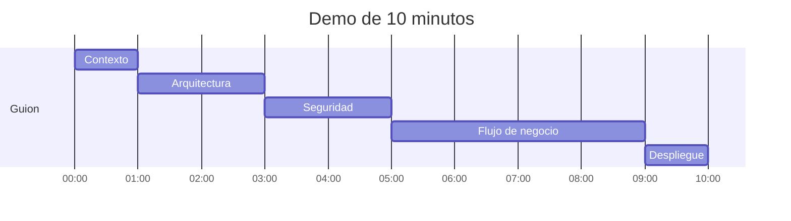
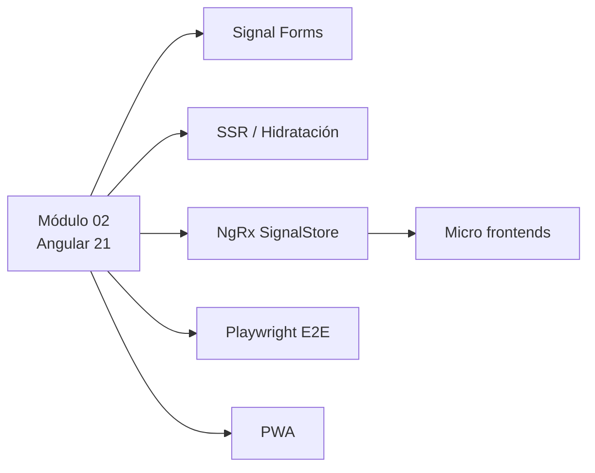
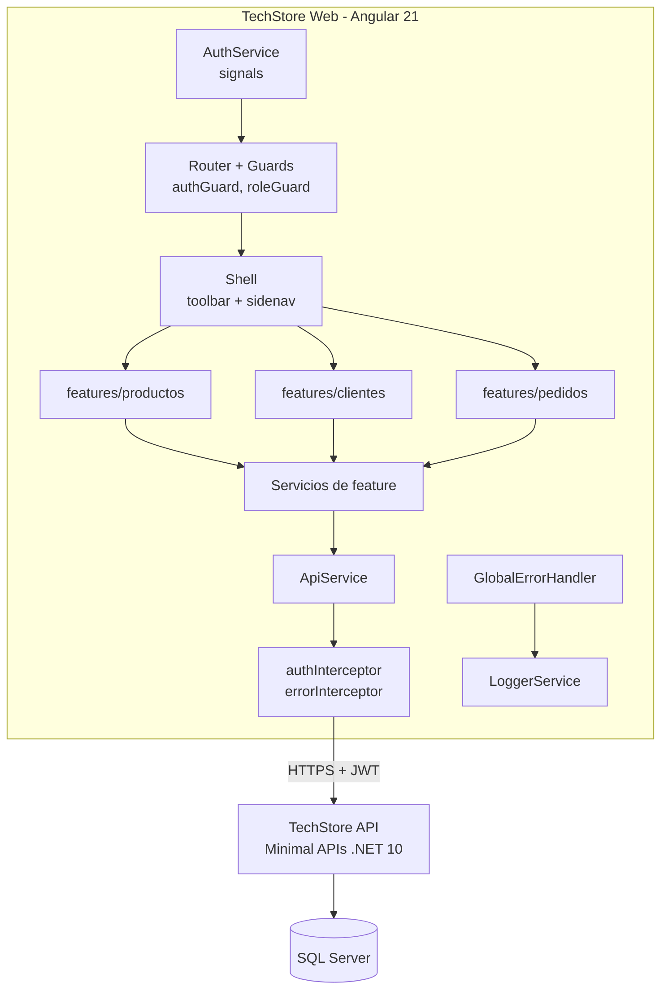

# Clase 05 · Evaluación y calificación

> **Especialización Full-Stack .NET 10 & Angular 21 Developer**
> Módulo 02 — Front-End: Aplicaciones con Angular 21 · Sesión 09

| Dato del curso | Detalle |
|---|---|
| Programa | Especialización Full-Stack .NET 10 & Angular 21 Developer |
| Módulo | 02 — Front-End: Aplicaciones con Angular 21 |
| Clase | 05 (Sesión 09) |
| Fecha | 10 de octubre de 2026 |
| Horario | 08:00 – 12:00 h (según cronograma oficial) |
| Modalidad | Virtual, vía Zoom |
| Institución | Galaxy Training — [www.galaxy.edu.pe](https://www.galaxy.edu.pe) |
| Certificación | Certificado digital, previa aprobación del examen |
| Proyecto del curso | **TechStore Web** consumiendo **TechStore API** (Minimal APIs .NET 10) |

| Instructor | |
|---|---|
| Nombre | Juan Carlos De La Cruz |
| Perfil | Senior Software Engineer y Technical Lead, con más de 9 años de experiencia en .NET, arquitectura de software y aplicaciones full-stack |
| Contacto | jdelacruz@galaxy.edu.pe |
| Canal técnico | YouTube: @juancarlosdelacruz481 |

**Anterior:** [Clase 04](Angular21-Clase-04-Accesos-Excepciones-y-Despliegue) · **Inicio:** [Home](Home)

---

## Contenido

- [Objetivos de la sesión](#objetivos-de-la-sesión)
- [1. Consideraciones y recomendaciones](#1-consideraciones-y-recomendaciones)
- [2. Criterios de evaluación y calificación](#2-criterios-de-evaluación-y-calificación)
- [3. Presentación del proyecto](#3-presentación-del-proyecto)
- [4. Entregables](#4-entregables)
- [5. Lecciones aprendidas](#5-lecciones-aprendidas)
- [6. Próximos temas a investigar](#6-próximos-temas-a-investigar)
- [Resumen técnico del módulo](#resumen-técnico-del-módulo)
- [Preguntas de repaso para el examen](#preguntas-de-repaso-para-el-examen)

---

## Objetivos de la sesión

1. Conocer con claridad cómo se evalúa el proyecto final.
2. Presentar una demo que muestre valor, no solo pantallas.
3. Reflexionar sobre lo aprendido en las 8 sesiones.
4. Llevarse una ruta de estudio para seguir creciendo.

---

## 1. Consideraciones y recomendaciones

### Checklist técnico del proyecto

| Área | Qué debe cumplir | Clase de referencia |
|---|---|---|
| **Estructura** | `core/`, `shared/`, `layout/` y `features/` respetadas; features con rutas lazy | [Clase 01](Angular21-Clase-01-Introduccion-y-Arquitectura), [Clase 02](Angular21-Clase-02-Servicios-Core-y-Autenticacion) |
| **Seguridad** | Login con JWT, guards por rol, interceptor de token y expiración de sesión | [Clase 02](Angular21-Clase-02-Servicios-Core-y-Autenticacion), [Clase 04](Angular21-Clase-04-Accesos-Excepciones-y-Despliegue) |
| **Listados** | GET paginado en servidor, búsqueda con debounce y eliminación con confirmación | [Clase 03](Angular21-Clase-03-Listados-Busquedas-Registros-Actualizacion) |
| **Formularios** | POST y PUT tipados, validaciones propias y errores del servidor por campo | [Clase 03](Angular21-Clase-03-Listados-Busquedas-Registros-Actualizacion) |
| **Errores y mensajes** | `errorInterceptor`, `GlobalErrorHandler` y `NotificationService` consistentes | [Clase 04](Angular21-Clase-04-Accesos-Excepciones-y-Despliegue) |
| **Despliegue** | Build de producción funcionando en Docker o Azure con la API real | [Clase 04](Angular21-Clase-04-Accesos-Excepciones-y-Despliegue) |

### Verificación rápida antes de presentar

```bash
# 1. Sin errores de compilación ni advertencias de budgets
ng build --configuration production

# 2. Pruebas en verde
ng test --no-watch

# 3. Front + API levantados juntos
docker compose up -d --build
```

- [ ] Probar la demo completa **el día anterior** con un usuario de cada perfil.
- [ ] Probar con el **token expirado** y con la **API apagada**.
- [ ] Tener datos de prueba realistas (productos, clientes y al menos un pedido).
- [ ] Cerrar pestañas y notificaciones; aumentar el zoom del navegador para la transmisión.
- [ ] Tener un plan B: capturas o un video corto por si falla la conexión.

---

## 2. Criterios de evaluación y calificación

| Criterio | Peso | Excelente | Por mejorar |
|---|---|---|---|
| Arquitectura del proyecto | 20 % | Estructura clara, features lazy, servicios core reutilizables | Lógica repetida o servicios mezclados con componentes |
| Autenticación y autorización | 20 % | JWT, guards por rol, menú dinámico y expiración | Rutas desprotegidas o roles solo ocultos en la UI |
| Consumo de la API (CRUD) | 25 % | GET, POST, PUT y DELETE con paginación y búsqueda | Operaciones incompletas o sin manejo de errores |
| Experiencia de usuario | 15 % | Material consistente, validaciones y mensajes claros | Errores técnicos visibles o formularios sin validar |
| Despliegue y calidad | 10 % | Publicado en Docker/Azure y pruebas con Vitest | Solo funciona en local, sin pruebas |
| Presentación | 10 % | Demo fluida, decisiones justificadas y tiempo respetado | Demo improvisada o fuera de tiempo |
| **Total** | **100 %** | | |

> La nota aprobatoria se rige por el reglamento de Galaxy Training. El **certificado digital** requiere aprobar el examen.

---

## 3. Presentación del proyecto

### Guion sugerido (10 minutos)



| Bloque | Tiempo | Qué mostrar |
|---|---|---|
| **Contexto** | 1 min | Qué problema resuelve TechStore Web y para quién |
| **Arquitectura** | 2 min | Estructura del proyecto, servicios core y flujo con la API (un diagrama ayuda) |
| **Seguridad** | 2 min | Login con dos perfiles distintos: el menú y los permisos cambian |
| **Flujo de negocio** | 4 min | Buscar, registrar, editar y eliminar; provocar un error de validación del servidor |
| **Despliegue** | 1 min | La app publicada en Docker o Azure y una prueba ejecutándose |

### Recomendaciones para la demo

- Muestra **lo que el usuario gana**, no cada línea de código. Las preguntas del jurado profundizarán en el código.
- Explica **una decisión técnica** que tomaste y por qué (por ejemplo, signals + RxJS en la búsqueda).
- Menciona **una dificultad** que encontraste y cómo la resolviste.
- Respeta el tiempo: practica con cronómetro.

### Preguntas típicas del jurado

1. ¿Dónde se agrega el token a las peticiones y por qué ahí?
2. ¿Qué pasa si un usuario sin permiso escribe la URL de una ruta protegida?
3. ¿Cómo evitas que la búsqueda sature la API?
4. ¿Qué ocurre si la API responde 400 con errores de validación?
5. ¿Qué hiciste para que recargar una ruta en producción no devuelva 404?

---

## 4. Entregables

| Entregable | Contenido mínimo |
|---|---|
| **Repositorio Git** | Código fuente, historial de commits y `.gitignore` correcto |
| **README.md** | Descripción, requisitos, cómo ejecutar en local y con Docker, usuarios de prueba, URL publicada |
| **Aplicación publicada** | URL en Azure Static Web Apps o instrucciones de Docker Compose |
| **Pruebas** | Al menos pruebas de un guard y de un servicio con Vitest |
| **Presentación** | Demo de 10 minutos siguiendo el guion |

**Plantilla sugerida de README:**

````markdown
# TechStore Web

Front-end en Angular 21 para la gestión de productos, clientes y pedidos de TechStore.
Consume TechStore API (Minimal APIs .NET 10).

## Requisitos
- Node.js LTS y Angular CLI 21
- TechStore API en ejecución (local o Docker)

## Ejecución local
```bash
npm install
ng serve -o
```

## Ejecución con Docker
```bash
docker compose up -d --build
```

## Usuarios de prueba
| Usuario | Rol | Contraseña |
|---|---|---|
| admin | Admin | (ver entrega) |
| vendedor | Vendedor | (ver entrega) |

## URL publicada
https://<tu-app>.azurestaticapps.net
````

---

## 5. Lecciones aprendidas

| Lección | Por qué importa |
|---|---|
| **Signals simplifican el estado** | Menos suscripciones manuales y actualizaciones precisas sin `zone.js` |
| **RxJS donde brilla** | Búsquedas, cancelación y composición de llamadas HTTP |
| **Centralizar paga** | `ApiService`, interceptores y `NotificationService` evitan código repetido |
| **Seguridad en dos capas** | El front guía la experiencia; la API decide los permisos |
| **Contratos tipados** | Interfaces alineadas a los DTOs de la API detectan errores al compilar |
| **Desplegar desde el inicio** | Publicar temprano evita sorpresas de CORS, rutas y configuración |

**Ejercicio de reflexión (5 minutos):** cada participante comparte una cosa que haría distinto si empezara el proyecto de nuevo.

---

## 6. Próximos temas a investigar

| Tema | Qué aporta | Por dónde empezar |
|---|---|---|
| **Signal Forms** | Formularios basados en signals (hoy experimental) | Guía de formularios en angular.dev |
| **SSR e hidratación** | SEO y primera carga más rápida | `ng new --ssr` y la guía de SSR |
| **Estado global** | NgRx SignalStore para apps con estado complejo | ngrx.io |
| **Pruebas E2E** | Probar flujos completos en el navegador | Playwright o Cypress |
| **PWA** | Trabajar sin conexión e instalar la app | `ng add @angular/pwa` |
| **Micro frontends** | Dividir aplicaciones grandes entre equipos | Native Federation |
| **Accesibilidad** | Apps usables por todas las personas | Angular CDK a11y y pautas WCAG |



---

## Resumen técnico del módulo



| Clase | Sesiones | Temas clave |
|---|---|---|
| [01](Angular21-Clase-01-Introduccion-y-Arquitectura) | 01–02 | Angular 21, signals, arquitectura, estructura del proyecto, modelos TypeScript |
| [02](Angular21-Clase-02-Servicios-Core-y-Autenticacion) | 03–04 | Lazy loading, ApiService, patrón Factory, Shell, JWT, guards, mensajes |
| [03](Angular21-Clase-03-Listados-Busquedas-Registros-Actualizacion) | 05–06 | Listados, búsqueda reactiva, paginación, DELETE, formularios, POST/PUT, validadores |
| [04](Angular21-Clase-04-Accesos-Excepciones-y-Despliegue) | 07–08 | Permisos por perfil, sesiones, interceptores, logs, Vitest, IIS, Docker, Azure |
| 05 | 09 | Evaluación, presentación y próximos pasos |

---

## Preguntas de repaso para el examen

1. ¿Qué diferencia hay entre `signal`, `computed` y `effect`?
2. ¿Por qué en Angular 21 los proyectos nuevos no incluyen `zone.js`?
3. ¿Qué ventajas tiene un componente standalone frente a uno declarado en un `NgModule`?
4. ¿Cómo se carga una feature bajo demanda?
5. ¿Qué problema resuelve el patrón Factory con `InjectionToken` y `useFactory`?
6. Describe el flujo completo de autenticación con JWT desde el login hasta una petición protegida.
7. ¿Por qué `inject()` debe llamarse en un contexto de inyección?
8. ¿Qué hacen `debounceTime`, `distinctUntilChanged` y `switchMap` en una búsqueda?
9. ¿Cómo se implementa la paginación en servidor con `mat-paginator`?
10. ¿Cómo se muestran en el formulario los errores `ValidationProblemDetails` de la API?
11. ¿Qué diferencia hay entre un validador síncrono y uno asíncrono?
12. ¿Qué errores maneja el `errorInterceptor` y cuáles el `GlobalErrorHandler`?
13. ¿Por qué una SPA necesita una regla de *fallback* a `index.html` en el servidor?
14. ¿Qué ventaja tiene el Dockerfile multi-etapa con Nginx?
15. ¿Por qué ocultar un botón por rol no reemplaza la autorización en la API?

<details>
<summary>Ver respuestas</summary>

1. `signal` guarda un valor reactivo; `computed` deriva un valor de otros signals y se recalcula solo; `effect` ejecuta efectos secundarios cuando cambian los signals que lee.
2. Porque la detección de cambios se guía por signals y eventos de plantilla; ya no es necesario interceptar cada operación asíncrona.
3. Declara sus propias dependencias, es más fácil de entender y reutilizar, y permite lazy loading directo con `loadComponent`.
4. Con `loadChildren: () => import('./feature.routes').then(m => m.RUTAS)` o `loadComponent` en la definición de la ruta.
5. Permite elegir la implementación (por ejemplo, el tipo de almacenamiento) según el contexto sin que los consumidores lo sepan.
6. Login → `POST /auth/login` → la API devuelve el JWT → `AuthService` lo decodifica y guarda → `authInterceptor` agrega `Authorization: Bearer` → la API valida firma, expiración y rol.
7. Porque Angular necesita saber qué inyector usar; solo lo sabe durante la construcción de clases, en campos, en fábricas, guards e interceptores.
8. Esperan a que el usuario deje de escribir, ignoran términos repetidos y cancelan la petición anterior cuando llega una nueva.
9. Se envían `page` y `pageSize` a la API, se muestra `items` en la tabla y `totalCount` en `[length]` del paginador; el evento `(page)` actualiza el filtro.
10. Se recorre `error.errors`, se convierte cada clave a camelCase y se asigna con `setErrors({ server: mensaje })` al control correspondiente.
11. El síncrono devuelve el resultado al instante; el asíncrono devuelve un Observable (por ejemplo, tras consultar la API) y deja el control en estado `pending`.
12. El interceptor maneja errores HTTP globales (0, 401, 403, 404, 500); el `GlobalErrorHandler` maneja errores de código no controlados.
13. Porque las rutas existen solo en el router del navegador; el servidor debe devolver `index.html` para cualquier ruta que no sea un archivo.
14. La imagen final solo tiene Nginx y los archivos estáticos: es más pequeña, más rápida y más segura.
15. Porque cualquier persona puede llamar a la API directamente; la autorización real debe validarse en el servidor.

</details>

---

**Anterior:** [Clase 04](Angular21-Clase-04-Accesos-Excepciones-y-Despliegue) · **Inicio:** [Home](Home)

*Material elaborado por Juan Carlos De La Cruz para Galaxy Training · Especialización Full-Stack .NET 10 & Angular 21 Developer.*
