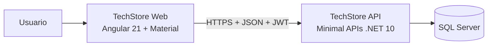

# Angular 21 · Guía técnica del Módulo 02

> **Especialización Full-Stack .NET 10 & Angular 21 Developer**
> Módulo 02 — Front-End: Aplicaciones con Angular 21

Wiki del curso con las guías técnicas de cada clase. Cada página amplía el contenido de las presentaciones con explicaciones, código completo, diagramas, laboratorios, errores frecuentes y autoevaluación.

## Datos del curso

| | |
|---|---|
| Programa | Especialización Full-Stack .NET 10 & Angular 21 Developer |
| Módulo | 02 — Front-End: Aplicaciones con Angular 21 |
| Institución | Galaxy Training — [www.galaxy.edu.pe](https://www.galaxy.edu.pe) |
| Modalidad | Virtual, vía Zoom |
| Horario | 08:00 – 12:00 h (según cronograma oficial) |
| Sesiones | 9 sesiones agrupadas en 5 clases |
| Tecnologías | Angular 21, TypeScript, RxJS, Angular Material, Node.js, npm, Angular CLI, Sass, Vitest, Docker, Azure |
| Certificación | Certificado digital, previa aprobación del examen |
| Proyecto | **TechStore Web**: front-end que consume **TechStore API** (Minimal APIs .NET 10 del Módulo 01) |

## Instructor

| | |
|---|---|
| Nombre | Juan Carlos De La Cruz |
| Perfil | Senior Software Engineer y Technical Lead, con más de 9 años de experiencia en .NET, arquitectura de software y aplicaciones full-stack |
| Contacto | jdelacruz@galaxy.edu.pe |
| Canal técnico | YouTube: @juancarlosdelacruz481 |

## Requisitos

- Conocimientos básicos de JavaScript, HTML y CSS.
- Conocimientos básicos de servicios REST.
- Conocimientos de arquitecturas full-stack (back-end y front-end).
- TechStore API del Módulo 01 disponible en local o en Docker.

## Cronograma y guías

| Clase | Fecha | Sesiones | Guía |
|---|---|---|---|
| 01 | 12 SET | 01 Introducción a Angular 21 · 02 Arquitectura y modelos | [Ver guía](Angular21-Clase-01-Introduccion-y-Arquitectura) |
| 02 | 19 SET | 03 Creación de servicios core · 04 Autenticación y autorización | [Ver guía](Angular21-Clase-02-Servicios-Core-y-Autenticacion) |
| 03 | 26 SET | 05 Listados y búsquedas · 06 Registros y actualización | [Ver guía](Angular21-Clase-03-Listados-Busquedas-Registros-Actualizacion) |
| 04 | 03 OCT | 07 Gestión de accesos y excepciones · 08 Despliegue local y nube | [Ver guía](Angular21-Clase-04-Accesos-Excepciones-y-Despliegue) |
| 05 | 10 OCT | 09 Evaluación y calificación | [Ver guía](Angular21-Clase-05-Evaluacion-y-Calificacion) |

> El cronograma puede estar sujeto a cambios por parte de Galaxy Training.

## Arquitectura del proyecto

## Metodología

- Exposición de aspectos teóricos.
- Desarrollo de casos prácticos sobre TechStore Web.
- Experiencias compartidas entre instructor y participantes.
- Discusión de casos empresariales.
- Evaluación continua, teórica y práctica, en cada sesión.

---

*Material elaborado por Juan Carlos De La Cruz para Galaxy Training.*
