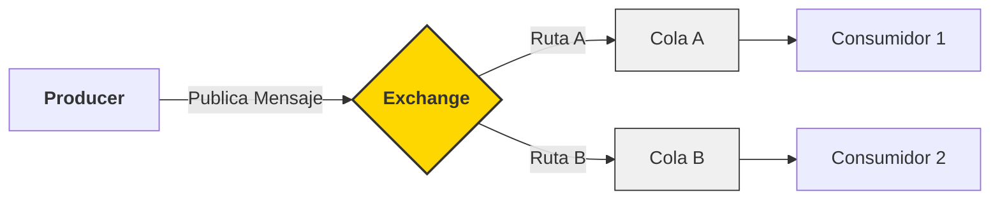
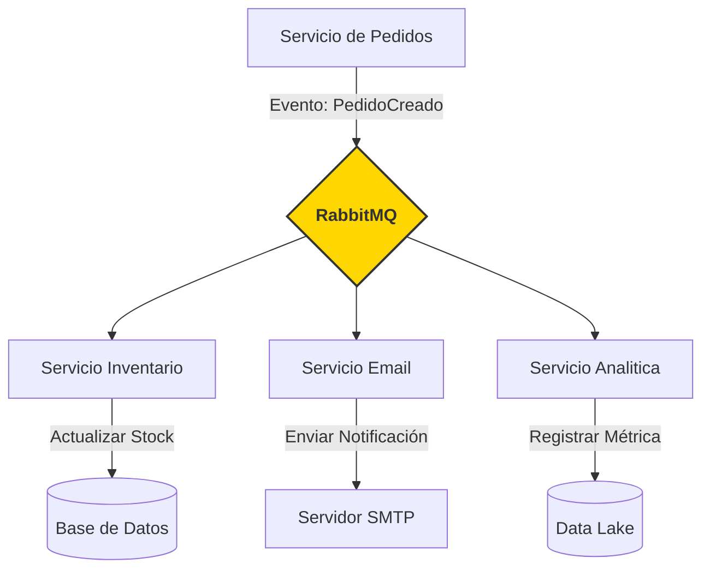

# 🚀 RabbitMQ y Arquitecturas Orientadas a Eventos con .NET

> **Instructor:** Juan Carlos De La Cruz  
> Esta guía ha sido diseñada para proporcionar una visión profunda, técnica y práctica sobre la mensajería asincrónica en ecosistemas .NET modernos.

---

## 1. Introducción: El Poder de la Asincronía

En el desarrollo de software moderno, la **comunicación entre servicios** es el sistema nervioso de cualquier aplicación distribuida. Para construir sistemas que sean verdaderamente escalables, resilientes y desacoplados, debemos alejarnos de las llamadas HTTP síncronas tradicionales y abrazar el paradigma de **Arquitectura Orientada a Eventos (EDA)**.

**RabbitMQ** surge como el estándar de oro en este ámbito, actuando como un **Message Broker** de alto rendimiento que facilita esta comunicación mediante el paso de mensajes asincrónicos.

### ¿Qué aprenderás en esta guía?
- 🧠 **Fundamentos:** Qué es y por qué usar un Message Broker.
- ⚙️ **Mecánica Interna:** Exchanges, Queues y Bindings.
- 🏗️ **Arquitectura:** Integración en **Hexagonal** y **Clean Architecture**.
- 💻 **Implementación .NET:** Código real y robusto para productores y consumidores.
- 🛠️ **Patrones Avanzados:** Manejo de fallos, reintentos y resiliencia.

---

## 2. ¿Qué es RabbitMQ? (El Corazón del Sistema)

RabbitMQ es un servidor de mensajería que implementa el protocolo **AMQP (Advanced Message Queuing Protocol)**. Su trabajo es simple pero crítico: actuar como un intermediario inteligente entre quien genera la información y quien la procesa.

### Conceptos Clave que debes dominar:

| Concepto | Rol Técnico | Analogía |
| :--- | :--- | :--- |
| **Producer** | Aplicación que publica o envía mensajes. | El remitente de una carta. |
| **Consumer** | Aplicación que se suscribe y procesa mensajes. | El destinatario de la carta. |
| **Queue** | El búfer donde residen los mensajes. | El buzón de correo físico. |
| **Exchange** | El cerebro que enruta los mensajes a las colas. | La oficina postal que clasifica el correo. |
| **Binding** | La regla que conecta un Exchange con una Queue. | La dirección escrita en el sobre. |

---

## 3. El Ciclo de Vida del Mensaje

A diferencia de otros brokers más simples, en RabbitMQ el productor **nunca** envía un mensaje directamente a una cola. Siempre pasa por un **Exchange**.



> **Diagrama 1:** Flujo básico desde el productor, pasando por el Exchange que decide el enrutamiento hacia las colas finales.


### Tipos de Exchange: Elige tu Estrategia de Enrutamiento
1. **Direct:** El mensaje va a la cola con la `Routing Key` exacta.
2. **Fanout:** El mensaje se copia a **todas** las colas vinculadas (ideal para notificaciones globales).
3. **Topic:** Enrutamiento basado en patrones (ej: `logs.error`, `logs.info`).
4. **Headers:** Usa los encabezados del mensaje para decidir el destino.

---

## 4. Arquitectura Orientada a Eventos (EDA)

En EDA, un sistema no "pide" permiso para hacer algo; simplemente anuncia que algo **ya ocurrió**.

- **Evento:** Un hecho inmutable en el pasado (ej: `PedidoCreado`, `PagoRechazado`).
- **Desacoplamiento:** El servicio de Pedidos no sabe que existe un servicio de Email. Solo publica el evento.



> **Diagrama 2:** Arquitectura Desacoplada donde un solo evento es consumido por múltiples servicios independientes.


> [!TIP]
> **Resiliencia:** Si el servicio de Email está caído, los mensajes se quedan en la cola de RabbitMQ. Cuando el servicio vuelve, procesa todo lo pendiente sin perder ni un solo correo.

---

## 5. Integración Arquitectónica: Hexagonal & Clean

La regla de oro: **Tu lógica de negocio (Dominio) no debe saber que RabbitMQ existe.**

### Arquitectura Hexagonal (Ports & Adapters)
RabbitMQ es un detalle de **Infraestructura**.

1. **Domain:** Define los eventos (POCOs/Records).
2. **Application (Port):** Define la interfaz `IEventBus` o `IEventPublisher`.
3. **Infrastructure (Adapter):** Implementa la lógica real de `RabbitMQClient`.

### Estructura Recomendada de Archivos
```text
src/
 ├── MyProject.Domain/
 │    └── Events/OrderCreatedEvent.cs
 ├── MyProject.Application/
 │    ├── Interfaces/IEventBus.cs
 │    └── UseCases/CreateOrderHandler.cs
 └── MyProject.Infrastructure/
      └── Bus/RabbitMQEventBus.cs
```

---

## 6. Implementación en .NET: Código de Producción

Para empezar, instala el driver oficial:
`dotnet add package RabbitMQ.Client`

### A. Configuración de la Conexión
Es vital manejar la conexión como un Singleton o mediante un objeto de larga duración.

```csharp
using RabbitMQ.Client;

// Configuración avanzada de conexión
var factory = new ConnectionFactory() 
{ 
    HostName = "localhost",
    UserName = "guest",
    Password = "guest",
    DispatchConsumersAsync = true // Habilita consumo asincrónico real
};

using var connection = factory.CreateConnection();
using var channel = connection.CreateModel();
```

### B. Publicación Robusta (Producer)
```csharp
using System.Text;
using System.Text.Json;

public async Task PublishOrderCreated(Guid orderId)
{
    // 1. Definir el Exchange (Directo para mayor control)
    channel.ExchangeDeclare("order-events", ExchangeType.Direct);

    // 2. Definir el mensaje (Inmutable)
    var message = new { OrderId = orderId, CreatedAt = DateTime.UtcNow };
    var body = Encoding.UTF8.GetBytes(JsonSerializer.Serialize(message));

    // 3. Publicar con persistencia
    var properties = channel.CreateBasicProperties();
    properties.Persistent = true; // El mensaje sobrevive a reinicios del broker

    channel.BasicPublish(
        exchange: "order-events",
        routingKey: "order.created",
        basicProperties: properties,
        body: body);
}
```

### C. Consumo Seguro (Consumer)
```csharp
var consumer = new AsyncEventingBasicConsumer(channel);

consumer.Received += async (model, ea) =>
{
    var body = ea.Body.ToArray();
    var message = Encoding.UTF8.GetString(body);
    
    try 
    {
        // Lógica de negocio aquí
        Console.WriteLine($"[x] Procesando: {message}");
        
        // ACK Manual: Confirmamos que el mensaje se procesó con éxito
        channel.BasicAck(ea.DeliveryTag, multiple: false);
    }
    catch (Exception)
    {
        // NACK: El mensaje falló, vuelve a la cola o va a DLX
        channel.BasicNack(ea.DeliveryTag, multiple: false, requeue: true);
    }
};

channel.BasicConsume(queue: "orders-queue", autoAck: false, consumer: consumer);
```

---

## 7. Buenas Prácticas y Estrategias Avanzadas

### 🛡️ Manejo de Errores: Dead Letter Queues (DLX)
Cuando un mensaje falla repetidamente, no debe bloquear la cola. Se envía a una "Cola de Mensajes Muertos" para su posterior inspección.

### ⚡ Prefetch Count (QoS)
No permitas que RabbitMQ envíe 1000 mensajes de golpe a un consumidor lento.
`channel.BasicQos(0, 1, false); // Procesa de 1 en 1`

### 📦 MassTransit: El siguiente nivel
En aplicaciones de nivel empresarial, se recomienda usar **MassTransit**. Es una abstracción sobre RabbitMQ que maneja automáticamente reintentos, sagas, circuitos rotos y serialización.

---

## 8. Conclusión: El Camino a la Escalabilidad

Implementar RabbitMQ no es solo mover datos de un punto A a un punto B. Es cambiar la mentalidad hacia sistemas **reactivos y tolerantes a fallos**. 

Bajo la guía de arquitecturas sólidas como la Hexagonal y el uso correcto de .NET, RabbitMQ se convierte en el aliado más poderoso para transformar un monolito frágil en una red de microservicios robusta.

---

## 📚 Recursos para Seguir Aprendiendo

- [Documentación Oficial de RabbitMQ](https://www.rabbitmq.com/)
- [RabbitMQ .NET Client en NuGet](https://www.nuget.org/packages/RabbitMQ.Client)
- [Enterprise Integration Patterns](https://www.enterpriseintegrationpatterns.com/)

---
> **Copyright © 2026 - Instructor Juan Carlos De La Cruz**  
> *El conocimiento se incrementa cuando se comparte.*
