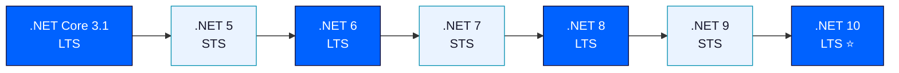
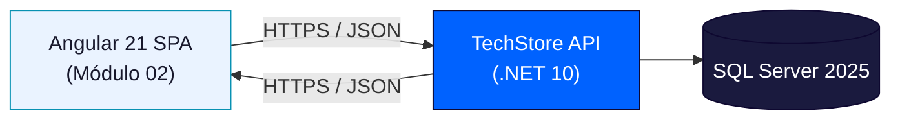

## Introducción y Evolución a .NET 10 · Minimal APIs en .NET 10

**Módulo 01: Back-End — Minimal APIs con .NET 10**
**Especialización Full-Stack .NET 10 & Angular 21 Developer**

> Esta guía acompaña la construcción de **TechStore API**, el proyecto integrador del módulo. En estas dos sesiones sentamos las bases: entendemos por qué usamos .NET 10 y creamos el primer proyecto con Minimal APIs.

---

## Índice

1. [Introducción y Evolución a .NET 10](#parte-1-introducción-y-evolución-a-net-10)
2. [Minimal APIs en .NET 10](#parte-2-minimal-apis-en-net-10)
3. [Checklist de cierre](#checklist-de-cierre)

---

# PARTE 1: Introducción y Evolución a .NET 10

## 1.1 ¿Qué es .NET 10 y por qué importa?

.NET es una plataforma de desarrollo gratuita, multiplataforma y de código abierto mantenida por Microsoft, usada para construir aplicaciones web, APIs, servicios en la nube, aplicaciones de escritorio y móviles. **.NET 10** es la última versión mayor de esta plataforma unificada, sucesora directa de .NET 9 y heredera del linaje que comenzó con .NET Core en 2016.

La palabra clave es *unificada*: antes de .NET Core existían .NET Framework (solo Windows), .NET Compact Framework, Mono, Xamarin... cada uno con su propio runtime y librerías. Desde .NET 5 (2020), Microsoft consolidó todo en **un solo runtime, un solo BCL (Base Class Library) y un solo modelo de proyecto**, sin importar si compilas una API, una app de escritorio o una app móvil.

### ¿Por qué migrar a .NET 10?

| Motivo | Detalle |
|---|---|
| **Rendimiento** | Cada versión trae mejoras de JIT, Server GC y del pipeline de ASP.NET Core; .NET 10 continúa la tendencia de ser la versión más rápida hasta la fecha. |
| **Soporte LTS** | .NET 10 es una versión **LTS (Long Term Support)**: 3 años de parches de seguridad y estabilidad, ideal para producción. |
| **C# 14** | Nuevas características del lenguaje que reducen código repetitivo y mejoran la seguridad de tipos (ver sección 1.4). |
| **AOT y contenedores más livianos** | Mejoras continuas en Native AOT, reduciendo el tamaño de imágenes Docker y el tiempo de arranque en frío — crítico para microservicios. |
| **Ecosistema** | Todo el tooling (EF Core, ASP.NET Core, herramientas de diagnóstico) se actualiza en conjunto con cada release anual. |

## 1.2 Línea de tiempo: de .NET Core a .NET 10

.NET sigue un **ciclo de lanzamiento anual** (cada noviembre). La convención es simple: **las versiones pares son LTS**, las impares son **STS (Standard Term Support)**, con soporte de 18 meses.



| Versión | Tipo | Lanzamiento | Estado actual |
|---|---|---|---|
| .NET Core 3.1 | LTS | Dic 2019 | Fuera de soporte |
| .NET 6 | LTS | Nov 2021 | Fuera de soporte |
| .NET 8 | LTS | Nov 2023 | Soporte hasta nov 2026 |
| .NET 9 | STS | Nov 2024 | Soporte estándar |
| **.NET 10** | **LTS** | **Nov 2025** | **Soporte hasta ~2028** |

> **Regla práctica:** para un proyecto de producción como TechStore API, siempre partimos de la última versión **LTS** disponible. Nunca empieces un proyecto nuevo sobre una versión STS a punto de expirar.

## 1.3 LTS vs STS: eligiendo la versión correcta

- **LTS (Long Term Support):** 3 años de soporte. Ideal para software que vivirá varios años en producción sin actualizaciones frecuentes de plataforma.
- **STS (Standard Term Support):** 18 meses de soporte. Útil si quieres estar a la vanguardia de features del lenguaje y puedes permitirte actualizar el runtime cada año.

Para **TechStore API**, al ser un sistema de negocio que debe operar de forma estable, la elección es clara: **.NET 10 LTS**.

## 1.4 C# 14: lo que cambia en el día a día

C# 14 (la versión de lenguaje que acompaña a .NET 10) continúa simplificando la sintaxis sin sacrificar seguridad de tipos. Estas son las características que usaremos constantemente en TechStore API:

### Top-level statements

Elimina el boilerplate de `class Program { static void Main(...) }`. Todo `Program.cs` moderno empieza directo:

```csharp
var builder = WebApplication.CreateBuilder(args);
var app = builder.Build();

app.MapGet("/", () => "TechStore API funcionando");

app.Run();
```

### Records — tipos inmutables por valor

Un `record` es ideal para **DTOs**: se compara por valor (dos records con los mismos datos son iguales) y es inmutable por defecto.

```csharp
public record ProductoDto(int Id, string Nombre, decimal Precio, int Stock);

var p1 = new ProductoDto(1, "Laptop", 3500m, 10);
var p2 = new ProductoDto(1, "Laptop", 3500m, 10);

Console.WriteLine(p1 == p2); // true — comparación por valor
```

### Pattern matching avanzado

Permite expresar lógica condicional compleja de forma declarativa, muy útil para reglas de negocio como la categorización de productos:

```csharp
string Categorizar(ProductoDto p) => p switch
{
    { Precio: > 3000 } => "Premium",
    { Precio: > 800 }  => "Estándar",
    { Stock: 0 }        => "Sin stock",
    _                    => "Económico"
};
```

### Nullable Reference Types

Activado por defecto en proyectos nuevos (`<Nullable>enable</Nullable>`). El compilador te avisa si podrías tener un `NullReferenceException`:

```csharp
public class Producto
{
    public string Nombre { get; set; } = default!; // no-nulo garantizado
    public string? Descripcion { get; set; }         // explícitamente nulable
}
```

> **Buena práctica:** en TechStore API, todas las entidades y DTOs usan Nullable Reference Types activado. Esto detecta en tiempo de compilación un porcentaje enorme de los bugs de referencias nulas que normalmente aparecerían en producción.

## 1.5 Full-Stack Architecture: .NET 10 + Angular 21

TechStore API es el **backend** de una arquitectura full-stack donde el **frontend** (Angular 21, Módulo 02) consume esta API vía HTTP/JSON. Esta separación tiene ventajas claras:

- **Desacoplamiento:** el backend no sabe (ni le importa) qué tecnología consume su API. Podría ser Angular, una app móvil o Postman.
- **Escalabilidad independiente:** puedes escalar el backend y el frontend por separado.
- **Contratos claros:** Swagger/OpenAPI (sesión 04) documenta el contrato exacto entre ambos mundos.



### Errores comunes en esta parte

- ❌ Empezar un proyecto nuevo en una versión STS "porque es la más reciente" — para producción, prioriza siempre LTS.
- ❌ Desactivar Nullable Reference Types "para que compile más rápido" — a la larga genera más bugs de los que evita.
- ❌ No fijar la versión del SDK en `global.json` — en equipos, cada desarrollador podría compilar con una versión distinta sin darse cuenta.

### Ejercicio propuesto

Crea el archivo `global.json` en la raíz de tu solución para fijar la versión del SDK y evitar inconsistencias entre desarrolladores:

```json
{
  "sdk": {
    "version": "10.0.100",
    "rollForward": "latestFeature"
  }
}
```

---

# PARTE 2: Minimal APIs en .NET 10

## 2.1 ASP.NET Core hoy

ASP.NET Core es el framework de .NET para construir aplicaciones web y APIs. Desde su rediseño en .NET Core, es **multiplataforma, de alto rendimiento y modular**: solo agregas al pipeline (`middlewares`) lo que realmente necesitas.

Con cada versión, ASP.NET Core mejora:
- Rendimiento del servidor Kestrel.
- Soporte nativo para OpenAPI (sin depender 100% de librerías de terceros).
- Mejor integración con **Native AOT**, reduciendo drásticamente el tiempo de arranque.

## 2.2 Minimal API vs Controller API — cuándo usar cada una

Desde .NET 6, existen dos estilos para exponer endpoints HTTP:

| Aspecto | Minimal API | Controller API (Classic) |
|---|---|---|
| Definición | Funciones lambda sobre `WebApplication` | Clases con atributos `[ApiController]`, `[HttpGet]`, etc. |
| Boilerplate | Mínimo | Mayor (clases, atributos, convenciones MVC) |
| Curva de aprendizaje | Baja | Media |
| Rendimiento | Ligeramente superior (menos capas de abstracción) | Muy bueno, pero con algo más de overhead |
| Ideal para | Microservicios, APIs pequeñas/medianas, PoCs | APIs grandes con muchos endpoints y filtros complejos |
| Organización a escala | `MapGroup` + archivos de extensión por recurso | Carpetas de controladores |

**Decisión para TechStore API:** usamos **Minimal API** en todos los endpoints. El proyecto es de tamaño medio y se beneficia de la simplicidad; organizamos el código con `MapGroup` y métodos de extensión por recurso (`ProductoEndpoints.cs`, `PedidoEndpoints.cs`, etc. — ver Sesiones 03-04) para que no se vuelva un solo archivo gigante.

## 2.3 Anatomía de una Minimal API

Todo Minimal API se arma con tres piezas:

1. **`WebApplicationBuilder`** — configura servicios, logging, configuración (`appsettings.json`) y el entorno (Development/Production).
2. **`WebApplication`** (resultado de `builder.Build()`) — configura el pipeline de middlewares y mapea las rutas.
3. **Endpoints (`Map*`)** — funciones que reciben una petición y devuelven un `IResult`.

```csharp
var builder = WebApplication.CreateBuilder(args);

// 1. Configuración de servicios (se detalla en Sesiones 03-04)
builder.Services.AddEndpointsApiExplorer();
builder.Services.AddSwaggerGen();

var app = builder.Build();

// 2. Pipeline de middlewares
if (app.Environment.IsDevelopment())
{
    app.UseSwagger();
    app.UseSwaggerUI();
}

// 3. Endpoints
app.MapGet("/api/health", () => Results.Ok(new { status = "ok" }));

app.Run();
```

## 2.4 CRUD completo con verbos HTTP

Vamos a construir el primer PoC de TechStore API: un CRUD de `Producto` **en memoria** (sin base de datos todavía — eso llega en la Sesión 04 con EF Core). El objetivo aquí es dominar el routing y los verbos HTTP.

```csharp
var builder = WebApplication.CreateBuilder(args);
var app = builder.Build();

// "Base de datos" temporal en memoria, solo para el PoC
var productos = new List<ProductoDto>
{
    new(1, "Laptop TechPro 15", 3500m, 12),
    new(2, "Mouse Inalámbrico", 45m, 80),
};

// GET — listar todos
app.MapGet("/api/productos", () => Results.Ok(productos));

// GET — obtener por id
app.MapGet("/api/productos/{id:int}", (int id) =>
{
    var producto = productos.FirstOrDefault(p => p.Id == id);
    return producto is not null ? Results.Ok(producto) : Results.NotFound();
});

// POST — crear
app.MapPost("/api/productos", (ProductoDto nuevo) =>
{
    productos.Add(nuevo);
    return Results.Created($"/api/productos/{nuevo.Id}", nuevo);
});

// PUT — actualizar
app.MapPut("/api/productos/{id:int}", (int id, ProductoDto actualizado) =>
{
    var index = productos.FindIndex(p => p.Id == id);
    if (index == -1) return Results.NotFound();
    productos[index] = actualizado;
    return Results.Ok(actualizado);
});

// DELETE — eliminar
app.MapDelete("/api/productos/{id:int}", (int id) =>
{
    var producto = productos.FirstOrDefault(p => p.Id == id);
    if (producto is null) return Results.NotFound();
    productos.Remove(producto);
    return Results.NoContent();
});

app.Run();

public record ProductoDto(int Id, string Nombre, decimal Precio, int Stock);
```

> Nota el uso de `{id:int}` — es una **restricción de ruta**: si alguien llama a `/api/productos/abc`, ASP.NET Core devuelve automáticamente `404` en lugar de intentar convertir "abc" a `int` y fallar de forma menos controlada.

### Agrupando endpoints con `MapGroup`

A medida que TechStore crece, agrupar por recurso mantiene el código ordenado desde el día uno:

```csharp
var productosGroup = app.MapGroup("/api/productos").WithTags("Productos");

productosGroup.MapGet("/", () => Results.Ok(productos));
productosGroup.MapGet("/{id:int}", (int id) => /* ... */);
productosGroup.MapPost("/", (ProductoDto nuevo) => /* ... */);
```

## 2.5 HTTP Status Codes: usándolos correctamente

Un error muy común es devolver siempre `200 OK`, incluso cuando algo falló. El consumidor de la API (Angular, Postman, otro servicio) depende de códigos de estado correctos para tomar decisiones.

| Código | Significado | Cuándo usarlo en TechStore API |
|---|---|---|
| `200 OK` | Éxito con contenido de respuesta | GET exitoso, PUT exitoso |
| `201 Created` | Recurso creado | POST exitoso — incluir header `Location` con la URL del nuevo recurso |
| `204 No Content` | Éxito sin contenido | DELETE exitoso |
| `400 Bad Request` | La petición está mal formada | Datos de entrada inválidos (falla de validación) |
| `401 Unauthorized` | Falta autenticación | No se envió token JWT o es inválido |
| `403 Forbidden` | Autenticado pero sin permiso | Un `Cliente` intenta crear un producto (acción de `Admin`) |
| `404 Not Found` | El recurso no existe | `GET /api/productos/999` cuando no existe el id 999 |
| `409 Conflict` | Conflicto de estado/negocio | Stock insuficiente al crear un pedido |
| `422 Unprocessable Entity` | Sintácticamente válido, semánticamente inválido | Pedido sin líneas de detalle |

### Errores comunes en esta parte

- ❌ Devolver `200 OK` con un cuerpo `{ "error": "no encontrado" }` en lugar de `404 Not Found` real.
- ❌ Usar `Results.Ok()` para un `POST` — lo correcto es `Results.Created(...)` con la ubicación del nuevo recurso.
- ❌ No validar el tipo de parámetro de ruta (`{id}` sin `:int`), dejando que errores de conversión lleguen como excepciones no controladas.

### Ejercicio propuesto

Extiende el PoC de la sección 2.4 agregando un endpoint `GET /api/productos/buscar?nombre=laptop` que filtre productos por nombre (búsqueda parcial, insensible a mayúsculas) usando **query parameters**. Pista: los parámetros de query se enlazan automáticamente por nombre en Minimal API:

```csharp
app.MapGet("/api/productos/buscar", (string? nombre) =>
{
    var resultado = string.IsNullOrWhiteSpace(nombre)
        ? productos
        : productos.Where(p => p.Nombre.Contains(nombre, StringComparison.OrdinalIgnoreCase));
    return Results.Ok(resultado);
});
```

---

## Checklist de cierre

Antes de avanzar a las Sesiones 03-04, confirma que puedes:

- [ ] Explicar la diferencia entre una versión LTS y una STS.
- [ ] Nombrar al menos 3 características nuevas de C# 14 y cuándo usarlas.
- [ ] Crear un proyecto Minimal API desde cero con `dotnet new web`.
- [ ] Implementar un CRUD completo (GET, POST, PUT, DELETE) con Minimal API.
- [ ] Elegir el código HTTP correcto para cada resultado posible de un endpoint.
- [ ] Explicar por qué TechStore API usa Minimal API en lugar de Controllers.

## Enlaces relacionados

- Spec del proyecto: `SPEC_TechStore_API.md` — secciones 1 y 2 (contexto y caso de uso)
- Siguiente wiki: **Sesiones 03-04 — Arquitectura de APIs e Implementación de Minimal APIs**
