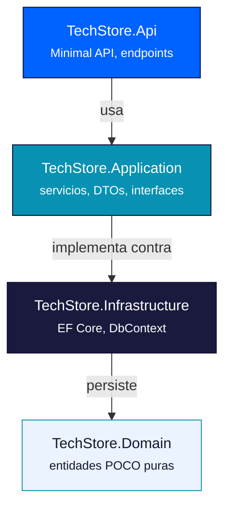

## Arquitectura de APIs en .NET 10 · Implementación de Minimal APIs

**Módulo 01: Back-End — Minimal APIs con .NET 10**
**Especialización Full-Stack .NET 10 & Angular 21 Developer**

> En estas sesiones diseñamos la arquitectura en capas de **TechStore API**, instalamos las librerías necesarias, modelamos la base de datos con EF Core y documentamos la API con Swagger.

---

## Índice

1. [Arquitectura de APIs en .NET 10](#parte-1-arquitectura-de-apis-en-net-10)
2. [Implementación de Minimal APIs](#parte-2-implementación-de-minimal-apis)
3. [Checklist de cierre](#checklist-de-cierre)

---

# PARTE 1: Arquitectura de APIs en .NET 10

## 1.1 Por qué una arquitectura en capas

Un PoC de un solo archivo `Program.cs` (como el de las Sesiones 01-02) funciona para prototipos, pero **no escala** cuando el proyecto crece: mezclar rutas HTTP, reglas de negocio y acceso a datos en un mismo lugar genera código difícil de probar, mantener y extender.

La solución es separar responsabilidades en **capas**, cada una con una única razón para cambiar:

| Capa | Responsabilidad | Depende de |
|---|---|---|
| **Domain** | Entidades del negocio puras (POCO), sin lógica de framework | Nada (capa más interna) |
| **Application** | Casos de uso, servicios, DTOs (records), interfaces | Domain |
| **Infrastructure** | Implementación técnica: EF Core, DbContext, servicios externos | Domain, Application (interfaces) |
| **Api** | Punto de entrada HTTP: Minimal API, `Program.cs`, middlewares | Application, Infrastructure |



> **Regla de oro:** las dependencias siempre apuntan "hacia adentro". `Domain` no conoce a nadie; `Api` conoce a todos. Esto permite, por ejemplo, cambiar SQL Server por otro motor de base de datos sin tocar la lógica de negocio.

## 1.2 Creando la solución multi-proyecto

```bash
dotnet new sln -n TechStore

dotnet new classlib -n TechStore.Domain
dotnet new classlib -n TechStore.Application
dotnet new classlib -n TechStore.Infrastructure
dotnet new web -n TechStore.Api

dotnet sln add TechStore.Domain TechStore.Application TechStore.Infrastructure TechStore.Api

# Referencias entre proyectos (las dependencias "hacia adentro")
dotnet add TechStore.Application reference TechStore.Domain
dotnet add TechStore.Infrastructure reference TechStore.Domain TechStore.Application
dotnet add TechStore.Api reference TechStore.Application TechStore.Infrastructure
```

## 1.3 NuGet: instalando las librerías necesarias

NuGet es el gestor de paquetes de .NET. Cada capa instala solo lo que necesita — otra ventaja de la separación:

```bash
# TechStore.Infrastructure — acceso a datos
dotnet add TechStore.Infrastructure package Microsoft.EntityFrameworkCore.SqlServer
dotnet add TechStore.Infrastructure package Microsoft.EntityFrameworkCore.Tools

# TechStore.Api — documentación y autenticación
dotnet add TechStore.Api package Swashbuckle.AspNetCore
dotnet add TechStore.Api package Microsoft.AspNetCore.Authentication.JwtBearer
```

| Paquete | Capa | Función |
|---|---|---|
| `Microsoft.EntityFrameworkCore.SqlServer` | Infrastructure | Proveedor de EF Core para SQL Server |
| `Microsoft.EntityFrameworkCore.Tools` | Infrastructure | Habilita `dotnet ef` (migraciones) |
| `Swashbuckle.AspNetCore` | Api | Genera la documentación OpenAPI/Swagger |
| `Microsoft.AspNetCore.Authentication.JwtBearer` | Api | Middleware de autenticación JWT (Sesión 05) |

> **Buena práctica:** fija las versiones de los paquetes (evita `*`) y revisa el archivo `.csproj` en cada Pull Request — un cambio de versión de EF Core puede alterar comportamientos de queries silenciosamente.

## 1.4 Inyección de Dependencias (DI)

.NET incluye un **contenedor de DI nativo** — no necesitas librerías externas como en otros ecosistemas. Se configura en `Program.cs` con `builder.Services`:

```csharp
// Program.cs (TechStore.Api)
builder.Services.AddScoped<IProductoService, ProductoService>();
builder.Services.AddScoped<IPedidoService, PedidoService>();
builder.Services.AddDbContext<TechStoreDbContext>(options =>
    options.UseSqlServer(builder.Configuration.GetConnectionString("Default")));
```

### Ciclos de vida de los servicios

| Ciclo de vida | Comportamiento | Cuándo usarlo |
|---|---|---|
| `Transient` | Nueva instancia cada vez que se solicita | Servicios sin estado, muy livianos |
| `Scoped` | Una instancia por petición HTTP | **La mayoría de nuestros servicios y el `DbContext`** |
| `Singleton` | Una única instancia durante toda la vida de la app | Configuración, caché en memoria, clientes HTTP reutilizables |

> En TechStore API, `TechStoreDbContext` y todos los servicios de aplicación (`ProductoService`, `PedidoService`, `TokenService`) se registran como **`Scoped`**: viven durante una petición y se liberan al finalizar, evitando fugas de memoria y problemas de concurrencia con EF Core.

## 1.5 Del dominio al primer caso de uso

Antes de escribir un endpoint, modelamos el dominio real. Para TechStore, el primer caso de uso es simple: **consultar el catálogo de productos**.

```csharp
// TechStore.Domain/Entities/Producto.cs
namespace TechStore.Domain.Entities;

public class Producto
{
    public int Id { get; set; }
    public string Nombre { get; set; } = default!;
    public decimal Precio { get; set; }
    public int Stock { get; set; }
}
```

```csharp
// TechStore.Application/Interfaces/IProductoService.cs
namespace TechStore.Application.Interfaces;

public interface IProductoService
{
    Task<IEnumerable<ProductoDto>> ObtenerTodosAsync();
    Task<ProductoDto?> ObtenerPorIdAsync(int id);
}
```

### Errores comunes en esta parte

- ❌ Poner lógica de negocio directamente en el endpoint (`Program.cs`) en lugar de delegarla a un servicio de `Application`.
- ❌ Registrar el `DbContext` como `Singleton` — provoca errores de concurrencia graves bajo carga.
- ❌ Que `Domain` referencie a `Infrastructure` (dependencia invertida) — rompe todo el propósito de la arquitectura en capas.

### Ejercicio propuesto

Crea la interfaz `ICategoriaService` en `TechStore.Application` con los métodos `ObtenerTodosAsync()` y `CrearAsync(CrearCategoriaDto dto)`, y regístrala en el contenedor de DI del `Program.cs` (aún sin implementación — eso viene en la parte 2).

---

# PARTE 2: Implementación de Minimal APIs

## 2.1 Implementando la arquitectura propuesta

Ahora damos vida a la arquitectura: implementamos `ProductoService`, conectamos EF Core y exponemos el primer endpoint real (con base de datos).

```csharp
// TechStore.Application/Services/ProductoService.cs
public class ProductoService(TechStoreDbContext db) : IProductoService
{
    public async Task<IEnumerable<ProductoDto>> ObtenerTodosAsync() =>
        await db.Productos
            .AsNoTracking()
            .Select(p => new ProductoDto(p.Id, p.Nombre, p.Precio, p.Stock))
            .ToListAsync();

    public async Task<ProductoDto?> ObtenerPorIdAsync(int id) =>
        await db.Productos
            .AsNoTracking()
            .Where(p => p.Id == id)
            .Select(p => new ProductoDto(p.Id, p.Nombre, p.Precio, p.Stock))
            .FirstOrDefaultAsync();
}
```

> `AsNoTracking()` le dice a EF Core que **no necesita rastrear cambios** en estas entidades porque son de solo lectura. Esto mejora notablemente el rendimiento en consultas de consulta pura (GET).

## 2.2 Modelando la base de datos con EF Core (Code-First)

Con **EF Core**, escribimos las clases en C# y dejamos que el framework genere el esquema de base de datos — el enfoque **Code-First**.

```csharp
// TechStore.Infrastructure/TechStoreDbContext.cs
public class TechStoreDbContext(DbContextOptions<TechStoreDbContext> options) : DbContext(options)
{
    public DbSet<Producto> Productos => Set<Producto>();
    public DbSet<Categoria> Categorias => Set<Categoria>();

    protected override void OnModelCreating(ModelBuilder modelBuilder)
    {
        modelBuilder.Entity<Producto>(entity =>
        {
            entity.Property(p => p.Nombre).IsRequired().HasMaxLength(150);
            entity.Property(p => p.Precio).HasColumnType("decimal(10,2)");
        });
    }
}
```

### Generando y aplicando migraciones

```bash
# Genera un script de cambios a partir de tus clases C#
dotnet ef migrations add InitialCreate --project TechStore.Infrastructure --startup-project TechStore.Api

# Aplica esos cambios a la base de datos real
dotnet ef database update --project TechStore.Infrastructure --startup-project TechStore.Api
```

> **Buena práctica:** genera migraciones **pequeñas y frecuentes** (una por cada cambio significativo de modelo), nunca una migración gigante al final del proyecto. Esto facilita revertir cambios puntuales si algo sale mal.

## 2.3 POCO Class vs Record — cuándo usar cada uno

Esta es una de las decisiones de diseño más importantes del proyecto:

| Característica | POCO Class | Record |
|---|---|---|
| Mutabilidad | Mutable (EF Core necesita poder modificar propiedades al rastrear cambios) | Inmutable por defecto |
| Igualdad | Por referencia | Por valor |
| Uso en TechStore API | **Entidades** (`Producto`, `Pedido`, `Cliente`...) | **DTOs** (`ProductoDto`, `CrearPedidoDto`...) |
| Sintaxis | Propiedades explícitas con `{ get; set; }` | Declaración compacta en una línea |

```csharp
// Entidad (POCO) — vive en Domain, la persiste EF Core
public class Producto
{
    public int Id { get; set; }
    public string Nombre { get; set; } = default!;
    public decimal Precio { get; set; }
}

// DTO (record) — vive en Application, viaja por la red
public record ProductoDto(int Id, string Nombre, decimal Precio);
```

> **¿Por qué no exponer las entidades directamente en la API?** Porque acoplarías tu contrato HTTP a tu esquema de base de datos. Si mañana agregas una columna interna (ej. `CostoProveedor`) a `Producto`, no quieres que se filtre automáticamente en la respuesta JSON. Los DTOs son tu "capa de traducción" controlada.

## 2.4 WebApplicationBuilder avanzado: mapeando todos los verbos

Con la arquitectura ya en su lugar, el endpoint queda limpio — solo orquesta, no contiene lógica:

```csharp
// TechStore.Api/Endpoints/ProductoEndpoints.cs
public static class ProductoEndpoints
{
    public static void MapProductoEndpoints(this RouteGroupBuilder group)
    {
        group.MapGet("/", async (IProductoService svc) =>
            Results.Ok(await svc.ObtenerTodosAsync()));

        group.MapGet("/{id:int}", async (int id, IProductoService svc) =>
        {
            var producto = await svc.ObtenerPorIdAsync(id);
            return producto is not null ? Results.Ok(producto) : Results.NotFound();
        });
    }
}

// Program.cs
app.MapGroup("/api/productos").WithTags("Productos").MapProductoEndpoints();
```

## 2.5 Documentando la API con Swagger (Swashbuckle)

Swagger/OpenAPI genera **documentación interactiva** directamente desde el código: cada endpoint, sus parámetros y las respuestas posibles.

```csharp
// Program.cs
builder.Services.AddEndpointsApiExplorer();
builder.Services.AddSwaggerGen(options =>
{
    options.SwaggerDoc("v1", new OpenApiInfo
    {
        Title = "TechStore API",
        Version = "v1",
        Description = "API REST para la gestión de catálogo y pedidos de TechStore"
    });
});

var app = builder.Build();

app.UseSwagger();
app.UseSwaggerUI(); // disponible en /swagger
```

Enriquecemos cada endpoint con metadatos que Swagger usa para generar mejor documentación:

```csharp
group.MapGet("/{id:int}", async (int id, IProductoService svc) => { /* ... */ })
    .WithName("ObtenerProductoPorId")
    .WithSummary("Obtiene un producto por su identificador")
    .Produces<ProductoDto>(StatusCodes.Status200OK)
    .Produces(StatusCodes.Status404NotFound);
```

> **Buena práctica:** habilita Swagger **desde el primer endpoint**, no al final del proyecto. Además de servir como documentación, es tu herramienta principal para probar la API manualmente durante el desarrollo, antes de que exista un frontend.

### Errores comunes en esta parte

- ❌ Devolver entidades de EF Core directamente desde el endpoint en lugar de mapear a un DTO — expone columnas internas y acopla tu API al esquema de base de datos.
- ❌ Olvidar `AsNoTracking()` en consultas de solo lectura, afectando el rendimiento innecesariamente.
- ❌ Generar una sola migración enorme al final del sprint en lugar de migraciones incrementales.
- ❌ No usar `WithName`/`WithTags`/`Produces` — Swagger genera una documentación pobre y poco útil para el equipo de Angular.

### Ejercicio propuesto

Implementa `POST /api/productos` completo: crea el DTO `CrearProductoDto` (record), el método `CrearAsync` en `IProductoService`/`ProductoService` (que guarda en `TechStoreDbContext` y llama a `SaveChangesAsync()`), y el endpoint correspondiente devolviendo `201 Created` con el nuevo producto. Documenta el endpoint con Swagger (`WithSummary`, `Produces<ProductoDto>(201)`).

---

## Checklist de cierre

Antes de avanzar a las Sesiones 05-06, confirma que puedes:

- [ ] Explicar el propósito de cada una de las 4 capas de la arquitectura.
- [ ] Crear una solución multi-proyecto con las referencias correctas entre capas.
- [ ] Registrar servicios en el contenedor de DI con el ciclo de vida correcto.
- [ ] Modelar entidades EF Core y generar/aplicar migraciones.
- [ ] Explicar cuándo usar `class` (POCO) y cuándo usar `record` (DTO).
- [ ] Tener Swagger funcionando y documentando al menos 3 endpoints.

## Enlaces relacionados

- Spec del proyecto: `SPEC_TechStore_API.md` — secciones 4 y 5 (modelo de datos y arquitectura)
- Wiki anterior: **Sesiones 01-02 — Introducción a .NET 10 y Minimal APIs**
- Siguiente wiki: **Sesiones 05-06 — Seguridad (CORS y JWT) y Caso Práctico de Aplicación**
