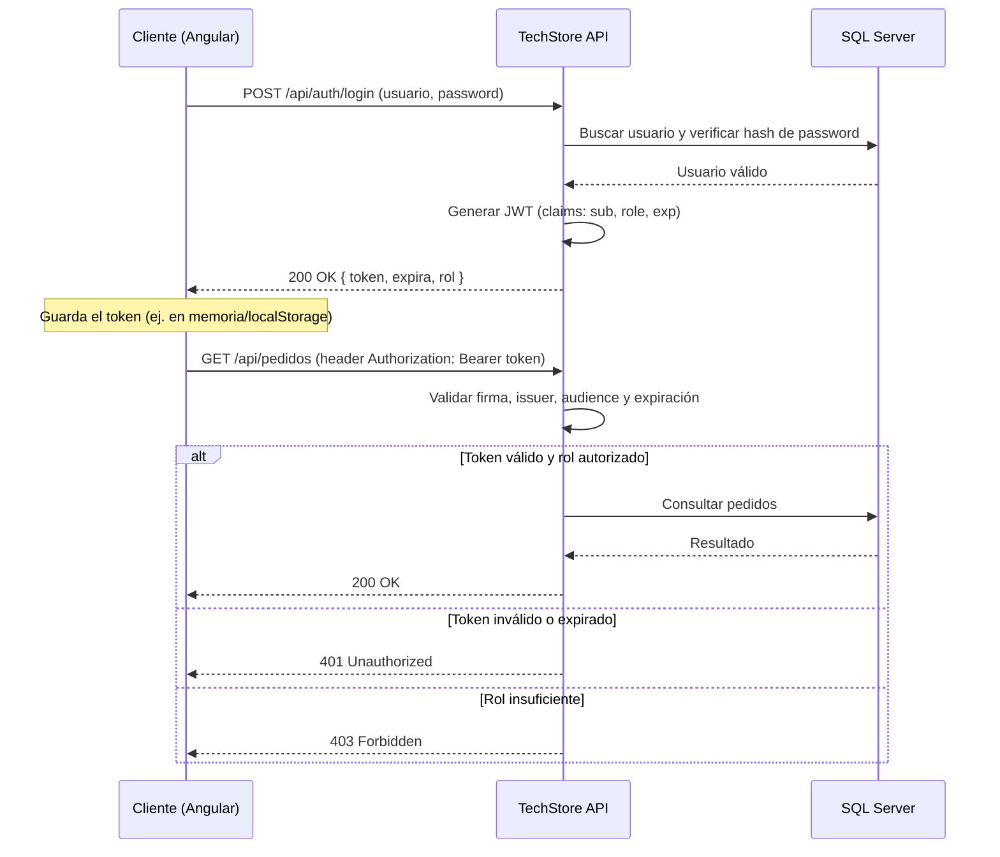
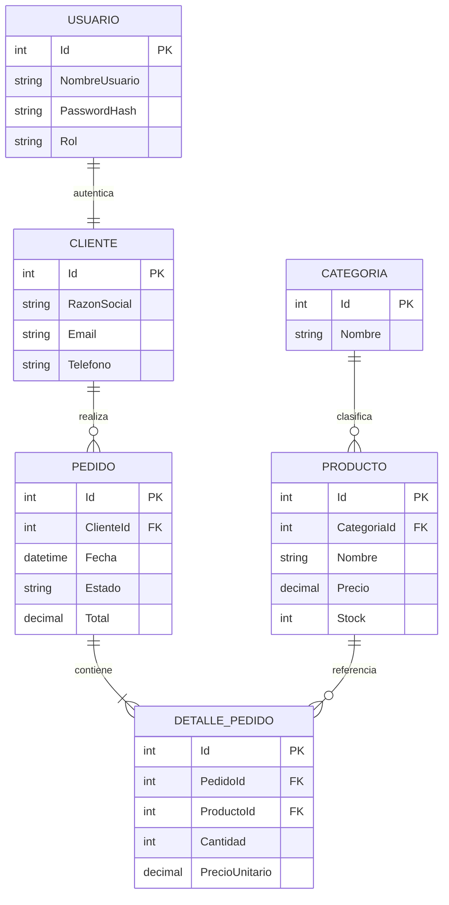

## Seguridad en .NET 10 (CORS y JWT) · Caso Práctico de Aplicación

**Módulo 01: Back-End — Minimal APIs con .NET 10**
**Especialización Full-Stack .NET 10 & Angular 21 Developer**

> Aseguramos TechStore API con CORS y JWT, y construimos el corazón funcional del proyecto: el proceso de **pedidos maestro-detalle**.

---

## Índice

1. [Seguridad en .NET 10 (CORS y JWT)](#parte-1-seguridad-en-net-10-cors-y-jwt)
2. [Caso Práctico de Aplicación](#parte-2-caso-práctico-de-aplicación)
3. [Checklist de cierre](#checklist-de-cierre)

---

# PARTE 1: Seguridad en .NET 10 (CORS y JWT)

## 1.1 CORS: controlando quién puede consumir la API

**CORS (Cross-Origin Resource Sharing)** es un mecanismo del navegador que bloquea, por defecto, que una página web en un dominio (ej. `https://techstore-frontend.com`) haga peticiones a una API en otro dominio (ej. `https://api.techstore.com`) — a menos que la API lo permita explícitamente.

> Importante: CORS es una protección **del navegador**, no de tu API. Postman o un `curl` ignoran CORS por completo. Aun así, es esencial configurarlo correctamente porque tu frontend Angular sí vive en el navegador.

### Configurando CORS en TechStore API

```csharp
// Program.cs
builder.Services.AddCors(options =>
{
    options.AddPolicy("AllowFrontend", policy =>
    {
        policy.WithOrigins(
                "http://localhost:4200",                          // Angular en desarrollo
                "https://techstore-frontend.azurestaticapps.net")  // Angular en producción
              .AllowAnyHeader()
              .AllowAnyMethod();
    });
});

var app = builder.Build();

app.UseCors("AllowFrontend"); // debe ir ANTES de UseAuthentication/UseAuthorization
```

### Errores comunes con CORS

- ❌ Usar `AllowAnyOrigin()` en producción — cualquier sitio web podría consumir tu API con las credenciales del usuario.
- ❌ Combinar `AllowAnyOrigin()` con `AllowCredentials()` — el navegador lo rechaza directamente porque es una combinación insegura.
- ❌ Registrar `UseCors` después de `UseAuthentication` — el orden del pipeline de middlewares importa.

## 1.2 JWT: autenticación sin estado

**JWT (JSON Web Token)** es un estándar para representar de forma compacta y verificable la identidad de un usuario. A diferencia de las sesiones tradicionales (que requieren guardar estado en el servidor), un JWT es **auto-contenido**: toda la información necesaria para validar al usuario viaja dentro del propio token.

### Anatomía de un JWT

Un JWT tiene tres partes separadas por puntos: `header.payload.signature`

```
eyJhbGciOiJIUzI1NiJ9.eyJzdWIiOiIxIiwicm9sZSI6IkFkbWluIn0.4f8a...
└──────── Header ────────┘└────────── Payload ──────────┘└─ Signature ─┘
```

| Parte | Contenido | Ejemplo decodificado |
|---|---|---|
| **Header** | Algoritmo de firma y tipo de token | `{ "alg": "HS256", "typ": "JWT" }` |
| **Payload** | Claims (afirmaciones sobre el usuario) | `{ "sub": "1", "role": "Admin", "exp": 1735689600 }` |
| **Signature** | Firma criptográfica que garantiza que el token no fue alterado | (binario, no legible) |

> El Header y el Payload **no están encriptados**, solo codificados en Base64 — cualquiera puede leerlos. Nunca pongas información sensible (contraseñas, datos privados) en el payload de un JWT. Lo que garantiza la seguridad es la **firma**: si alguien modifica el payload, la firma deja de coincidir y el token se invalida.

### Algoritmos de firma

| Algoritmo | Tipo | Uso recomendado |
|---|---|---|
| **HS256** | Simétrico (una sola clave secreta compartida) | APIs con un solo servidor emisor y validador — el caso de TechStore API |
| **RS384** | Asimétrico (clave privada firma, clave pública valida) | Arquitecturas de microservicios donde varios servicios necesitan *validar* tokens sin poder *emitirlos* |
| **ES256** | Asimétrico (curva elíptica) | Alto rendimiento con seguridad equivalente a RS256, tokens más pequeños |

**Decisión para TechStore API:** usamos **HS256** porque tenemos un único servicio que emite y valida tokens. Si en el futuro TechStore creciera a una arquitectura de microservicios, migraríamos a RS384.

### Flujo completo de autenticación



## 1.3 Implementando JWT en .NET 10

### Configuración del middleware

```csharp
// Program.cs
var jwtKey = builder.Configuration["Jwt:Key"]!; // desde variables de entorno en producción

builder.Services.AddAuthentication(JwtBearerDefaults.AuthenticationScheme)
    .AddJwtBearer(options =>
    {
        options.TokenValidationParameters = new TokenValidationParameters
        {
            ValidateIssuer = true,
            ValidIssuer = builder.Configuration["Jwt:Issuer"],
            ValidateAudience = true,
            ValidAudience = builder.Configuration["Jwt:Audience"],
            ValidateLifetime = true,
            ValidateIssuerSigningKey = true,
            IssuerSigningKey = new SymmetricSecurityKey(Encoding.UTF8.GetBytes(jwtKey))
        };
    });

builder.Services.AddAuthorization();
```

### Generando el token en el login

```csharp
// TechStore.Application/Services/TokenService.cs
public class TokenService(IConfiguration config) : ITokenService
{
    public string GenerarToken(Usuario usuario)
    {
        var claims = new[]
        {
            new Claim(ClaimTypes.NameIdentifier, usuario.Id.ToString()),
            new Claim(ClaimTypes.Name, usuario.NombreUsuario),
            new Claim(ClaimTypes.Role, usuario.Rol)
        };

        var key = new SymmetricSecurityKey(Encoding.UTF8.GetBytes(config["Jwt:Key"]!));
        var credentials = new SigningCredentials(key, SecurityAlgorithms.HmacSha256);

        var token = new JwtSecurityToken(
            issuer: config["Jwt:Issuer"],
            audience: config["Jwt:Audience"],
            claims: claims,
            expires: DateTime.UtcNow.AddMinutes(60),
            signingCredentials: credentials);

        return new JwtSecurityTokenHandler().WriteToken(token);
    }
}
```

### El endpoint de login

```csharp
group.MapPost("/login", async (LoginDto dto, IUsuarioService usuarios, ITokenService tokens) =>
{
    var usuario = await usuarios.ValidarCredencialesAsync(dto.NombreUsuario, dto.Password);
    if (usuario is null) return Results.Unauthorized();

    var token = tokens.GenerarToken(usuario);
    return Results.Ok(new TokenResponseDto(token, DateTime.UtcNow.AddMinutes(60), usuario.Rol));
});
```

> **Buena práctica de seguridad:** las contraseñas **nunca** se guardan en texto plano. Usa `BCrypt.Net-Next` para generar un hash al registrar al usuario (`BCrypt.HashPassword(password)`) y verificarlo al hacer login (`BCrypt.Verify(password, hash)`).

## 1.4 Usuarios, roles y protección de endpoints

TechStore API define dos roles: `Admin` y `Cliente` (ver Spec, sección 2.2). Protegemos endpoints declarativamente:

```csharp
// Solo administradores pueden gestionar el catálogo
group.MapPost("/", async (CrearProductoDto dto, IProductoService svc) => { /* ... */ })
    .RequireAuthorization(policy => policy.RequireRole("Admin"));

// Clientes autenticados (de cualquier rol) pueden crear pedidos
group.MapPost("/", async (CrearPedidoDto dto, IPedidoService svc, ClaimsPrincipal user) =>
{
    var clienteId = int.Parse(user.FindFirstValue(ClaimTypes.NameIdentifier)!);
    // ...
}).RequireAuthorization();
```

## 1.5 Pruebas de seguridad con tokens

Antes de dar por cerrada la sesión, verifica manualmente estos 4 escenarios con Postman o Swagger UI:

| Escenario | Petición | Resultado esperado |
|---|---|---|
| Sin token | `GET /api/pedidos` sin header `Authorization` | `401 Unauthorized` |
| Token inválido/manipulado | Header `Authorization: Bearer token-alterado` | `401 Unauthorized` |
| Token expirado | Token generado con `expires` en el pasado | `401 Unauthorized` |
| Rol insuficiente | Un `Cliente` intenta `POST /api/productos` | `403 Forbidden` |

### Errores comunes en esta parte

- ❌ Guardar la `Jwt:Key` directamente en `appsettings.json` versionado en git — debe ir en variables de entorno o un gestor de secretos (`dotnet user-secrets` en desarrollo, Azure Key Vault en producción).
- ❌ Poner tiempos de expiración muy largos (ej. 30 días) sin mecanismo de revocación.
- ❌ Confundir `401` (no autenticado) con `403` (autenticado, pero sin permiso) — son semánticamente distintos y el frontend los maneja de forma diferente.

### Ejercicio propuesto

Implementa el endpoint `POST /api/auth/register` que reciba nombre de usuario, contraseña y datos de cliente, valide que el nombre de usuario no exista, hashee la contraseña con BCrypt, cree el `Usuario` con rol `Cliente` por defecto y el `Cliente` asociado, todo en una única operación de guardado.

---

# PARTE 2: Caso Práctico de Aplicación

## 2.1 Modelamiento del proceso de negocio

Con la seguridad lista, construimos el **proceso central de TechStore**: un cliente arma un pedido con varias líneas de producto. Este es el flujo maestro-detalle descrito en el Spec del proyecto (sección 2.3).



## 2.2 Creación de la base de datos en SQL Server

Con las entidades `Cliente`, `Pedido` y `DetallePedido` agregadas al `DbContext`, configuramos las relaciones con Fluent API:

```csharp
protected override void OnModelCreating(ModelBuilder modelBuilder)
{
    modelBuilder.Entity<Pedido>()
        .HasMany(p => p.Detalles)
        .WithOne()
        .HasForeignKey(d => d.PedidoId)
        .OnDelete(DeleteBehavior.Cascade); // al borrar un pedido, se borran sus líneas

    modelBuilder.Entity<DetallePedido>()
        .Property(d => d.PrecioUnitario)
        .HasColumnType("decimal(10,2)");

    modelBuilder.Entity<Pedido>()
        .Property(p => p.Total)
        .HasColumnType("decimal(10,2)");
}
```

```bash
dotnet ef migrations add AgregarPedidosYDetalle --project TechStore.Infrastructure --startup-project TechStore.Api
dotnet ef database update --project TechStore.Infrastructure --startup-project TechStore.Api
```

## 2.3 APIs CRUD de soporte

Antes del endpoint principal, TechStore necesita **catálogos de soporte** completos: `Categoria` y `Cliente` (además de `Producto`, ya implementado). Son CRUDs estándar que siguen exactamente el patrón de la Sesión 04:

```csharp
public static class ClienteEndpoints
{
    public static void MapClienteEndpoints(this RouteGroupBuilder group)
    {
        group.MapGet("/", async (IClienteService svc) => Results.Ok(await svc.ObtenerTodosAsync()))
            .RequireAuthorization(p => p.RequireRole("Admin"));

        group.MapGet("/{id:int}", async (int id, IClienteService svc, ClaimsPrincipal user) =>
        {
            // Un cliente solo puede ver su propio perfil; el Admin puede ver cualquiera
            var cliente = await svc.ObtenerPorIdAsync(id);
            return cliente is not null ? Results.Ok(cliente) : Results.NotFound();
        }).RequireAuthorization();
    }
}
```

## 2.4 Implementando la API principal (maestro-detalle)

Este es el endpoint más importante del proyecto. En esta sesión lo implementamos **sin transacción explícita todavía** (la transacción ACID llega en la Sesión 07) — aquí nos enfocamos en la lógica de negocio del maestro-detalle.

```csharp
// TechStore.Application/Services/PedidoService.cs
public class PedidoService(TechStoreDbContext db) : IPedidoService
{
    public async Task<PedidoDto> CrearAsync(CrearPedidoDto dto)
    {
        var pedido = new Pedido
        {
            ClienteId = dto.ClienteId,
            Fecha = DateTime.UtcNow,
            Estado = "Pendiente"
        };

        foreach (var linea in dto.Lineas)
        {
            var producto = await db.Productos.FindAsync(linea.ProductoId)
                ?? throw new KeyNotFoundException($"Producto {linea.ProductoId} no existe");

            pedido.Detalles.Add(new DetallePedido
            {
                ProductoId = producto.Id,
                Cantidad = linea.Cantidad,
                PrecioUnitario = producto.Precio
            });
        }

        pedido.Total = pedido.Detalles.Sum(d => d.Cantidad * d.PrecioUnitario);

        db.Pedidos.Add(pedido);
        await db.SaveChangesAsync();

        return await ObtenerPorIdAsync(pedido.Id) ?? throw new InvalidOperationException();
    }

    public async Task<PedidoDto?> ObtenerPorIdAsync(int id) =>
        await db.Pedidos
            .Include(p => p.Cliente)
            .Include(p => p.Detalles).ThenInclude(d => d.Producto)
            .Where(p => p.Id == id)
            .Select(p => new PedidoDto(
                p.Id, p.Cliente!.RazonSocial, p.Fecha, p.Estado, p.Total,
                p.Detalles.Select(d => new DetalleDto(
                    d.Producto!.Nombre, d.Cantidad, d.PrecioUnitario, d.Cantidad * d.PrecioUnitario)).ToList()))
            .FirstOrDefaultAsync();
}
```

```csharp
// TechStore.Api/Endpoints/PedidoEndpoints.cs
group.MapPost("/", async (CrearPedidoDto dto, IPedidoService svc) =>
{
    if (dto.Lineas is null || dto.Lineas.Count == 0)
        return Results.UnprocessableEntity(new { error = "El pedido debe tener al menos una línea" });

    var pedido = await svc.CrearAsync(dto);
    return Results.Created($"/api/pedidos/{pedido.Id}", pedido);
}).RequireAuthorization();
```

> Observa el uso de `Include`/`ThenInclude` — es cómo EF Core hace **eager loading** de relaciones. Sin esto, `p.Cliente` y `p.Detalles` llegarían vacíos (o lanzarían una excepción si el `DbContext` ya se liberó).

## 2.5 Realizando pruebas y ajustes

Checklist de pruebas manuales para el caso práctico (con Swagger UI o Postman):

1. `POST /api/auth/login` con un usuario `Cliente` → obtener token.
2. `GET /api/productos` → copiar 2-3 IDs de productos existentes.
3. `POST /api/pedidos` con esos productos y cantidades válidas → esperar `201 Created` con el pedido completo (cliente, líneas, total calculado).
4. `GET /api/pedidos/{id}` → verificar que el detalle coincide exactamente con lo enviado.
5. `POST /api/pedidos` con un `productoId` inexistente → verificar manejo de error (por ahora, una excepción no controlada; se refina en la Sesión 07).

### Errores comunes en esta parte

- ❌ Olvidar `Include`/`ThenInclude`, resultando en propiedades de navegación `null` al mapear al DTO.
- ❌ Calcular el `Total` en el frontend en lugar del backend — el backend es la única fuente de verdad para cálculos de negocio.
- ❌ No validar que `Lineas` no esté vacío antes de procesar el pedido.

### Ejercicio propuesto

Agrega el endpoint `GET /api/pedidos` que liste pedidos: si el usuario autenticado tiene rol `Admin`, devuelve todos los pedidos; si tiene rol `Cliente`, devuelve solo los suyos (filtra por el `ClienteId` asociado a su `ClaimTypes.NameIdentifier`).

---

## Checklist de cierre

Antes de avanzar a las Sesiones 07-08, confirma que puedes:

- [ ] Explicar la diferencia entre `401 Unauthorized` y `403 Forbidden`.
- [ ] Configurar CORS para un origen específico (no `AllowAnyOrigin` en producción).
- [ ] Generar y validar un JWT con claims de rol.
- [ ] Proteger un endpoint por rol con `RequireAuthorization`.
- [ ] Modelar y persistir una relación maestro-detalle con EF Core.
- [ ] Implementar el endpoint `POST /api/pedidos` completo y probarlo end-to-end.

## Enlaces relacionados

- Spec del proyecto: `SPEC_TechStore_API.md` — secciones 6 y 7 (endpoints y seguridad)
- Wiki anterior: **Sesiones 03-04 — Arquitectura de APIs**
- Siguiente wiki: **Sesiones 07-08 — Gestión de Transacciones y Despliegue**
