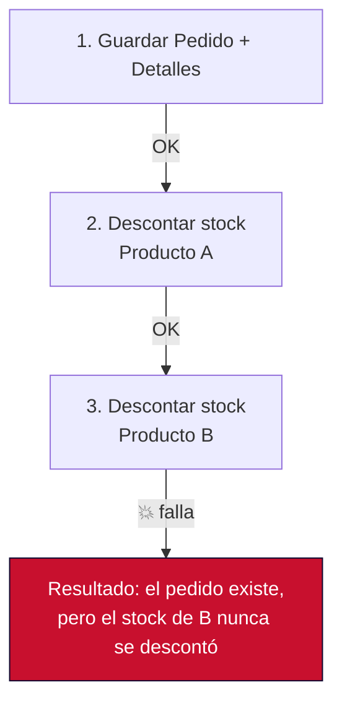
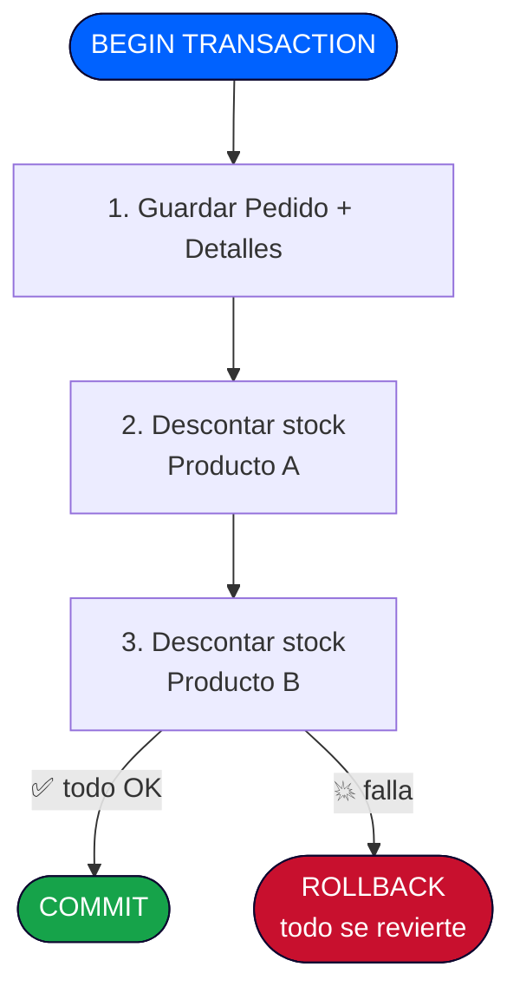
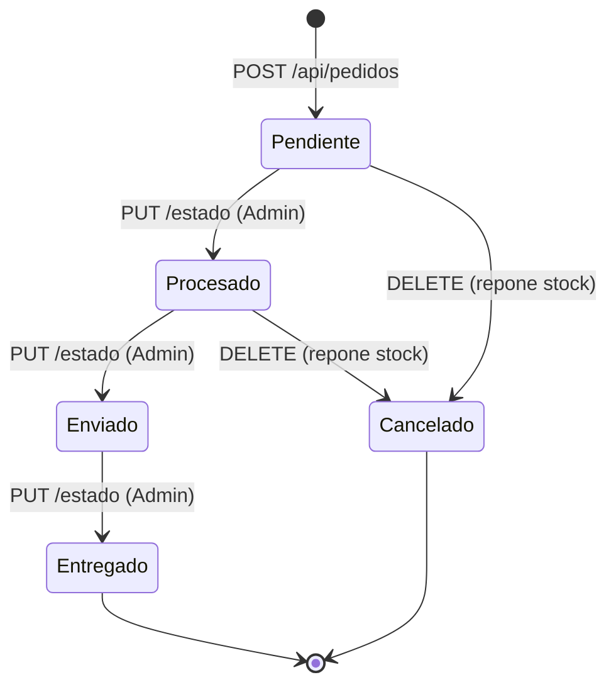
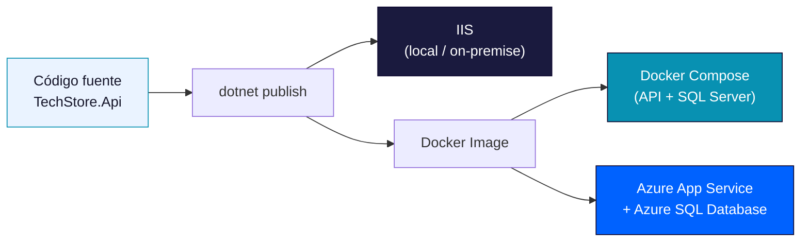

## Gestión de Transacciones · Despliegue de APIs Local y Nube

**Módulo 01: Back-End — Minimal APIs con .NET 10**
**Especialización Full-Stack .NET 10 & Angular 21 Developer**

> Cerramos la construcción de TechStore API garantizando consistencia con transacciones ACID y llevando la API a producción: local (IIS), contenedores (Docker) y nube (Azure).

---

## Índice

1. [Gestión de Transacciones](#parte-1-gestión-de-transacciones)
2. [Despliegue de APIs Local y Nube](#parte-2-despliegue-de-apis-local-y-nube)
3. [Checklist de cierre](#checklist-de-cierre)

---

# PARTE 1: Gestión de Transacciones

## 1.1 ACID: la base de la confiabilidad

Cuando una operación de negocio implica **múltiples cambios en la base de datos que deben ocurrir todos o ninguno**, necesitamos una **transacción**. El estándar que garantiza que las transacciones sean confiables se resume en el acrónimo **ACID**:

| Propiedad | Garantiza |
|---|---|
| **A**tomicidad | Todo o nada: la transacción se aplica completa o no se aplica en absoluto |
| **C**onsistencia | Los datos siempre cumplen las reglas de negocio e integridad definidas |
| **A**islamiento | Las transacciones concurrentes no interfieren entre sí |
| **D**urabilidad | Una vez confirmada (`commit`), la transacción persiste aunque el sistema falle inmediatamente después |

### ¿Por qué TechStore API necesita transacciones explícitas?

El caso `POST /api/pedidos` (Sesión 06) modifica **dos cosas relacionadas**: crea el pedido con sus líneas, **y** descuenta el stock de cada producto. Si el pedido se guarda pero el descuento de stock falla (o viceversa), la base de datos queda en un **estado inconsistente**: productos vendidos que aparentan seguir en stock, o stock descontado sin un pedido real que lo respalde.

**Sin transacción (❌ riesgoso):**



**Con transacción (✅ correcto):**



## 1.2 `SaveChanges` ya es transaccional (hasta cierto punto)

Es importante entender un matiz de EF Core: **una sola llamada a `SaveChangesAsync()`** ya envuelve todos los cambios pendientes del `DbContext` en una transacción implícita. El problema es cuando necesitas **lógica de negocio entre múltiples `SaveChangesAsync()`**, o cuando combinas operaciones que deben ser atómicas pero se calculan en pasos separados — ahí necesitas una **transacción explícita**.

## 1.3 Implementando la transacción en `PedidoService`

Retomamos el `PedidoService` de la Sesión 06 y lo hacemos verdaderamente transaccional, incluyendo la validación y descuento de stock:

```csharp
public async Task<PedidoDto> CrearAsync(CrearPedidoDto dto)
{
    using var transaction = await db.Database.BeginTransactionAsync();
    try
    {
        var pedido = new Pedido
        {
            ClienteId = dto.ClienteId,
            Fecha = DateTime.UtcNow,
            Estado = "Pendiente"
        };

        foreach (var linea in dto.Lineas)
        {
            var producto = await db.Productos.FindAsync(linea.ProductoId)
                ?? throw new NotFoundException($"Producto {linea.ProductoId} no existe");

            if (producto.Stock < linea.Cantidad)
                throw new StockInsuficienteException(producto.Nombre, producto.Stock, linea.Cantidad);

            producto.Stock -= linea.Cantidad; // se descuenta en la MISMA unidad de trabajo

            pedido.Detalles.Add(new DetallePedido
            {
                ProductoId = producto.Id,
                Cantidad = linea.Cantidad,
                PrecioUnitario = producto.Precio
            });
        }

        pedido.Total = pedido.Detalles.Sum(d => d.Cantidad * d.PrecioUnitario);
        db.Pedidos.Add(pedido);

        await db.SaveChangesAsync();       // aplica pedido + detalles + stock actualizado
        await transaction.CommitAsync();   // confirma TODO de forma atómica

        return await ObtenerPorIdAsync(pedido.Id) ?? throw new InvalidOperationException();
    }
    catch
    {
        await transaction.RollbackAsync(); // revierte TODO ante cualquier error
        throw;
    }
}
```

### Excepciones de negocio personalizadas

```csharp
public class StockInsuficienteException(string producto, int disponible, int solicitado)
    : Exception($"Stock insuficiente para '{producto}': disponible {disponible}, solicitado {solicitado}");

public class NotFoundException(string mensaje) : Exception(mensaje);
```

### Traduciendo excepciones a códigos HTTP

```csharp
group.MapPost("/", async (CrearPedidoDto dto, IPedidoService svc) =>
{
    try
    {
        var pedido = await svc.CrearAsync(dto);
        return Results.Created($"/api/pedidos/{pedido.Id}", pedido);
    }
    catch (StockInsuficienteException ex)
    {
        return Results.Conflict(new { error = ex.Message }); // 409
    }
    catch (NotFoundException ex)
    {
        return Results.NotFound(new { error = ex.Message }); // 404
    }
}).RequireAuthorization();
```

## 1.4 Cancelación de pedidos: otra operación transaccional

Cancelar un pedido también es una operación de "todo o nada": cambiar el estado **y** reponer el stock de cada línea. Antes de ver el código, es útil visualizar el ciclo de vida completo del campo `Estado` de un `Pedido`:



> Solo se permite cancelar pedidos en estado `Pendiente` o `Procesado`. Una vez `Enviado` o `Entregado`, el pedido ya no puede cancelarse por esta vía — regla que se valida explícitamente en el código.

```csharp
public async Task CancelarAsync(int pedidoId)
{
    using var transaction = await db.Database.BeginTransactionAsync();
    try
    {
        var pedido = await db.Pedidos
            .Include(p => p.Detalles)
            .FirstOrDefaultAsync(p => p.Id == pedidoId)
            ?? throw new NotFoundException($"Pedido {pedidoId} no existe");

        if (pedido.Estado is "Enviado" or "Entregado")
            throw new InvalidOperationException("No se puede cancelar un pedido ya enviado");

        foreach (var detalle in pedido.Detalles)
        {
            var producto = await db.Productos.FindAsync(detalle.ProductoId);
            if (producto is not null) producto.Stock += detalle.Cantidad; // repone stock
        }

        pedido.Estado = "Cancelado";
        await db.SaveChangesAsync();
        await transaction.CommitAsync();
    }
    catch
    {
        await transaction.RollbackAsync();
        throw;
    }
}
```

## 1.5 Documentando con NSwag (alternativa a Swashbuckle)

**NSwag** ofrece una capacidad extra muy valiosa para un equipo full-stack: puede **generar automáticamente un cliente TypeScript** a partir de tu API, listo para que el equipo de Angular (Módulo 02) lo use sin escribir servicios HTTP a mano.

```bash
dotnet add TechStore.Api package NSwag.AspNetCore
```

```csharp
// Program.cs
builder.Services.AddOpenApiDocument(config =>
{
    config.Title = "TechStore API";
    config.Version = "v1";
});

var app = builder.Build();
app.UseOpenApi();
app.UseSwaggerUi(); // UI alternativa de NSwag
```

> Con la especificación OpenAPI generada, el comando `nswag openapi2tsclient` (o su equivalente en la CLI de NSwag) produce un cliente TypeScript fuertemente tipado — el equipo de Angular ya no necesita adivinar la forma del JSON.

## 1.6 Casos de prueba obligatorios

Antes de cerrar esta parte, verifica estos 3 escenarios (definidos también en el Spec, sección 9):

| # | Escenario | Resultado esperado |
|---|---|---|
| 1 | Pedido con todas las líneas con stock suficiente | `201 Created`, stock descontado correctamente en cada producto |
| 2 | Pedido donde la 2ª de 3 líneas no tiene stock suficiente | `409 Conflict`, **ninguna** línea se aplica ni se descuenta stock (verificar en base de datos) |
| 3 | Cancelación de un pedido "Pendiente" | `200 OK`, stock repuesto para todas sus líneas |

### Errores comunes en esta parte

- ❌ Descontar el stock **antes** de validar todas las líneas — si la línea 3 falla, ya modificaste el stock de las líneas 1 y 2 en memoria (aunque no se haya hecho `SaveChanges`, es una mala práctica que genera confusión).
- ❌ Olvidar el `catch` con `RollbackAsync()` — sin él, una excepción deja la transacción abierta indefinidamente.
- ❌ Transacciones demasiado largas (ej. incluir llamadas HTTP a servicios externos dentro de la transacción) — bloquean recursos de base de datos innecesariamente.

### Ejercicio propuesto

Agrega el endpoint `PUT /api/pedidos/{id}/estado` que permita a un `Admin` avanzar el estado de un pedido (`Pendiente → Procesado → Enviado → Entregado`), validando que la transición sea válida (no se puede pasar de `Pendiente` directo a `Entregado`). No requiere transacción explícita (es un solo cambio), pero sí debe manejar el caso de estado inválido con `400 Bad Request`.

---

# PARTE 2: Despliegue de APIs Local y Nube

## 2.1 Introducción al despliegue

**Desplegar** significa llevar la API de tu máquina de desarrollo a un entorno donde otros (el frontend Angular, usuarios reales) puedan acceder a ella. TechStore API contempla tres estrategias, de menor a mayor escalabilidad:

1. **IIS (local/on-premise)** — para entornos corporativos con infraestructura Windows existente.
2. **Docker / Docker Compose** — para portabilidad y entornos reproducibles.
3. **Azure App Service** — para despliegue gestionado en la nube, con escalado automático.



## 2.2 Despliegue local con IIS

```bash
dotnet publish TechStore.Api -c Release -o ./publish
```

Pasos en el servidor Windows:

1. Instalar el **ASP.NET Core Hosting Bundle** (incluye el módulo `ASP.NET Core Module v2`).
2. Crear un sitio en IIS Manager apuntando a la carpeta `./publish`.
3. Configurar el Application Pool en modo **"No Managed Code"** (el runtime de .NET no es gestionado por IIS directamente, sino por Kestrel detrás del módulo ANCM).
4. Configurar el `web.config` generado automáticamente por `dotnet publish` (define el proceso que IIS debe iniciar).

## 2.3 Contenerización con Docker

### Dockerfile multi-stage

Un Dockerfile **multi-stage** compila el proyecto en una imagen con el SDK completo, y copia solo el resultado publicado a una imagen final mucho más liviana (sin herramientas de compilación):

```dockerfile
# Etapa 1: compilación
FROM mcr.microsoft.com/dotnet/sdk:10.0 AS build
WORKDIR /src

COPY ["TechStore.Api/TechStore.Api.csproj", "TechStore.Api/"]
COPY ["TechStore.Application/TechStore.Application.csproj", "TechStore.Application/"]
COPY ["TechStore.Infrastructure/TechStore.Infrastructure.csproj", "TechStore.Infrastructure/"]
COPY ["TechStore.Domain/TechStore.Domain.csproj", "TechStore.Domain/"]
RUN dotnet restore "TechStore.Api/TechStore.Api.csproj"

COPY . .
RUN dotnet publish "TechStore.Api/TechStore.Api.csproj" -c Release -o /app

# Etapa 2: runtime (imagen final, liviana)
FROM mcr.microsoft.com/dotnet/aspnet:10.0 AS final
WORKDIR /app
COPY --from=build /app .
EXPOSE 8080
ENTRYPOINT ["dotnet", "TechStore.Api.dll"]
```

> **Por qué multi-stage:** la imagen del SDK pesa varios cientos de MB (incluye compiladores y herramientas). La imagen final solo necesita el runtime de ASP.NET Core, resultando en una imagen mucho más pequeña y con menor superficie de ataque.

### Docker Compose: orquestando API + Base de Datos

```yaml
# docker-compose.yml
services:
  techstore-api:
    build:
      context: .
      dockerfile: TechStore.Api/Dockerfile
    ports:
      - "8080:8080"
    environment:
      - ConnectionStrings__Default=Server=db;Database=TechStoreDb;User Id=sa;Password=${DB_PASSWORD};TrustServerCertificate=True
      - Jwt__Key=${JWT_KEY}
    depends_on:
      - db

  db:
    image: mcr.microsoft.com/mssql/server:2025-latest
    environment:
      - ACCEPT_EULA=Y
      - MSSQL_SA_PASSWORD=${DB_PASSWORD}
    ports:
      - "1433:1433"
    volumes:
      - techstore-db-data:/var/opt/mssql

volumes:
  techstore-db-data:
```

```bash
# Levanta ambos contenedores con un solo comando
docker compose up -d

# Ver logs en vivo
docker compose logs -f techstore-api

# Detener y limpiar
docker compose down
```

> **Buena práctica:** nunca hardcodees `DB_PASSWORD` o `JWT_KEY` en el `docker-compose.yml`. Usa un archivo `.env` (excluido de git vía `.gitignore`) o secretos gestionados por tu plataforma de CI/CD.

## 2.4 Despliegue en la nube: Azure

### Azure App Service (backend)

1. Crear un **App Service Plan** (Linux, nivel según tráfico esperado).
2. Crear el **App Service** apuntando a la imagen Docker (Azure Container Registry) o al código publicado directamente.
3. Configurar **Application Settings** (equivalentes a variables de entorno):
   - `ConnectionStrings__Default`
   - `Jwt__Key`, `Jwt__Issuer`, `Jwt__Audience`
   - `Frontend__Origin` (para CORS)
4. Habilitar **HTTPS Only** y, si aplica, un dominio personalizado con certificado gestionado.

### Azure SQL Database

- Crear una instancia de **Azure SQL Database** para `TechStoreDb`.
- Ejecutar las migraciones de EF Core contra la base de datos de Azure (`dotnet ef database update --connection "<cadena-de-Azure>"`) o automatizarlo en el pipeline de despliegue.
- Configurar el **firewall de Azure SQL** para permitir conexiones solo desde el App Service (regla "Allow Azure services").

### Health checks

```csharp
builder.Services.AddHealthChecks()
    .AddDbContextCheck<TechStoreDbContext>();

var app = builder.Build();
app.MapHealthChecks("/health");
```

Azure App Service puede monitorear `/health` automáticamente y reiniciar la instancia si detecta fallas persistentes.

## 2.5 Recomendaciones y buenas prácticas de despliegue

| Recomendación | Por qué importa |
|---|---|
| Variables de entorno para configuración sensible | Nunca subas contraseñas o claves al repositorio |
| Versionar imágenes Docker (`v1.0`, `v1.1`, no solo `latest`) | Permite rollback inmediato ante un despliegue fallido |
| Health checks antes de exponer la API | Evita enviar tráfico a una instancia que no está lista |
| Automatizar con CI/CD (GitHub Actions, Azure Pipelines) | Reduce errores humanos y acelera despliegues frecuentes |
| Monitorear logs y métricas desde el primer día | Detectar problemas de producción antes de que los reporten los usuarios |

### Errores comunes en esta parte

- ❌ Subir la imagen Docker con la etiqueta `latest` únicamente — dificulta saber qué versión exacta está corriendo en producción.
- ❌ Exponer el puerto de SQL Server (`1433`) públicamente en Azure sin restricciones de firewall.
- ❌ No correr las migraciones de EF Core como parte del pipeline de despliegue, dejando la base de datos desactualizada respecto al código.

### Ejercicio propuesto

Escribe un archivo `.github/workflows/deploy.yml` (o el equivalente en tu plataforma de CI/CD) que, en cada push a `main`: (1) compile y pruebe el proyecto, (2) construya la imagen Docker, (3) la publique en un registro de contenedores, y (4) actualice el Azure App Service con la nueva imagen.

---

## Checklist de cierre

Antes de avanzar a la Sesión 09 (evaluación final), confirma que puedes:

- [ ] Explicar las 4 propiedades ACID con tus propias palabras.
- [ ] Implementar una transacción explícita con `BeginTransactionAsync`/`CommitAsync`/`RollbackAsync`.
- [ ] Provocar intencionalmente un rollback y verificar que ningún cambio parcial quedó guardado.
- [ ] Generar una imagen Docker multi-stage para TechStore API.
- [ ] Levantar API + base de datos juntas con `docker compose up`.
- [ ] Explicar las diferencias entre desplegar en IIS, Docker y Azure App Service.

## Enlaces relacionados

- Spec del proyecto: `SPEC_TechStore_API.md` — secciones 9 y 10 (transacciones y despliegue)
- Wiki anterior: **Sesiones 05-06 — Seguridad y Caso Práctico**
- Siguiente wiki: **Sesión 09 — Evaluación y Calificación**
