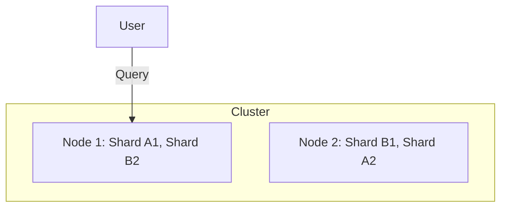
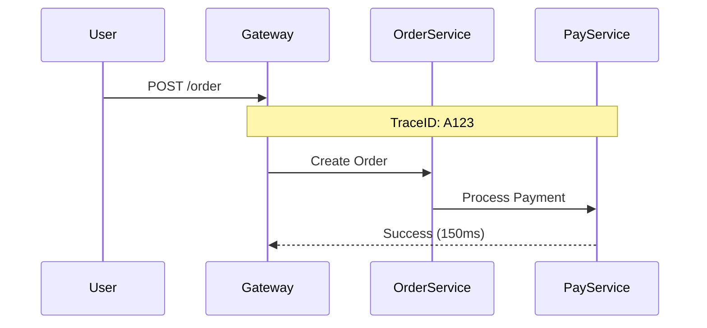

# Observabilidad con Elasticsearch y Kibana

Instructor: Juan Carlos De La Cruz

---

# 1. ¿Qué es la Observabilidad?

La **observabilidad** es la capacidad de entender el estado interno de un sistema a partir de los datos que este genera externamente. En arquitecturas modernas (microservicios, serverless), no basta con saber *si* algo falla, sino *por qué* y *dónde* ocurrió el evento.

### Los Tres Pilares (Telemetría)
Para lograr observabilidad completa, la infraestructura debe recolectar:
1.  **Logs:** El "qué pasó". Historial de eventos detallados.
2.  **Métricas:** El "cómo está la salud". Datos numéricos agregados (CPU, RAM, Latencia).
3.  **Traces:** El "mapa del viaje". Sigue una petición a través de múltiples servicios.

---

# 2. El Motor: Elasticsearch Deep Dive

**Elasticsearch** no es solo una base de datos; es un motor de búsqueda y analítica distribuido basado en **Apache Lucene**. Su velocidad se debe a una estructura llamada **Inverted Index (Índice Invertido)**.

### El Índice Invertido
Imagina el índice de un libro. En lugar de leer todo el libro para encontrar una palabra (escaneo lineal), vas al índice y ves en qué páginas aparece. Elasticsearch hace lo mismo: mapea palabras (tokens) a los documentos que las contienen, permitiendo búsquedas en milisegundos sobre petabytes de datos.

### Arquitectura Distribuida
Elasticsearch organiza los datos en **Clústeres**, **Nodos** e **Índices**:

-   **Nodos:** Instancias del servidor corriendo Elasticsearch.
-   **Shards (Fragmentos):** Un índice se divide en fragmentos para distribuirse en varios nodos. Esto permite escalabilidad horizontal.
-   **Replicas:** Copias de los shards. Sirven para:
    1.  **Alta disponibilidad:** Si un nodo falla, la réplica asume el control.
    2.  **Rendimiento:** Las réplicas pueden responder consultas de lectura, aumentando el *throughput*.



---

# 3. Visualización y Análisis: Kibana

**Kibana** es la "ventana" al clúster de Elasticsearch. Su objetivo no es solo graficar, sino permitir el descubrimiento de patrones y anomalías.

### Herramientas Clave en Kibana
1.  **Discover:** Exploración cruda de datos. Permite filtrar por campos, IDs de usuario o niveles de error usando KQL (Kibana Query Language).
2.  **Dashboards:** Paneles interactivos que combinan gráficos de barras, tortas y mapas.
3.  **Lens:** Herramienta de arrastrar y soltar para crear visualizaciones rápidas sin conocer la sintaxis técnica.
4.  **Canvas:** Permite crear presentaciones de datos en tiempo real con un diseño altamente estético.


------------------------------------------------------------------------

# 3. ¿Qué es Kibana?

**Kibana** es una herramienta de visualización que trabaja junto con
Elasticsearch.

Permite:

-   Explorar datos
-   Crear dashboards
-   Analizar logs
-   Visualizar métricas
-   Investigar errores

Kibana convierte los datos almacenados en Elasticsearch en
**visualizaciones interactivas**.

------------------------------------------------------------------------

# 4. Elasticsearch + Kibana en Observabilidad

En sistemas de observabilidad, Elasticsearch actúa como:

**Motor de almacenamiento y búsqueda de logs y trazas.**

Mientras que Kibana actúa como:

**Plataforma de visualización y análisis.**

Arquitectura típica:

    Aplicación (.NET / Java / Node)
               │
               │ Logs / Traces
               ▼
    OpenTelemetry Collector
               │
               ▼
    Elasticsearch
               │
               ▼
    Kibana

------------------------------------------------------------------------

---

# 4. Gestión del Ciclo de Vida del Dato (ILM)

En observabilidad, los datos (logs/métricas) pierden valor con el tiempo. No necesitas la misma velocidad para un log de hace 1 hora que para uno de hace 3 meses. Elasticsearch usa **ILM (Index Lifecycle Management)** para optimizar costos:

1.  **Hot (Caliente):** Datos recientes, alta tasa de escritura y lectura. Shards en nodos rápidos (SSD).
2.  **Warm (Tibio):** Datos que ya no se escriben, pero se consultan ocasionalmente.
3.  **Cold (Frío):** Datos históricos. Se mueven a hardware más económico.
4.  **Deleted (Borrado):** Eliminación automática tras cumplirse el periodo de retención (ej. 90 días).

---

# 5. Observabilidad en Microservicios: El Desafío

En un sistema monolítico, un log es suficiente. En microservicios, un solo "click" del usuario puede disparar 10 peticiones internas. 

### ¿Cómo ayuda Elastic + Kibana?
-   **Correlación por TraceId:** Al buscar un ID de traza en Kibana, ves los logs de *todos* los microservicios involucrados en esa transacción única.
-   **Análisis de Latencia:** Kibana APM permite ver qué microservicio (o qué consulta a base de datos) es el cuello de botella en tiempo real.



---

# 6. Integración con .NET: Consultas desde Código

Además de enviar logs, a veces tu aplicación necesita consultar Elasticsearch (ej. búsquedas rápidas de productos o auditoría).

### Instalación del Cliente
```bash
dotnet add package Elastic.Clients.Elasticsearch
```

### Ejemplo de Búsqueda
```csharp
using Elastic.Clients.Elasticsearch;

var client = new ElasticsearchClient(new Uri("http://localhost:9200"));

// Buscar logs con nivel de Error en un índice específico
var response = await client.SearchAsync<dynamic>(s => s
    .Index("otel-logs*")
    .Query(q => q
        .Match(m => m
            .Field("severity_text")
            .Query("Error")
        )
    )
);

if (response.IsValidResponse)
{
    var total = response.Total;
    Console.WriteLine($"Errores encontrados: {total}");
}
```

---

# 7. Buenas Prácticas y Estrategia

1.  **Data Streams:** Usa Data Streams en lugar de índices simples para logs. Gestionan automáticamente el rollover y el ILM.
2.  **Mapeos Explícitos:** No confíes siempre en el mapeo dinámico de Elastic. Define tipos de datos (keyword vs text) para ahorrar espacio y mejorar la velocidad de búsqueda.
3.  **Filtros en el Origen:** No envíes telemetría basura. Filtra logs de `healthcheck` o métricas de sistema irrelevantes antes de que lleguen a Elasticsearch.

---

# 8. Conclusión Profesional

La observabilidad no es una herramienta, es una **cultura**. Elasticsearch y Kibana proporcionan la infraestructura necesaria para que esta cultura florezca, permitiendo que los equipos de desarrollo dejen de "adivinar" y comiencen a "saber".

Con la combinación de **OpenTelemetry + Elastic Stack**, tienes una solución de grado empresarial que escala con tu negocio y garantiza que siempre tengas visibilidad total sobre tus sistemas.

