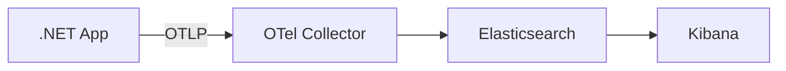

# Observabilidad en .NET con OpenTelemetry + Elasticsearch + Kibana + Docker

Instructor: Juan Carlos De La Cruz

------------------------------------------------------------------------

# 1. Introducción a la Observabilidad

La **observabilidad** no es solo "monitoreo avanzado". Mientras que el monitoreo se enfoca en saber *si* algo falla (ej. "¿está vivo el servidor?"), la observabilidad permite entender *por qué* falla analizando los estados internos del sistema a través de sus datos externos.

### Los Tres Pilares (Telemetría)
Para lograr una visión completa, necesitamos tres tipos de datos:

1.  **Logs (Registros):** Eventos discretos en el tiempo con mensajes descriptivos. Son fundamentales para el "qué pasó" en un momento exacto.
2.  **Metrics (Métricas):** Datos agregados y numéricos (ej. uso de CPU, número de peticiones por segundo). Indican la salud general del sistema.
3.  **Traces (Trazabilidad):** Siguen el camino de una petición a través de múltiples servicios. Es el "mapa" que une todo en arquitecturas de microservicios.

### ¿Por qué OpenTelemetry (OTel)?
Históricamente, los desarrolladores dependían de SDKs propietarios (ej. AppInsights, Datadog). **OpenTelemetry** es un estándar abierto de la CNCF que permite instrumentar tu código una sola vez y enviar los datos a cualquier destino (Elastic, Prometheus, Jaeger, etc.), evitando el *vendor lock-in*.

---

# 2. Arquitectura de la Solución

En esta guía implementaremos un flujo moderno donde la aplicación no envía datos directamente a la base de datos de logs, sino a un intermediario inteligente.

**Flujo de Datos:**
1.  **App (.NET):** Genera telemetría usando SDKs de OpenTelemetry.
2.  **OTel Collector:** Recibe, procesa (filtra, agrupa, limpia) y exporta la telemetría.
3.  **Elasticsearch:** Almacena y permite búsquedas ultrarrápidas sobre los datos.
4.  **Kibana:** Interfaz gráfica para visualizar dashboards y trazas.




------------------------------------------------------------------------

# 2. Requisitos

Antes de comenzar necesitas:

-   .NET 8 o superior
-   Docker
-   Docker Compose
-   Un proyecto .NET API o Worker

------------------------------------------------------------------------

# 3. Infraestructura con Docker

Utilizaremos Docker Compose para levantar todo el ecosistema. Es importante notar el uso de la imagen `contrib` del Collector, ya que incluye exportadores esenciales como el de Elasticsearch.

### Archivo: `docker-compose.yml`

```yaml
version: "3.8"

services:
  elasticsearch:
    image: docker.elastic.co/elasticsearch/elasticsearch:8.13.4
    container_name: elasticsearch
    environment:
      - discovery.type=single-node
      - xpack.security.enabled=false
      - ES_JAVA_OPTS=-Xms512m -Xmx512m
    ports:
      - "9200:9200"
    healthcheck:
      test: ["CMD-SHELL", "curl -s http://localhost:9200 >/dev/null || exit 1"]
      interval: 10s
      timeout: 10s
      retries: 5

  kibana:
    image: docker.elastic.co/kibana/kibana:8.13.4
    container_name: kibana
    depends_on:
      elasticsearch:
        condition: service_healthy
    environment:
      - ELASTICSEARCH_HOSTS=http://elasticsearch:9200
    ports:
      - "5601:5601"

  otel-collector:
    image: otel/opentelemetry-collector-contrib:0.98.0
    container_name: otel-collector
    command: ["--config=/etc/otel-config.yaml"]
    volumes:
      - ./otel-config.yaml:/etc/otel-config.yaml
    ports:
      - "4317:4317" # gRPC receiver
      - "4318:4318" # HTTP receiver
    depends_on:
      - elasticsearch
```

---

# 4. El Corazón: OpenTelemetry Collector

El Collector funciona mediante **Pipelines**. Un pipeline define el camino de los datos:
1.  **Receivers:** Cómo entran los datos (gRPC, HTTP).
2.  **Processors:** Qué les hacemos (batching, filtrado, añadir atributos).
3.  **Exporters:** A dónde los enviamos.

### Archivo: `otel-config.yaml`

```yaml
receivers:
  otlp:
    protocols:
      grpc:
      http:

processors:
  # Agrupa los datos antes de enviarlos (más eficiente)
  batch:
    send_batch_size: 1000
    timeout: 10s
  # Evita que el collector use toda la RAM
  memory_limiter:
    check_interval: 1s
    limit_mib: 512

exporters:
  elasticsearch:
    endpoints: ["http://elasticsearch:9200"]
    logs_index: "otel-logs"
    traces_index: "otel-traces"
    # El exportador de métricas para Elastic requiere configuración adicional 
    # o usar un índice dedicado.
    mapping:
      mode: raw

service:
  pipelines:
    logs:
      receivers: [otlp]
      processors: [memory_limiter, batch]
      exporters: [elasticsearch]
    traces:
      receivers: [otlp]
      processors: [memory_limiter, batch]
      exporters: [elasticsearch]
```


------------------------------------------------------------------------

# 5. Levantar la infraestructura

Ejecutar:

docker compose up -d

Servicios disponibles:

Elasticsearch\
http://localhost:9200

Kibana\
http://localhost:5601

OpenTelemetry Collector\
http://localhost:4317

------------------------------------------------------------------------

# 6. Preparación del Proyecto .NET

### Instalación de Paquetes
Es vital instalar las librerías oficiales de OpenTelemetry y el sink de Serilog optimizado para OTLP:

```bash
# Servidor de logs y telemetría
dotnet add package Serilog.AspNetCore
dotnet add package Serilog.Sinks.OpenTelemetry

# OpenTelemetry Core y Hosting
dotnet add package OpenTelemetry.Extensions.Hosting
dotnet add package OpenTelemetry.Exporter.OpenTelemetryProtocol

# Instrumentación Automática
dotnet add package OpenTelemetry.Instrumentation.AspNetCore
dotnet add package OpenTelemetry.Instrumentation.Http
dotnet add package OpenTelemetry.Instrumentation.Runtime
```

---

# 7. Configuración y Registro

Para mantener el código limpio, utilizaremos `appsettings.json` para las URLs y configuraremos tanto Serilog como OpenTelemetry en `Program.cs`.

### Configuración en `appsettings.json`

```json
{
  "OTEL_EXPORTER_OTLP_ENDPOINT": "http://localhost:4317",
  "ServiceSettings": {
    "ServiceName": "BankAPI"
  }
}
```

### Implementación en `Program.cs`

```csharp
using OpenTelemetry.Resources;
using OpenTelemetry.Trace;
using OpenTelemetry.Metrics;
using Serilog;

var builder = WebApplication.CreateBuilder(args);

// 1. Configurar Serilog con OpenTelemetry (Logs)
var otelEndpoint = builder.Configuration["OTEL_EXPORTER_OTLP_ENDPOINT"];
var serviceName = builder.Configuration["ServiceSettings:ServiceName"];

builder.Host.UseSerilog((context, loggerConfiguration) => 
{
    loggerConfiguration
        .MinimumLevel.Information()
        .Enrich.FromLogContext()
        .WriteTo.Console()
        .WriteTo.OpenTelemetry(options =>
        {
            options.Endpoint = otelEndpoint;
            options.Protocol = Serilog.Sinks.OpenTelemetry.OtlpProtocol.Grpc;
            options.ResourceAttributes = new Dictionary<string, object>
            {
                ["service.name"] = serviceName
            };
        });
});

// 2. Configurar OpenTelemetry (Traces y Metrics)
builder.Services.AddOpenTelemetry()
    .ConfigureResource(resource => resource.AddService(serviceName))
    .WithTracing(tracing =>
    {
        tracing
            .AddAspNetCoreInstrumentation()
            .AddHttpClientInstrumentation()
            .AddSqlClientInstrumentation() // Opcional: para BD
            .AddOtlpExporter(options => options.Endpoint = new Uri(otelEndpoint));
    })
    .WithMetrics(metrics =>
    {
        metrics
            .AddAspNetCoreInstrumentation()
            .AddRuntimeInstrumentation() // CPU, RAM, GC
            .AddOtlpExporter(options => options.Endpoint = new Uri(otelEndpoint));
    });
```


------------------------------------------------------------------------

# 8. Instrumentación Manual Avanzada

No todo se captura automáticamente. Para lógica de negocio, debemos usar `ActivitySource` (Traces) y `Meter` (Metrics).

### Traces Manuales (Activities)
```csharp
using System.Diagnostics;

public static class Telemetry
{
    public static readonly ActivitySource ActivitySource = new("Bank.Worker");
}

// En tu servicio:
using var activity = Telemetry.ActivitySource.StartActivity("ProcesarPago", ActivityKind.Internal);
activity?.SetTag("pago.monto", 500);
activity?.SetTag("pago.moneda", "USD");
```

### Métricas Personalizadas (Counters)
```csharp
using System.Diagnostics.Metrics;

public static class BankMetrics
{
    private static readonly Meter Meter = new("Bank.Metrics", "1.0.0");
    public static readonly Counter<int> PaymentsCounter = Meter.CreateCounter<int>("bank.payments.total");
}

// Para usarlo:
BankMetrics.PaymentsCounter.Add(1, new KeyValuePair<string, object?>("status", "success"));
```

---

# 9. La Magia: Correlación Automática

Una de las mayores ventajas de usar **Serilog + OpenTelemetry** es que los `TraceId` y `SpanId` se inyectan automáticamente en los logs. 

Esto significa que si encuentras un error en Kibana, puedes copiar el `trace.id` y ver **exactamente qué logs se generaron durante esa petición específica**, incluso si pasaron por 5 microservicios diferentes.

---

# 10. Visualización en Kibana

### Configuración de Index Patterns
Al entrar a Kibana (http://localhost:5601), ve a **Stack Management > Index Patterns** y crea:
1.  `otel-logs*`: Para ver todos los logs estructurados.
2.  `otel-traces*`: Para analizar la latencia y los saltos entre servicios.

### Consultas con KQL (Kibana Query Language)
- **Ver errores de un servicio específico:**
  `service.name: "BankAPI" AND severity_text: "Error"`
- **Filtrar por un ID de negocio (gracias a logs estructurados):**
  `Body : "LoanId: 12345"` o si es atributo: `attributes.LoanId : 12345`
- **Seguir una transacción completa:**
  `trace.id : "tu-id-de-traza-aqui"`

---

# 11. Buenas Prácticas de Producción

1.  **Logs Estructurados:** Nunca uses interpolación de strings (`$"Error {id}"`). Usa parámetros: `Log.Error("Error en proceso {ProcessId}", id)`. Esto permite que Elastic indexe `ProcessId` como un campo searchable.
2.  **Sampling (Muestreo):** En producción, no envíes el 100% de las trazas si tienes mucho tráfico. Configura un `TraceIdRatioBasedSampler`.
3.  **Filtrado en el Collector:** Usa el procesador `filter` en el Collector para no enviar logs de salud (`/health`) a Elasticsearch y ahorrar espacio.

---

# 12. Conclusión

Implementar este stack transforma una aplicación "caja negra" en un sistema transparente. Con .NET y OpenTelemetry, no solo estás preparado para el presente, sino que tu instrumentación es compatible con cualquier herramienta futura de observabilidad.

**Recursos adicionales:**
-   [Documentación oficial OTel .NET](https://opentelemetry.io/docs/instrumentation/net/)
-   [Elasticsearch Guide for OTel](https://www.elastic.co/guide/en/observability/current/opentelemetry.html)

